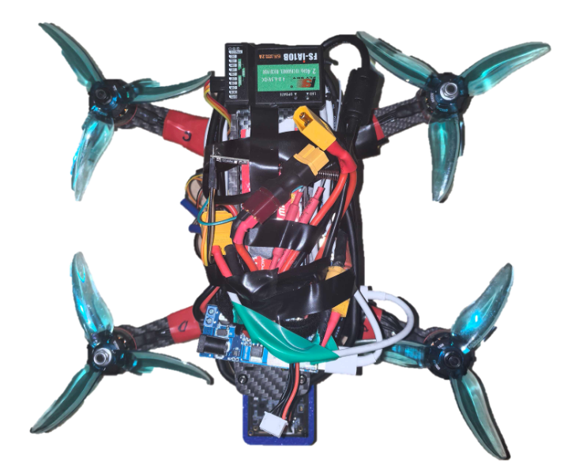
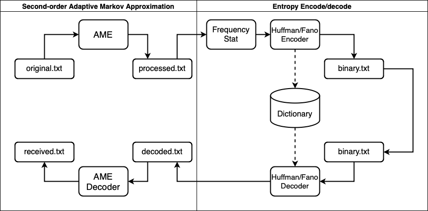
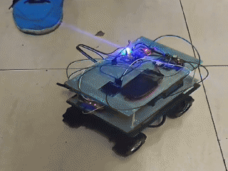
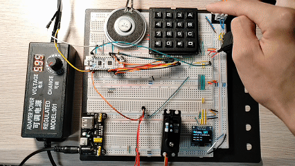

## EDUCATION

**University of Electronic Science and Technology of China (UESTC)** [(*Sept 2022 --- Present*)]{.cvdate}

**University of Glasgow, Dual Degree Program** [(*Sept 2022 --- Present*)]{.cvdate}

  - **Major**: Electrical & Communication Engineering BEng; [GPA: 3.87/4.0](https://marcobisky.github.io/cv/score.pdf), [Ranking: 2/164 (Top 1.2%)](https://marcobisky.github.io/cv/rank.pdf)
  - **Relevant Coursework**: Information Theory, Artificial Intelligence and Machine Learning, Stochastic Processes, Digital Circuit Design, etc.
  - **Online Course**: Abstract Algebra, Complex Analysis, Differential Geometry, Convex Optimization, etc.

## RESEARCH & PROJECTS

**System-level Co-Design of RISCV Accelerators for TinyML at the Edge** [(*Sept 2025 --- Present*)]{.cvdate}

*Research Assistant, [Prof. Yun Li](https://scholar.google.com/citations?user=1NT1jFMAAAAJ&hl=en), UESTC*

  - Designing, implementing and verifying hardware-accelerated DSC and attention kernels in Vision Transformer (ViT) using `C++` with RISCV Vector (RVV) intrinsics that are adaptable and efficient for edge computing in [Coral NPU](https://github.com/google-coral/coralnpu/tree/main) framework open-sourced by Google and VeriSilicon in 2025.
  - Simulating and building with `Verilator`, `Cocotb`, `Bazel` and `CMakeLists`. Testing on Arty A100T FPGA with real-time camera input and UART object position output.

**[YOPO: You Only Pick Once --- Light Object Tracking Algorithm](https://github.com/Marcobisky/YOPO)** [(*Sept 2025*)]{.cvdate}

::: {.content-visible when-format="html"}
{.column-margin}
:::

  - Developed a lightweight object tracking algorithm that requires only one initial selection, successfully mitigate the intense computation of DNN forward propagation on every frame.
  - Utilized NCC-based matching, adaptive kernel updating, capable of tracking objects with gradual color and size changes.

**[Control](https://marcobisky.github.io/posts/quadrocopter-control/) and [Computer Vision](https://marcobisky.github.io/cv/drone-cv.pdf) for [Autonomous Quadcopter System](https://marcobisky.github.io/cv/drone.pdf)** [(*Feb 2025 --- Jun 2025*)]{.cvdate}

::: {.content-visible when-format="html"}
{.column-margin}
:::

  - Developed an auto quadrotor aircraft for objection detection, route planning, and closed-loop flight control.
  - Used `ROS2` and `OpenCV` library to implement originally designed computer vision algorithms for real-time landing area detection.

**[Design and Visualization of a Complete Single-cycle RV32I CPU Core](https://github.com/Marcobisky/my-riscv)** [(*Jan 2025 --- Mar 2025*)]{.cvdate}

::: {.content-visible when-format="html"}
{.column-margin}
:::

  - Designed a single-core, single-cycle RISCV 32-bit CPU from scratch in `Verilog` for RTL simulation and in `Digital` Software for working principle visualization, open-sourced on [Github](https://github.com/Marcobisky/my-riscv).
  - Built a complete datapath including PC, fetcher, decoder, register file, ALU, LRU-based L1 cache, etc., compatible with basic peripherals: GPIOs, IIC, UART, etc.
  - Implemented a boot program in RISCV assembly, basic delay and GPIO libraries in `C`. Compiled and simulated using RISCV GNU toolchain.

**[Adaptive Markov Entropy Source Encoding](https://github.com/Marcobisky/ame-entropy-source-coding)** [(*Oct 2024 --- Nov 2024*)]{.cvdate}

::: {.content-visible when-format="html"}
{.column-margin}
:::

  - Originally-designed the second-order Markov Adapative Approximation (AME) to perform source coding of *the Game of Thrones* using `Python` and `Matlab`.
  - Evaluated and compared the performance of AME, Huffman and Fano coding.

**[CNN/LSTM for Embedded Systems](https://github.com/Marcobisky/CNN-for-mbed)** [(*Feb 2024 --- May 2024*)]{.cvdate}

::: {.content-visible when-format="html"}
{.column-margin}
:::

  - Designed and Integrated CNN and LSTM models into STM32 MCU for end-to-end patient fall detection of accuracy 95%, temperature monitoring and real-time data visualization.
  - Manually collected and labeled time-series 3D acceleration dataset. Trained models on Linux, then hardcoded and accelerated them in `C++` on MbedOS for real-time inference.

**Human Voice Recognition Smart Car** [(*Sept 2023 --- Dec 2023*)]{.cvdate}

::: {.content-visible when-format="html"}
{.column-margin}
:::

  - Designed and implemented a voice-controlled car on STM32F103 using `C` standard libraries, supporting actions such as moving forwards/backwards, turning/sliding left/right.
  - Led a 4-member team in the project.

**Digital Door Lock for Dormitory** [(*Sept 2023 --- Oct 2023*)]{.cvdate}

::: {.content-visible when-format="html"}
{.column-margin}
:::

  - Designed and implemented an embedded digital door lock system in `C++` on Nucleo L432KC MCU.
  - Developed basic functions include manually setting up password, automatically lock for repeated wrong passwords, OLED message displaying, etc.
  - Led a 3-member team in the project.

## RELEVANT SKILLS

**IT Skills**: Latex, Quarto Markdown, Linux, [Manim](https://www.bilibili.com/video/BV1AterevErt/?spm_id_from=333.1387.homepage.video_card.click&vd_source=42579e22289b6144ba0b2bdcf99834e3), [Github](https://github.com/Marcobisky).

**Programming**: `C/C++`, `Python`, `RISCV Assembly`, `Verilog`, `Makefile`, `Bazel`, `Chisel`, `Matlab`.

**Language**: Native Chinese, Fluent English ([IELTS 7](https://marcobisky.github.io/cv/ielts-score.pdf)).

## AWARDS

**Top Academic Scholarship of UESTC (Top 5%)** [(*Dec 2023, Dec 2024*)]{.cvdate}

**China National Scholarship (Top 0.2%)** [(*Dec 2024*)]{.cvdate}

**[First Prize: 7th National College Art Exhibition and Performance (Violin section)](http://www.moe.gov.cn/srcsite/A17/moe_794/moe_628/202408/t20240806_1144389.html)** [(*Sept 2024*)]{.cvdate}

