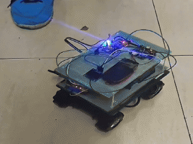
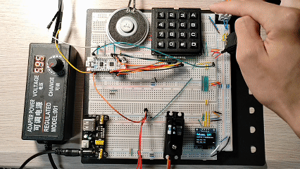

## EDUCATION

**University of Electronic Science and Technology of China (UESTC)** [(*Sept 2022 --- June 2026*)]{.cvdate}

**University of Glasgow, Dual Degree Program** [(*Sept 2022 --- June 2026*)]{.cvdate}

  - **Major**: Electrical & Computer Engineering BEng; [GPA: 3.87/4.0](https://marcobisky.github.io/cv/score.pdf), [Ranking: 2/164 (Top 1.2%)](https://marcobisky.github.io/cv/rank.pdf)
  - **Relevant Coursework**: Information Theory, Stochastic Processes, Flow Matching and Diffusion Models, Reinforcement Learning in LLM, etc.

## RESEARCH & PROJECTS

**[LLMlab: Rapid RLVR Post-Training Verification Platform Based on Formal Languages](https://github.com/Marcobisky/llmlab)** [(*June 2026*)]{.cvdate}

  - Motivation: To reduce the prohibitively high cost of validating LLM training algorithms, LLMlab enables efficient algorithm performance verification on controlled synthetic data.
  - Designed a deterministic formal language supporting efficient RLVR algorithm benchmarking across varying levels of language difficulty.
  - Implemented a complete pretrain, SFT, GRPO, KD, OPD, and SDPO pipeline with parallel ablation experiments on 2.67M and 0.15M teacher and student models, achieving 100% accuracy on difficulty levels 0--3 and over 70% accuracy on difficulty levels 4--6.
  - Integrated a visualization toolkit including PCA-projected loss landscapes with weight trajectory tracking, per-layer attention heatmaps, and exposure bias measurements for in-depth model interpretability and training dynamics analysis.

**LLM Post-Training: Reproducing [Self-Distillation Policy Optimization (SDPO)](https://arxiv.org/abs/2601.20802) Paper** [(*May 2026*)]{.cvdate}

  - Successfully reproduced the SDPO algorithm using the verl RL framework on RunPod H100 GPUs, building on a thorough understanding of the algorithm.
  - Trained Qwen2.5-3B on code generation tasks using LeetCode-style feedback (runtime errors, failed test cases) as the learning signal, and tracked 40 steps of SDPO training dynamics via WandB, logging mean reward and token-level KL divergence relative to the reference policy.

**System-level Co-Design of RISCV Accelerators for TinyML at the Edge** [(*Sept 2025 --- April 2026*)]{.cvdate}

*Research Assistant, [Prof. Yun Li](https://scholar.google.com/citations?user=1NT1jFMAAAAJ&hl=en), UESTC*

  - Engineered a standalone Neural Processing Unit (NPU) for real-time YOLOv8n edge inference on an Artix-7 FPGA, bypassing soft-core processors via a custom RISC-V instruction extension (Xnpu).
  - Architected an end-to-end Python ML compiler for automated INT16 quantization and memory-aware instruction scheduling, preserving accuracy within 0.3% mAP of the PyTorch FP32 baseline.
  - Designed parameterized RTL operators featuring a 3×3 systolic MAC grid and fully hardware-accelerated post-processing (DFL, NMS), achieving 288 MACs/cycle and 23.4 GOPS peak throughput.
  - Integrated asynchronous camera/UDP video pipelines and AXI4 DDR3L memory multiplexing, fully verified via `Cocotb`, `Bazel`, and `Icarus Verilog`.

**[YOPO: You Only Pick Once --- Light Object Tracking Algorithm](https://github.com/Marcobisky/YOPO)** [(*Sept 2025*)]{.cvdate}

::: {.content-visible when-format="html"}
{.column-margin}
:::

  - Developed a lightweight object tracking algorithm that requires only one initial selection, successfully mitigate the intense computation of DNN forward propagation on every frame.
  - Utilized NCC-based matching, adaptive kernel updating, capable of tracking objects with gradual color and size changes.

**[Design and Visualization of a Complete Single-cycle RV32I CPU Core](https://github.com/Marcobisky/my-riscv)** [(*Jan 2025 --- Mar 2025*)]{.cvdate}

::: {.content-visible when-format="html"}
{.column-margin}
:::

  - Designed a single-core, single-cycle RISCV 32-bit CPU from scratch in `Verilog` for RTL simulation and in `Digital` Software for working principle visualization, open-sourced on [Github](https://github.com/Marcobisky/my-riscv).
  - Built a complete datapath including PC, fetcher, decoder, register file, ALU, LRU-based L1 cache, etc., compatible with basic peripherals: GPIOs, IIC, UART, etc.
  - Implemented a boot program in RISCV assembly, basic delay and GPIO libraries in `C`. Compiled and simulated using RISCV GNU toolchain.

**[CNN/LSTM for Embedded Systems](https://github.com/Marcobisky/CNN-for-mbed)** [(*Feb 2024 --- May 2024*)]{.cvdate}

::: {.content-visible when-format="html"}
{.column-margin}
:::

  - Designed and Integrated CNN and LSTM models into STM32 MCU for end-to-end patient fall detection of accuracy 95%, temperature monitoring and real-time data visualization.
  - Manually collected and labeled time-series 3D acceleration dataset. Trained models on Linux, then hardcoded and accelerated them in `C++` on MbedOS for real-time inference.

**Human Voice Recognition Smart Car** [(*Sept 2023 --- Dec 2023*)]{.cvdate}

::: {.content-visible when-format="html"}
{.column-margin}
:::

  - Designed and implemented a voice-controlled car on STM32F103 using `C` standard libraries, supporting actions such as moving forwards/backwards, turning/sliding left/right.
  - Led a 4-member team in the project.

**Digital Door Lock for Dormitory** [(*Sept 2023 --- Oct 2023*)]{.cvdate}

::: {.content-visible when-format="html"}
{.column-margin}
:::

  - Designed and implemented an embedded digital door lock system in `C++` on Nucleo L432KC MCU.
  - Developed basic functions include manually setting up password, automatically lock for repeated wrong passwords, OLED message displaying, etc.
  - Led a 3-member team in the project.

## RELEVANT SKILLS

**IT Skills**: Latex, Quarto Markdown, Linux, [Manim](https://www.bilibili.com/video/BV1AterevErt/?spm_id_from=333.1387.homepage.video_card.click&vd_source=42579e22289b6144ba0b2bdcf99834e3), [Github](https://github.com/Marcobisky).

**Programming**: `Python`, `PyTorch`, `C/C++` , `Makefile`.

**Language**: Native Chinese, Fluent English ([IELTS 7](https://marcobisky.github.io/cv/ielts-score.pdf)).

## AWARDS

**Top Academic Scholarship of UESTC (Top 5%)** [(*Dec 2023, Dec 2024*)]{.cvdate}

**China National Scholarship (Top 0.2%)** [(*Dec 2024*)]{.cvdate}

**[First Prize: 7th National College Art Exhibition and Performance (Violin section)](http://www.moe.gov.cn/srcsite/A17/moe_794/moe_628/202408/t20240806_1144389.html)** [(*Sept 2024*)]{.cvdate}

**[Outstanding Graduate of Sichuan Province, 2026](https://www.gla.uestc.edu.cn/info/1089/17553.htm)** [(*Oct 2025*)]{.cvdate}

