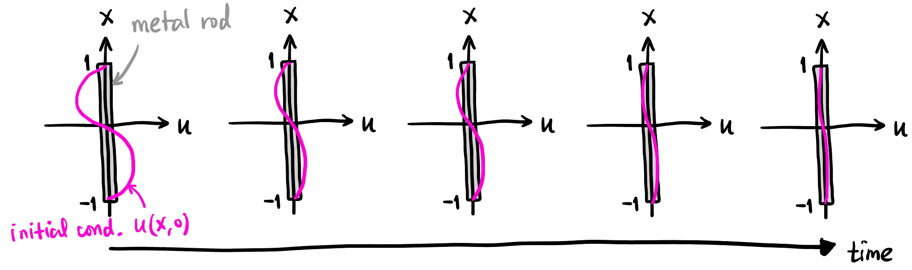
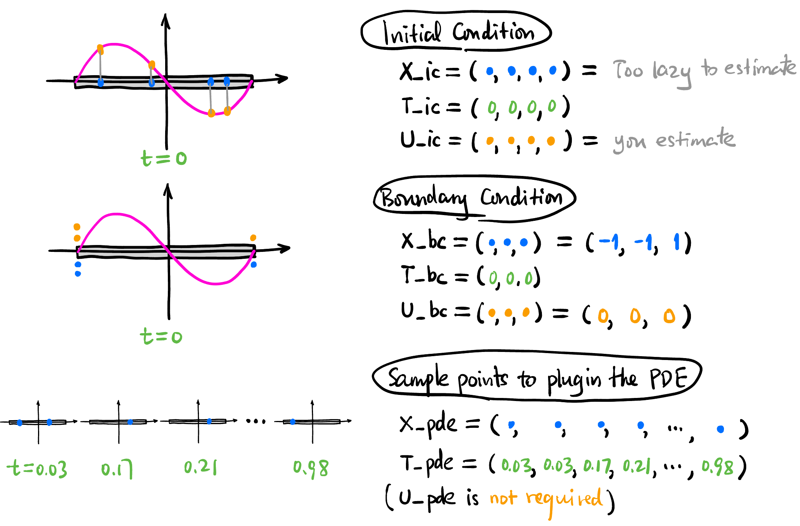
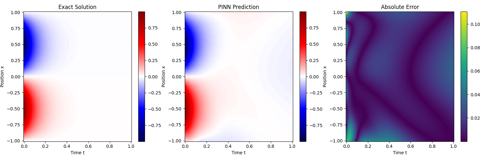
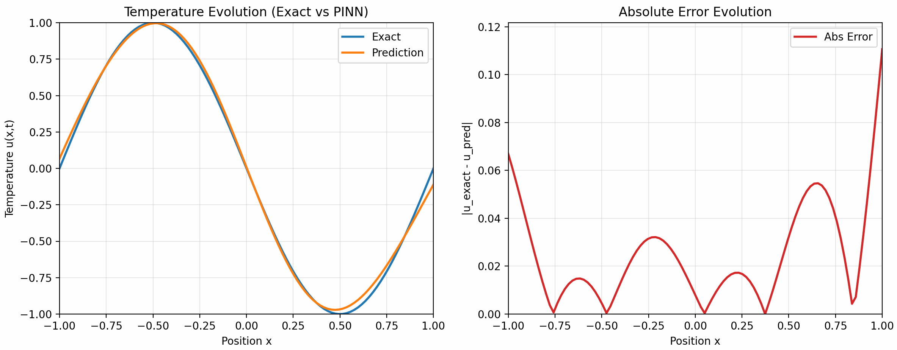
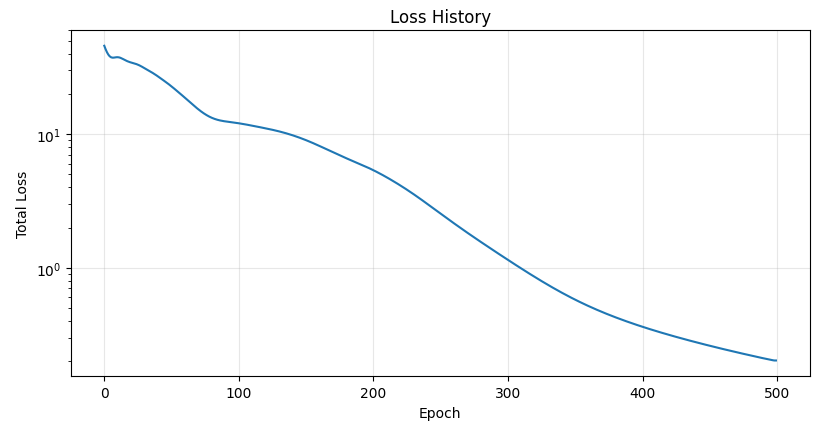

> **PDEs are not so difference from ODEs**: 就我个人而言, 处理 ODE 时感觉比较轻松, 但见到 PDE 时总感觉有莫名的心里负担. 直到我意识到: ODE 要求的函数是单变量的函数, 如果是多变量的函数呢? 这就是 PDE 啊! 比如热传导方程, 要求解的函数是 $u(x,t)$, 可是 $x$ 和 $t$ 可以认为是等地位的! PDE 只是 ODE 的自然推广而已 (好像这是废话耶, 被自己蠢到了 (///▽///)).

## Motivation

- **Naive method**: 比如求解一维热传导方程时, 需要输入位置和时间 $(x,t)$, 输出温度 $u$, 直接设计一个 2 输入 1 输出的神经网络, 然后收集很多 $(x,t,u)$ 数据集进行训练. 再比如求解 Navier-Stokes 方程时, 同样需要输入位置和时间 $(x,y,z,t)$, 输出速度和压力 $(u,v,w,p)$, 直接设计一个 4 输入 4 输出的神经网络, 然后收集 $(x,y,z,t,u,v,w,p)$ 数据集进行训练.
    - 这样需要大量的测量数据! 但是不同于 LLM, 热量的传导和流体的流动我们已经有非常精确的 PDE 来描述了, 那为什么还要用神经网络? 是因为它们很难解哈哈! 但是设计神经网络的时候, 它是完全不知道这些 PDE 的存在的, 有没有什么方法将 PDE 的知识注入到神经网络?
- **PINNs**: Idea 很简单, 由于 PDE 里面那些算子恰好都是输出值对输入值的微分 (一阶、二阶或高阶), 而神经网络恰好可以用 autograd 来完成输出对输入的微分!!! Autograd 算出来的结果一般都不满足 PDE, 对吧, 会有一个残差 (residual), 那我们就把这个残差加入 Loss 函数让它去优化, 这样神经网络就会在训练过程中逐渐满足 PDE 的约束了! 
    - 这样所需的测量数据就会很少 (在下面的 hands-on experiment 里我们甚至都没有用任何测量数据, 只用 PDE 的残差来训练神经网络, 毕竟任何满足 PDE 的函数都是热传导方程的解嘛, 只需要对 PDE 进行 “蒸馏” 就可以了).
    - 当然一般求解 PDE 还需要给定初始条件和边界条件, 这些也可以加入 Loss 函数中进行优化, 这样神经网络就会同时满足 PDE、初始条件和边界条件的约束了!

## Heat Equation

这里简单复习一下 1D 的热传导方程:
$$
\boxed{u_t = \alpha u_{xx}}
$$

简单起见, 假设初始状态是 $u(x,0)=\sin \pi x$ (见 @fig-temp-time-evolution), 边界条件就是 $x=1,-1$ 处的温度恒为 $0$. 由于正弦函数是空间二阶导算子的特征向量, 显然在任意时刻的温度分布都是一个 $\sin$ 函数, 而且是指数衰减的, 所以我们可以轻松地写出解析解:

$$
u(x,t) = \underbrace{e^{-\alpha \pi^2 t}}_{\mathclap{\scriptsize \text{exponential decay}}} \sin \pi x
$$

{#fig-temp-time-evolution width=90%}

也就是说, 在任意位置和时间 $(x,t)$, 我们都能解析地算出温度, 我们会用这个结果与 PINN 预测的结果进行对比:

```python
ALPHA = 1.0  # Thermal diffusivity
# Function to compute exact solution for verification
def exact_solution(x, t):
    return -np.exp(-ALPHA * np.pi**2 * t) * np.sin(np.pi * x)
```


## Collocation Points 生成

这里我们所有的训练数据都只用 Collocation Points 而没有用实际测量的数据.

{#fig-collocation-sample width=90%}

```python
# N_IC = 4: Number of initial state points
# N_BC = 3: Number of boundary condition points
# N_PDE = 100: Number of collocation points for PDE residual
def generate_data(N_IC, N_BC, N_PDE):
    # a) Initial Condition Data (u(x, 0) = -sin(\pi * x))
    x_ic = np.random.uniform(-1, 1, (N_IC, 1))
    t_ic = np.zeros((N_IC, 1))
    u_ic = -np.sin(np.pi * x_ic)

    # b) Boundary Condition Data (u(\pm 1, t) = 0)
    # Left boundary (x = -1)
    x_bc_left = -np.ones((N_BC // 2, 1))
    t_bc_left = np.random.uniform(0, 1, (N_BC // 2, 1))
    u_bc_left = np.zeros((N_BC // 2, 1))
    
    # Right boundary (x = 1)
    x_bc_right = np.ones((N_BC // 2, 1))
    t_bc_right = np.random.uniform(0, 1, (N_BC // 2, 1))
    u_bc_right = np.zeros((N_BC // 2, 1))

    # c) Collocation Points for PDE Residual (Latin Hypercube Sampling)
    # Define bounds: [x_min, t_min], [x_max, t_max]
    l_bounds = [-1.0, 0.0]
    u_bounds = [1.0, 1.0]
    
    # Create an LHS sampler
    sampler = qmc.LatinHypercube(d=2) # 2 dimensions (x, t)
    sample = sampler.random(n=N_PDE)
    
    # Scale samples to the domain bounds
    points_pde = qmc.scale(sample, l_bounds, u_bounds)
    x_pde = points_pde[:, 0:1]
    t_pde = points_pde[:, 1:2]

    # Convert everything to PyTorch Tensors and move to device
    def to_tensor(arr, requires_grad=False):
        return torch.tensor(arr, dtype=torch.float32, device=device, requires_grad=requires_grad)

    X_ic = to_tensor(x_ic)
    T_ic = to_tensor(t_ic)
    U_ic = to_tensor(u_ic)

    X_bc = to_tensor(np.vstack([x_bc_left, x_bc_right]))
    T_bc = to_tensor(np.vstack([t_bc_left, t_bc_right]))
    U_bc = to_tensor(np.vstack([u_bc_left, u_bc_right]))

    # PDE points need requires_grad=True for autograd
    X_pde = to_tensor(x_pde, requires_grad=True)
    T_pde = to_tensor(t_pde, requires_grad=True)

    return X_ic, T_ic, U_ic, X_bc, T_bc, U_bc, X_pde, T_pde
```

## Neural Network 设计

输入位置和时间 $(x,t)$, 输出温度值 $u$, 不妨就用简单的 MLP 来实现 (具体层数和每层的神经元数量可以通过输入 `layers` 参数来调整):

```python
class PINN(nn.Module):
    def __init__(self, layers):
        super(PINN, self).__init__()
        # layers is a list of hidden layer sizes, e.g., [2, 20, 20, 20, 1]
        self.linears = nn.ModuleList()
        for i in range(len(layers) - 1):
            self.linears.append(nn.Linear(layers[i], layers[i+1]))
            # Weight initialization (helpful for PINNs)
            nn.init.xavier_normal_(self.linears[-1].weight)
            nn.init.zeros_(self.linears[-1].bias)

        # Activation function (Tanh is very common for smooth solutions like heat flow)
        self.activation = nn.Tanh()

    def forward(self, x, t):
        # Input concatenation: [x, t]
        inputs = torch.cat([x, t], dim=1)
        for i in range(len(self.linears) - 1):
            inputs = self.activation(self.linears[i](inputs))
        
        # Last layer doesn't need activation
        output = self.linears[-1](inputs)
        return output
```

下文称这个神经网络为 $u_\theta$.

## Training

定义三种 Loss:

- **Initial Condition Loss**: 
    $$
    L_1 = \text{MSE}(u_\theta(\texttt{X\_ic}), \texttt{U\_ic})
    $$

- **Boundary Condition Loss**: 
    $$
    L_2 = \text{MSE}(u_\theta(\texttt{X\_bc}), \texttt{U\_bc})
    $$

- **PDE Residual Loss**: 
    $$
    L_3 = \text{MSE}\left(\frac{\partial \texttt{u\_pde}}{\partial t}, \alpha \frac{\partial^2 \texttt{u\_pde}}{\partial x^2}\right)
    $$
    where $\texttt{u\_pde} := u_\theta(\texttt{X\_pde}, \texttt{T\_pde})$.
    - 这里我们用自动微分来计算 $\partial \texttt{u\_pde} / \partial t$ 和 $\partial^2 \texttt{u\_pde} / \partial x^2$.

- **Total Loss**: 三者的加权和:
    $$
    L = w_1 L_1 + w_2 L_2 + w_3 L_3
    $$

    - $w_1, w_2, w_3$ 是用来平衡各项损失权重的超参数.

下面的代码没有用 Mini-batch 来训练而是用了整个数据集 (因为数据量很小).

```python
# 返回 epoch 长度的 loss history
def train(pinn, X_ic, T_ic, U_ic, X_bc, T_bc, U_bc, X_pde, T_pde, epochs=5000, lr=1e-3, w_pde=1.0, w_ic=10.0, w_bc=10.0):
    
    optimizer = optim.Adam(pinn.parameters(), lr=lr)
    
    # Track losses
    losses = []

    for epoch in range(epochs):
        optimizer.zero_grad()

        # a) Compute losses from initial condition
        u_ic_pred = pinn(X_ic, T_ic)
        loss_ic = torch.mean((u_ic_pred - U_ic)**2)

        # b) Compute losses from boundary conditions
        u_bc_pred = pinn(X_bc, T_bc)
        loss_bc = torch.mean((u_bc_pred - U_bc)**2)

        # c) Compute losses from PDE residual at collocation points
        u_pde = pinn(X_pde, T_pde)
        
        # Compute partial derivatives using torch.autograd.grad
        u_t = torch.autograd.grad(u_pde, T_pde, torch.ones_like(u_pde), create_graph=True)[0]
        u_x = torch.autograd.grad(u_pde, X_pde, torch.ones_like(u_pde), create_graph=True)[0]
        u_xx = torch.autograd.grad(u_x, X_pde, torch.ones_like(u_x), create_graph=True)[0]

        # PDE residual f = u_t - \ALPHA * u_xx
        residual_pde = u_t - ALPHA * u_xx
        loss_pde = torch.mean(residual_pde**2)

        # Total Loss with weights
        total_loss = w_pde * loss_pde + w_ic * loss_ic + w_bc * loss_bc
        losses.append(total_loss.item())

        total_loss.backward()
        optimizer.step()

        # Log progress every 500 epochs
        if epoch % 500 == 0:
            print(f"Epoch {epoch:5d}: Loss = {total_loss.item():.4e} (IC: {loss_ic.item():.2e}, BC: {loss_bc.item():.2e}, PDE: {loss_pde.item():.2e})")

    return losses
```

## Results

我们在:

```python
N_IC = 50
N_BC = 4
N_PDE = 5000
pinn_layers = [2, 20, 20, 20, 20, 1]
```

且
$$
w_1 = 10, \quad w_2 = 10, \quad w_3 = 1
$$

的配置下训练了 500 个 epoch, 下面是训练结果:

{#fig-heat}

{#fig-heat-gif}

{#fig-loss width=60%}


## Takeaways

为了求解一个有初始条件和边界条件的 PDE, 你甚至不需要任何测量数据, 只需要选取不同的自变量点, 比如有两个自变量 $(x,t)$, 就用 `meshgrid` 随机生成一些 $(x,t)$ 组合, 让神经网络前向传播, 然后用自动微分算出输出对输入的微分, 计算 PDE 的残差, 把残差加入 Loss 函数进行优化. 特别的, 初始条件其实就是 PDE 在 $t=0$ 时的一个特殊约束, 边界条件也是 PDE 在 $x=-1$ 和 $x=1$ 时的特殊约束, 这些都可以直接加入 Loss 函数进行优化.

<!-- ----------------------------------------- -->
::: {.callout-important icon=true collapse=false}
**注意**: 这样训练出来的网络只能用来求固定初始条件和边界条件的热传导方程的解!!! 如果想要训练一个能适用于不同初始条件和边界条件的网络, 就需要**在网络和训练数据里面注入初始条件和边界条件**, 如何注入呢? 我今后会用它引入 DeepONet 和 FNO 这种 operator learning.
:::
<!-- ----------------------------------------- -->

<!-- ----------------------------------------- -->
::: {.callout-note icon=true collapse=true}
## Code for reproducibility

```{.python filename="pinn.py" #lst-pinn-py}

```

:::
<!-- ----------------------------------------- -->
