> 本文代码: [GitHub - smallflowmatching](https://github.com/Marcobisky/smallflowmatching).

## Intro

本文我们用一个可视化的方式理解一下 FM 的预训练、微调和对齐的过程, 以及背后的 Control Theory 和 RL 的思想. 很多技术处理参考了 Prof. Z. Liu et al 的 @liu2025vggflow 文章, 但是为了可视化的方便我们做了很多简化和改动.

## Pretrain

> Image space 相关的基础概念在此忽略.

简单来说, 预训练的目标是找一个时变向量场, 它输入图片 $x$ (在这里假定 $x \in \mathbb{R}^2$) 和时间 $t$ ($t \in [0,1]$), 输出一个向量, 代表点 $x$ 应该向哪个方向运动. 我们构建经典的 Swiss Spiral 数据集, 代表有意义的图片分布在 $\mathbb{R}^2$ 的子流形上.

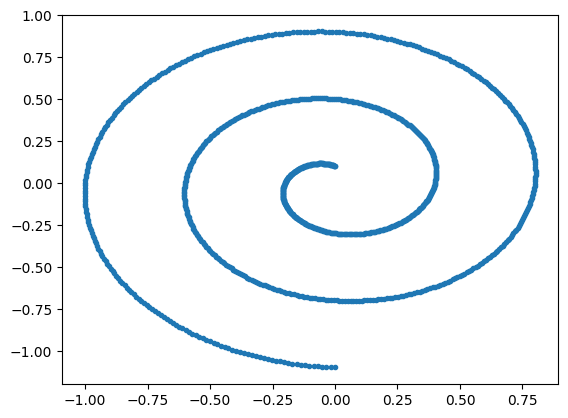{#fig-swiss-raw width=50%}

我们用一个简单的 MLP `MLPVelocity` 来拟合这个时变向量场, 它将作为我们后续进行 finetuning 和 alignment 的 base model (或叫 backbone).

### Pretrain Process

不妨**先用 batch = 1 来思考**, 一个「可训练的条目」里面有三样东西: 

- 一个 $\mathcal{N}(0,I)$ 中的随机点 $x_0$.
- 数据集中的一个随机图片 $x_1$.
- 一个随机时间点 $t$.

想象一个从 $x_0$ 匀速开向 $x_1$ 的车, 这个车在 $t$ 时刻的位置 $x_t$ 和速度 $\dot{x}_t$ 为:

$$
\begin{aligned}
x_t &= (1-t) x_0 + t x_1 \\
\dot{x}_t &= x_1 - x_0
\end{aligned}
$$

这里 FM 得思想非常反直觉: 直接让 $(x_t, t)$ 作为输入, $\dot{x}_t$ 作为标签来训练 `MLPVelocity`!

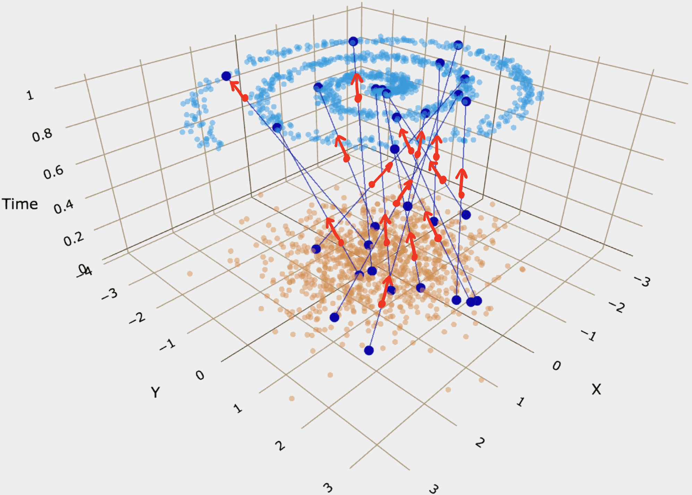{#fig-fm-train width=70%}

乍一看, 点在这样训练出来的向量场中的运动好像是直线. 但是由于随机配对和随机时间的因素, 最后点的运动**不会是直线而是曲线**! 要注意区分一下 training trajectory 和 actual path:

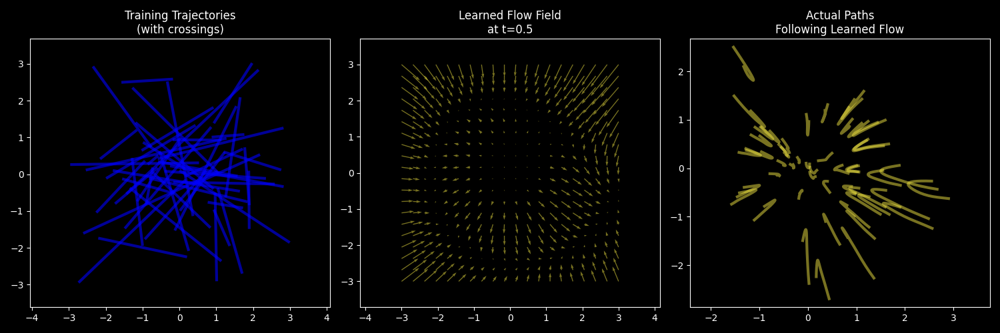{#fig-fm-train-vs-actual width=90%}

### Pretrain Result

由于我们的数据集不大, 所以每个 epoch 只有一个 batch (整个数据集), 训练了 15000 个 epoch:

::: {layout = "[50,50]"}
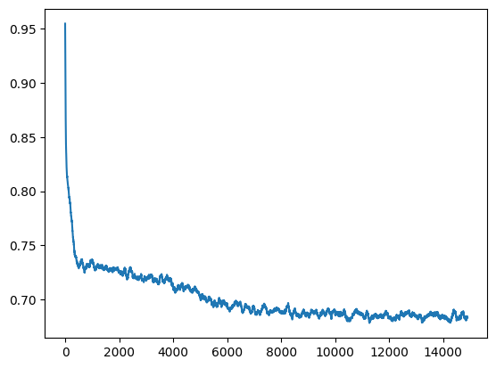{#fig-pretrain-loss}

{#fig-pretrain-gif}
:::


## Finetuning (FT)

我们已经实现了噪声到有意义图片的 FM 模型. 现在我们的目标是提示词生成对应的图片. 这一般需要大量的 text-image pair 数据集来进行监督学习, 但是 text 怎么送到神经网络里面呢? 一个很自然的想法是先用一个预训练的文本编码器 (比如 CLIP 的文本编码器) 将文本编码成一个向量, 然后把这个向量「用某种方法」送到神经网络里面去.

在这个简化的例子中, 我们把一段提示词简化成一个 0-8 的 class label (8 代表没有提示词), 然后自己随便定义一个 label-image pair 数据集, 它长这样:

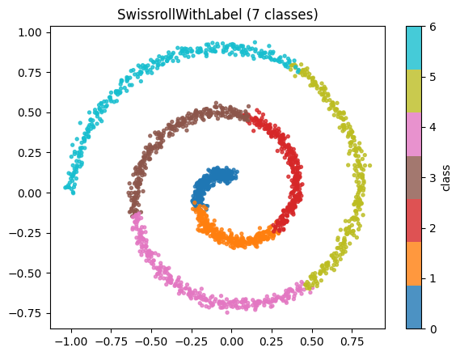{#fig-swiss-label width=50%}

 然后用一个 Embedding 层 `CondEmbedderLabel` 将这个 class label 升维到一个长度为 4 的向量, 怎么做呢? 可以用 `nn.Embedding(8,4)` **随机**生成一个 embedding LUT (即一个 $8 \times 4$ 的矩阵), 然后用 class label 作为 index 从这个 LUT 里取出对应的向量, 注意这个 LUT 在反向传播的时候是会被更新的 (可以想想为什么 LUT 也可以更新), 即这个 embedding 是可学习的. 用代码写出来是:

```python
class CondEmbedderLabel(nn.Module):
    """Embed discrete class labels into continuous vectors.

    Labels in [0, num_classes) are valid class labels.
    Label = num_classes is the unconditional (null) label.
    During training, labels are randomly replaced with the null label
    at rate ``dropout_prob`` to enable classifier-free guidance.
    """

    def __init__(self, cond_dim: int, num_classes: int, dropout_prob: float = 0.1) -> None:
        super().__init__()
        self.embeddings = nn.Embedding(num_classes + 1, cond_dim)
        self.null_cond = num_classes
        self.dropout_prob = dropout_prob

    def forward(self, labels: torch.Tensor) -> torch.Tensor:
        if self.training:
            drop_ids = torch.rand(labels.shape[0], device=labels.device) < self.dropout_prob
            labels = torch.where(drop_ids, self.null_cond, labels)
        return self.embeddings(labels)
```

这里我们加了一点点小 trick, 就是一个带标签的输入进来, 会有默认 0.1 的概率被替换为无条件标签. 这样在训练过程中模型就会同时见到带条件的输入和不带条件的输入, 让模型学会**在没有条件输入的情况下也能生成有意义的输出**.

最后我们将 `CondEmbedderLabel` 的输出直接用 MLP 连接到 backbone 网络的第一层上, 连接的地方 **weights 和 bias 全初始化为 0** (@fig-controlnet 红色部分), 剩余的参数直接拷贝预训练网络的参数 (因为其它部分跟 `MLPVelocity` 网络结构一模一样), 这样就保证了在**训练初期**这个 ControlNet 不会对 backbone 的输出产生任何影响. 随着训练的进行, 网络中的权重语义会**混合在一起**变成一个**端到端**的模型 `ConditionalMLPVelocity`.

如果讲得 fancier 一点, 其实这里我们借鉴了 ControlNet @zhang2023addingconditionalcontroltexttoimage 的思路, 但是叫什么不重要.

{#fig-controlnet width=80%}

然后一个「可训练的条目」里面也是有三样东西:

- 一个 $\mathcal{N}(0,I)$ 中的随机点 $x_0$.
- 数据集中的一个随机的 image-label pair $(x_1, c)$.
- 一个随机时间点 $t$.

训练过程跟预训练几乎一样, 只是现在输入到网络里面的除了 $x_t$ 和 $t$ 以外还有 class label $c$ 的 embedding.

这个 `ConditionalMLPVelocity` 也是在 $\mathbb{R}^2$ 上定义了一个时变的 vector field, 或者说一个 ODE, 任何一个点 (初始条件) 都可以顺着它演化到另一个点. 当然不同的 class label 会影响这个 ODE 动力学, 使得 $t=1$ 的时候的点落在不同的区域.

### FT Result

{#fig-finetune-colored}

### Dropout 对 Sampling 的影响

观察 @fig-finetune-colored 会发现 unconditional 的最终分布并不是一个比较理想的 spiral, 这是因为 dropout 设置过低, 造成模型对 unconditional 的数据见得太少了, 导致它在 unconditional 的时候的表现不够好. 你可以把 dropout 调高一点, 比如调到 0.5, 就会发现 unconditional 的分布变得更像 spiral 了, 但是 conditional 的分布就变得更差了, 这是一个 trade-off, 见 @fig-ft-dropout. 


::: {#fig-ft-dropout layout-ncol=2}
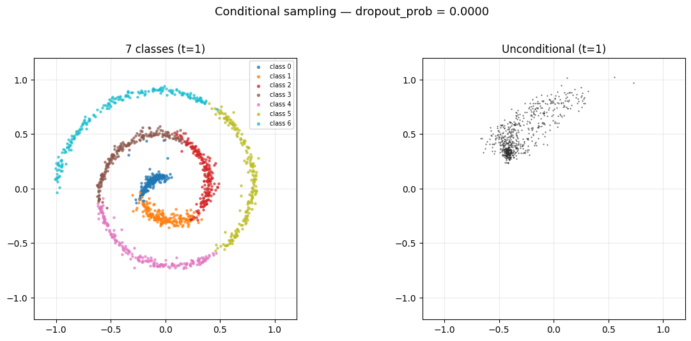{#fig-ft-dropout00}

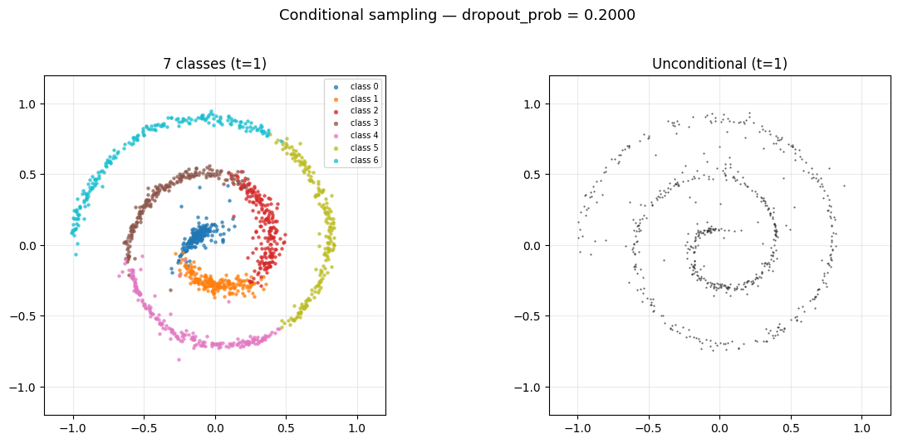{#fig-ft-dropout02}

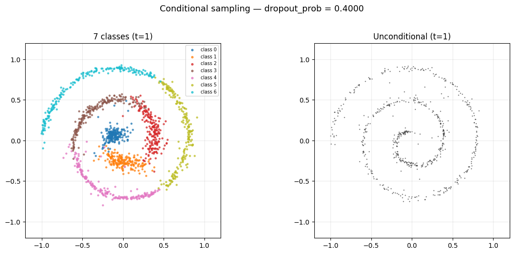{#fig-ft-dropout04}

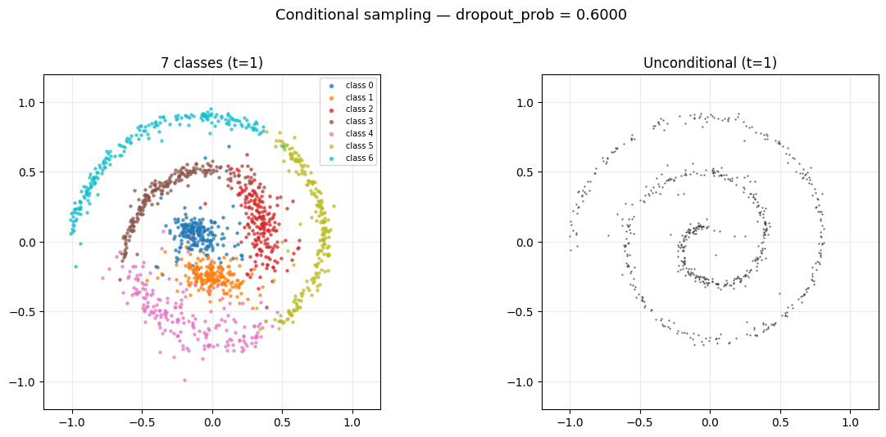{#fig-ft-dropout06}

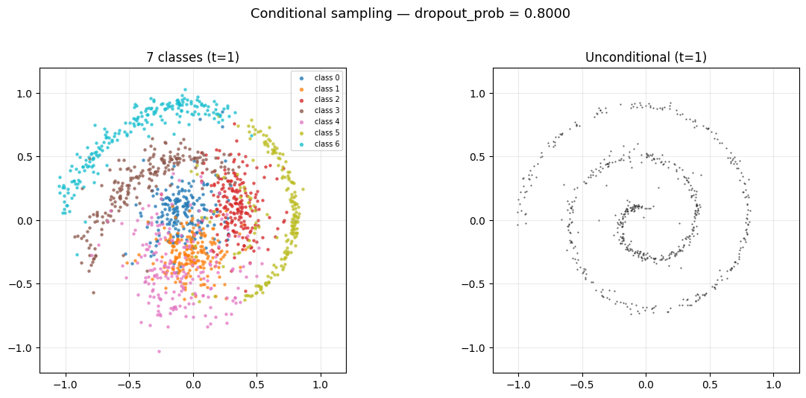{#fig-ft-dropout08}

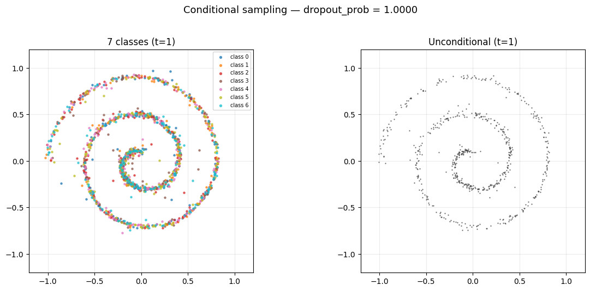{#fig-ft-dropout10}

conditional 和 unconditional 的分布在不同 dropout 下是 trade-off 关系.
:::

## Alignment

得到 conditional FM model `ConditionalMLPVelocity` 之后, 我们的目标是让它的输出图片 (2D 点) 的「质量」更高 (称为 **alignment** 对齐人类美学). 我们定义了一个 reward function `Reward2D` $r(x)$ 来衡量输出点的质量 (@fig-reward-function), 黄色区域表示质量较高, 蓝色区域表示质量较低. 

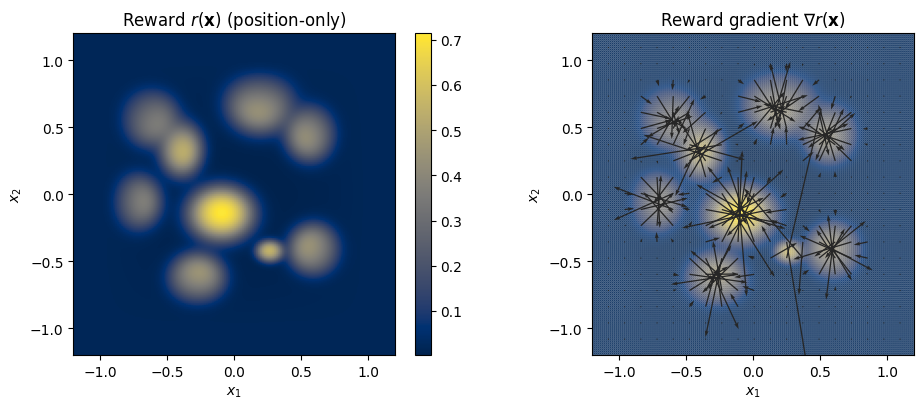{#fig-reward-function width=80%}

当然实际上 Image Space 中并不存在这样一个 reward function, 怎么办呢? 

- 一种办法是让人类打分, 比如构建出数据集 `(image, human_score)`.
    - 但是由于我们无法穷尽所有的图片, 永远存在有没有被打分的图片, 而 **align 一个 model 必须要具备对任意图片进行评价的能力**. 于是我们可以用这个 (image, human_score) 数据集来训练一个网络, 称为 **Reward Model (RM)**, 让它学会对任意图片进行打分, 这样就间接地得到了一个可以对任意图片进行评价的网络, 相当于一个无穷大的数据集 `(image, ai_score)`.
    - 但是比如「8 分」在不同的人眼里可能有完全不同的理解! 所以我们这样做:
    
- **让人类只给出一些「相对」的评价**, 比如「这个图片比那个图片更好」, 而不是「这个图片的质量是 8 分」.
    - 这样我们就可以构建一个数据集 `(image1, image2, human_prefer)`, `human_prefer` 表示这个 labeler 更喜欢 `image1` 还是 `image2`. 然后再用某些 RLHF 的方法训练一个 RM (还是要训练! 只不过训练方法不一样).
        
        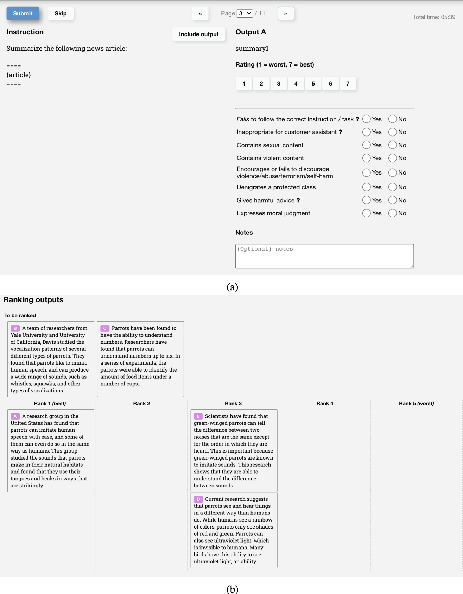{#fig-rank-ui width=80%}

扯远了, 反正我们在这个 toy example 里直接把 reward model 写死了, `Reward2D` 输入一个 2D 点, 输出一个标量 reward. 目标就是让 `ConditionalMLPVelocity` 的输出点的 reward 尽可能高. 一个很自然的想法是**将 reward 加入 Loss 函数里面**, 然后继续用 FT 的方法训练 `ConditionalMLPVelocity`. 

但是仔细思考一下 FT 的训练过程, 我们**并没有跑任何一个完整的 trajectory 来反向传播**, 而是通过随机的时间点采样和随机配对来训练, 只有 $t=1$ 的输入点才会真正地受到 reward 的影响 (这几乎没有!). 所以这 Loss 等于没加. 是不是考虑下换个训练思路?

> 说实话笔者写到这里的时候没想出一个自然的引入 RL 的方法, 姑且用「让我们换个思路」圆过去吧嘻嘻 o(≧v≦)o

让我们换个思路, 不过我们其实还有一个隐性的要求, 就是 **align 出来的模型不要跟原先的模型差太远** (now this requirement seems weird, 我们只是需要一个端到端生成的模型, 能生成就好了, 为什么要求它跟原先的模型差不多呢? anyway, 不管了), 如何度量这个差异? 不妨**别在 $v_{\text{base}}$ 上直接改**, 而是让它保持不变, 设计一个新的 residual vector field $\tilde{v}_\theta$ 来 align.

我们已经有 base model `ConditionalMLPVelocity` $v_{\text{base}} (x,t \mid c)$ ($c$ 是 class label), 以及写死的 reward model `Reward2D` $r(x)$. 我们想找一个控制信号 $\tilde{v}_\theta (x,t \mid c)$, 可以想象成温迪 E 技能制造的额外的时变风场 (residual vector field), 一个点在某时刻的速度是 $v_{\text{base}}$ 和 $\tilde{v}_\theta$ 的叠加:

$$
\dot{x} := v_{\text{base}} + \tilde{v}_\theta
$${#eq-total-field}

**$\dot{x}$ 在 @liu2025vggflow 也写成 $v_\theta$. 注意 @eq-total-field 是定义式!** 在 Control Theory 中相当于我们构造了一个物理系统 $f$, 使得 state velocity **恰好等于**控制信号 $\tilde{v}_\theta$ 加一个跟 $x$ 有关的向量 $v_{\text{base}}$, 非线性正来源于 $v_{\text{base}}$ 对 $x$ 的非线性依赖.

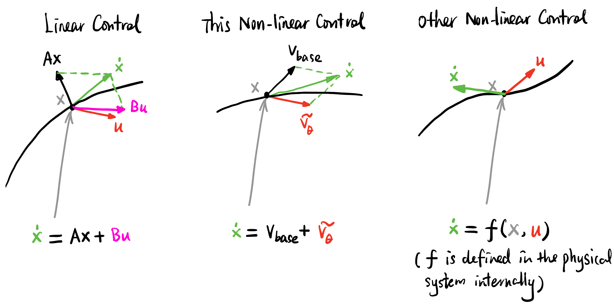{#fig-control-theory-reminder width=90%}


我们希望这个风场 $\tilde{v}_\theta$ 能在演化结束时获得的 reward 更高. 但是! 也不希望这股风太大, 具体来说就是可以将 $\|\tilde{v}_\theta\|^2$ 也加入 Loss 函数中, 来限制风场的大小.

值得一提的是, 这里所有涉及到的量都是确定的 (但是是时变的), 而且是 ODE, 没有任何随机性因素! 初始点固定了, base dynamics $v_{\text{base}}$ 固定, $\tilde{v}_\theta$ 也固定, 这个点的未来也是确定的 (有点机械论的悲观 ¯\\\_(ツ)\_/¯). 想象一下, 每给出一种风场 $\tilde{v}_\theta$, 从 $x$ 出发一路积分 Loss, 加上最后的 terminal reward, 得到一个数, 这个值被定义为 State Value $V(x,0)$, 

$$
V^{\tilde{v}_\theta} := \int_0^1 \|\tilde{v}_\theta(x,t \mid c)\|^2 \mathrm{d}t - r(x(1))
$$

当然 @liu2025vggflow 文中给前者加了一个系数来平衡两者的权重:

$$
V^{\tilde{v}_\theta} := \frac{\lambda}{2} \int_0^1 \|\tilde{v}_\theta(x,t \mid c)\|^2 \mathrm{d}t - r(x(1))
$${#eq-value}

它越小越好[^value]! 我们要求的就是:

$$
\arg \min_{\tilde{v}_\theta} \{V^{\tilde{v}_\theta}\}
$$

[^value]: 稍微提一下, 这里 MDP 的 state value 是未来 **reward** 的 sum (确切来说, 是 expected, discounted sum), 而 HJB 里的 value 是未来 **loss** 的 sum, 前者要最大化, 后者要最小化 (有点 confusing).


$V^{\tilde{v}_\theta}$ 本身会满足一个 PDE, 叫做 HJB 方程:

$$
-\frac{\partial V}{\partial t} = L + \langle \nabla V, \dot{x} \rangle
$$

其中:

$$
\begin{aligned}
L &= \frac{\lambda}{2} \|\tilde{v}_\theta\|^2 \\
\dot{x} &= v_{\text{base}} + \tilde{v}_\theta
\end{aligned}
$$

假设我们已经找到了最优的 $\tilde{v}_\theta^*$, 它对应的 $V^*$ 会满足 Optimal HJB 方程:

$$
\begin{aligned}
-\frac{\partial V^*}{\partial t} &= \min_{\tilde{v}_\theta} \left\{ L + \langle \nabla V^*, \dot{x} \rangle \right\} \\
&= \min_{\tilde{v}_\theta} \left\{ \frac{\lambda}{2} \|\tilde{v}_\theta\|^2 + \langle \nabla V^*, v_{\text{base}} + \tilde{v}_\theta \rangle \right\}
\end{aligned}
$${#eq-optimal-hjb}

@eq-optimal-hjb RHS 中的 $v_{\text{base}}$ 是固定的, 右侧的最小值问题等价于求:

$$
\min_{\tilde{v}_\theta} \left\{ \frac{\lambda}{2} \|\tilde{v}_\theta\|^2 + \langle \nabla V^*, \tilde{v}_\theta \rangle \right\}
$$

这是一个关于 $\tilde{v}_\theta$ 的函数, 不妨记为 $\xi(\tilde{v}_\theta)$, 我们可以通过对 $\xi$ 求**方向导数**来找到最优解 $\tilde{v}_\theta^*$:

$$
\begin{aligned}
\nabla_{\tilde{v}_\theta} \xi &= \lambda \tilde{v}_\theta + \nabla V^* = 0 \\
\implies \tilde{v}_\theta^* &= -\frac{1}{\lambda} \nabla V^*
\end{aligned}
$${#eq-vv}

这说明了什么? **如果我们知道 $V^*$, 它的梯度直接就是最优的风场!** (所以 @liu2025vggflow 叫 VGG, Value Gradient Guidance). 但是 $V^*$ 又满足 Optimal HJB 方程, 我们再把 @eq-vv 代回 @eq-optimal-hjb 就得到了一个关于 $V^*$ 的 PDE!:

$$
\begin{aligned}
-\frac{\partial V^*}{\partial t} &= \frac{\lambda}{2} \left\|-\frac{1}{\lambda} \nabla V^*\right\|^2 - \left\langle \nabla V^*, v_{\text{base}} -\frac{1}{\lambda} \nabla V^* \right\rangle \\
\implies \frac{\partial V^*}{\partial t} &= \frac{1}{2\lambda} \|\nabla V^*\|^2 - \nabla V^* \cdot v_{\text{base}}
\end{aligned}
$$

或者展开来写:

$$
\frac{\partial}{\partial t} V^*(x,t \mid c) = \frac{1}{2\lambda} \|\nabla V^*(x,t \mid c)\|^2 - \nabla V^*(x,t \mid c) \cdot v_{\text{base}}(x,t \mid c)
$${#eq-pde}

这里有很多给定 class label 的 "$\mid c$", 其实不同的 $c$ 就提供了不同的 $v_{\text{base}}$, 也就提供了一连串不同的 PDE, 不用管它, 反正我们训练的时候会随机采样 $c$ 来训练一个网络 $V_\phi$ 来拟合所有的 $V^*$.

Terminal reward 去哪了? 其实它变成了一个边界条件, @eq-value 在 $t=1$ 的时候:

$$
V^*(x,1 \mid c) = -r(x)
$$

i.e.,

$$
\nabla V^*(x,1 \mid c) = -\nabla r(x)
$${#eq-boundary}

有了 [PDE3: PINNs – How Do Neural Networks Solve PDEs? 神经网络如何求解偏微分方程?](../pinn/index.qmd) 的经验, we can't help but to solve this PDE using PINN!

但是初始条件呢? 即 $t=0$ 任意位置 $x$ 的 $V^*$ 是多少? 我们不关心这个问题, 到时候训练的时候随机采样作为 batch 然后平均一下就可以了. (其实这里笔者没太理解)

### Naïve PINN Design

我们先设计一个神经网络 `PINN` 来拟合 $V^*$, 它输入 $(x,t,c)$, 输出一个实数. 损失来源于两个地方: @eq-pde 和 @eq-boundary 的满足情况. 我们可以随机生成很多个 Collocation points $x_i$ 塞进 `PINN`, 但是还要同时输入 $t$ 和 $c$ 神经网络才会吐出值来, 所以直接随机产生一大堆 $t$ 和 $c$ 然后分成 batch 平均掉. 所以 Loss 可以表达为:

$$
\begin{aligned}
L_{\text{PDE}}(\phi) &= \mathbb{E}_{x_0 \sim \mathcal{N}(0,I), t \sim U([0,1]), c \sim U(\mathbb{Z}_7)} \left\| \frac{\partial V}{\partial t} - \frac{1}{2\lambda} \|\nabla V\|^2 + \nabla V \cdot v_\text{base} \right\|^2 \\
L_{\text{boundary}}(\phi) &= \mathbb{E}_{x_0 \sim \mathcal{N}(0,I), t = 1, c \sim U(\mathbb{Z}_7)} \|\nabla V + \nabla r(x_1)\|^2
\end{aligned}
$$

其中 $\phi$ 是 `PINN` 的参数. 总 Loss 就是两者的和:

$$
L_{\text{PINN}} (\phi) = \alpha L_{\text{boundary}}(\phi) + L_{\text{PDE}}(\phi)
$$

Loss 里面 $\partial V / \partial t$ 和 $\nabla V$ 都可以通过 Autograd 来求. $\alpha$ 用来调整边界条件的重要性占比. 理论上我们就已经可以拿到 $V^*$ 了! 

但是训练过就会发现不论将 $\alpha$ 调多大, 训练出来的 $\nabla V^*$ 都接近 0, 也就是学到的风一直为 0. 原因不明, @liu2025vggflow 文中也写到「直接参数化 $V^*$ 不如参数化 $\nabla V^*$ 有效果」, 从而 @liu2025vggflow 选择了对 @eq-pde 两边求梯度, 得到一个比较复杂的 PDE:

$$
\frac{\partial}{\partial t} \nabla V^* = [\nabla \nabla V^*]^T \left(\frac{1}{\lambda} \nabla V^* - v_{\text{base}}\right) - [\nabla v_{\text{base}}]^T \nabla V^*
$$

然后可能用输入为 $(x,t,c)$, 输出一个向量 $\nabla V^*$ 的网络来拟合这个 PDE. 

但是这样代码会有点复杂, 我也没试过, 但是笔者尝试了下面的方案, 效果还不错, 动机和原因就忽略了哈哈, 直接罗列出来:

### Final PINN: Dual-head, Autograd-free, Random Fourier Features

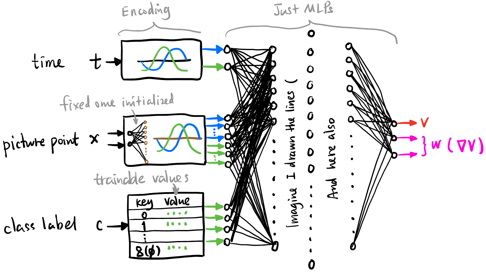{#fig-pinn width=90%}

@fig-pinn 是最终的 `PINN` 设计, 主要有以下几个特点:

#### Dual-head

还是用 @eq-pde 的形式来训练 `PINN`, 输入还是 $(x,t,c)$, 只不过**输出多加一个 head**, 即输出 $(V^*, \nabla V^*)$.

但是神经网络会将 $V^*$ 和 $\nabla V^*$ 看作同地位的输出 (比如 $(V^*, W)$), 而不是一者为另一者的梯度, 所以损失函数里面还要加一项:
$$
L_{\text{consistency}} (\phi) = \|W - \nabla V^*\|^2
$$

注意这里 $\nabla V^*$ 是用 Autograd 求的.

#### Two-stage Training

动机很简单也很 ad hoc: 既然学不到边界条件, 那就先单独训练边界条件, 再用三个 Loss 进行联合训练:

- **Stage 1**: 只开启 Boundary Loss:
    $$
    L_{\text{boundary}}(\phi)
    $$
- **Stage 2**: 三个 Loss 一起训练:
    $$
    L_{\text{PINN}} (\phi) = \alpha_b L_{\text{boundary}}(\phi) + L_{\text{PDE}}(\phi) + \alpha_c L_{\text{consistency}} (\phi)
    $$
    where $\alpha_b=5$, $\alpha_c=0.5$.

#### Autograd-free

不用 Autograd 来求 Loss 中的 $\partial V / \partial t$ 和 $\nabla V$, 而是都用中心差分来近似 (除了 $L_{\text{consistency}}$):
$$
\frac{\partial V}{\partial t} \approx \frac{V(x, t + \epsilon) - V(x, t - \epsilon)}{2\epsilon}
$$
where $\epsilon = 10^{-3}$.

#### Random Fourier Features Encoding (RFF)

由于 `PINN` 设计成了 MLP, **MLP 难以学到高频信号** [@tancik2020fourierfeaturesletnetworks; @sun2024learninghighfrequencyfunctionseasy], 即微小的 $x$ 变化造成的梯度信息难以被捕捉 (是这样诠释吗?).

方案如图 @fig-pinn, 对点的位置采用 RFF 编码: 先将 $x$ 乘上一个随机矩阵升到 64 维, 再模仿 $t$ 的编码方式用 $\sin$ 和 $\cos$ 进行逐点运算再拼接得到 128 维的向量 (64 个蓝色箭头, 64 个绿色箭头).

目前的理解是**直接学习一个信号如何变化, 不如学习这个信号的频谱如何变化来得快**.

### Alignment Result

经过上面的训练, 我们得到了 $\tilde{v}_\theta^*$ 风场, 我们直接将它加到 `ConditionalMLPVelocity` 的输出上, 就得到了一个 align 过后的网络:

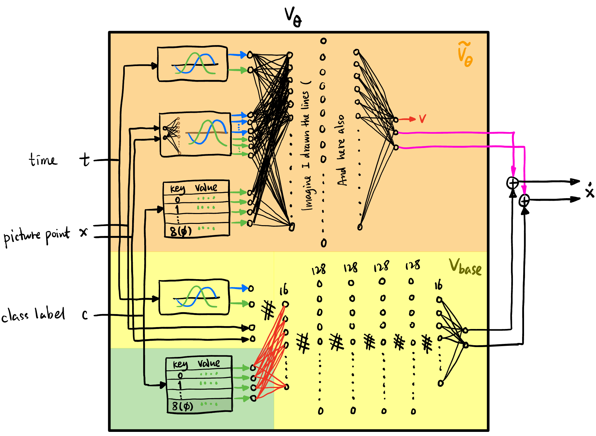{#fig-vtheta-no-distill width=90%}

注意这里跟 @liu2025vggflow 有区别, @liu2025vggflow 相当于还对 @fig-vtheta-no-distill 的知识 distill 到了 $v_{\text{base}}$ 里面 (而不是直接两个网络的输出相加). 但是我们这里就不蒸馏了哈哈哈.

用同一批噪声分别经过 align 过后的网络和未 align 的网络, 可以得到两批点的分布, 我们计算在每种 class 下 final 分布的平均 reward. 由 @fig-alignment-result 可以看到, align 过后 final 点的平均 reward 在所有 class label 下 (包括 unconditional) 都有了提升, 说明 `PINN` 成功学到了人类的审美.

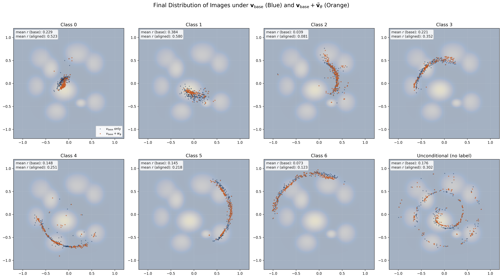{#fig-alignment-result}

来欣赏一下动画吧!

{#fig-alignment-result-jet}

{#fig-alignment-result-jet2}

我突然发现所有的这种 diffusion 出来的时变向量场都会在 $t$ 接近 $1$ 的时候发生类似「相变」的现象, 何意味?

## Conclusion and Future Work

我们用一个简单的 2D toy example 实现了下面技术的基本流程:

- FM 的 pretrain, finetune 和 alignment.
- 如何用 ControlNet 的思想将条件信息注入预训练的模型中.
- 如何用人类偏好和 RL 建模来对模型进行 alignment.
- 如果用 Collocation points 训练 PINN 时总是收敛到平凡解或 boundary condition 的 loss 总是不收敛该怎么办? (Dual-head, two-stage training, autograd-free, RFF, etc.)

此实验的局限性包括: 

- 没有在实际的图像空间中进行训练.
    - 这个空间过大, 比如可能需要用其它的方法注入信息 (参考 Stable Diffusion 3 的 Unet 如何注入文本信息和 $t$), 或者在 latent space 中进行 diffusion.
- 没有训练一个真正的 reward model 来进行 alignment, 而是直接把 reward function 写死了.
- 没有对 align 过后的模型进行 distillation, 直接让它们的输出相加了.

若有兴趣, 可以研究:

- 最后出来的 ODE 有一个类似「相变」的现象, 原因是什么? 感觉 diffusion 的信息量都集中在最后 $t$ 接近 1 的时候.
- 真实图片空间的维度过大, 能不能想出一种将这种空间可视化的方法 (尽量 faithful)?
- 不要在 Euclidean space 上进行扩散? 比如加入可学习的曲率或 metric.


## Unifying Control Theory, RL and Lagrangian / Hamiltonian Mechanics {.appendix}

控制论、马尔可夫决策过程、HJB 方程、拉格朗日量、哈密顿量、广义动量、强化学习 和本文的 residual field 等可以在下面的统一框架下进行理解:

:::{.column-page-inset-right}
| MDP (马尔可夫决策过程) | HJB (哈密顿-雅可比-贝尔曼方程) | 拉格朗日/哈密顿力学 | VGG-Flow |
|-----|-----|-----|-----|
| State $$s(t)$$ | State $$x(t)$$ | State $$q(t)$$ | Image $$x(t)$$ |
| Policy (Probabilistic) $$\pi(a\|s)$$ | Control (Deterministic) $$u(x,t)$$ | Velocity $$\dot{q}(q,t)$$ | Residual Field $$\tilde{v}_\theta(x,t)$$ |
| Environment (Stationary) $$\begin{cases} p: (s,a) &\mapsto s' \\ r: (s,a) &\mapsto \text{Reward}\end{cases}$$ | Dynamics (Time-varying) $$\begin{cases} f: (x,u,t) &\mapsto \dot{x} \\ L: (x,u,t) &\mapsto \text{Loss} \end{cases}$$ | Dynamics (Time-varying) $$\begin{cases} f: (q, \_, t) &\mapsto \dot{q} \\ \mathcal{L}: (q, \dot{q}, t) &\mapsto \text{Lagrangian} \end{cases}$$ | Dynamics (Time-varying) $$\begin{cases} v_\theta: (x, \tilde{v}_\theta, t) &\mapsto \dot{x} \\ L: (x, \tilde{v}_\theta, t) &\mapsto \text{Loss} \end{cases}$$ |
| State Value (Given $\pi$) $$V(s) = \mathbb{E}(\underbrace{\Sigma r}_{\mathclap{\scriptsize \text{discounted reward}}})$$ | Value (Given $u$) $$V(x,t) = \int_t^T L \mathrm{d}\tau + \underbrace{\Phi(x(T))}_{\mathclap{\scriptsize \text{terminal loss}}}$$ | Action (Given $\dot{q}$) $$S(q,t) = \int_t^T \mathcal{L} \mathrm{d}\tau$$ | Value (Given $\tilde{v}_\theta$) $$V(x,t) = \int_t^1 L \mathrm{d}\tau - \underbrace{r(x(1))}_{\mathclap{\scriptsize \text{terminal reward}}}$$ |
| State-action Quality $$q(s,a)$$ | Quality Density $$H(x,\nabla V,t) = L + \langle \nabla V, \dot{x} \rangle$$ | Hamiltonian $$\mathcal{H}(q, \nabla S, t) = \mathcal{L} + \langle \underbrace{\nabla S}_{\mathclap{\scriptsize \text{momenta } p}} \cdot \dot{q} \rangle$$ | Quality Density $$H(x, \nabla V, t) = L + \langle \nabla V, \dot{x} \rangle$$ |
| Bellman Eq (Given $\pi$) $$\begin{cases} V &= \langle q_i \rangle \\ q_i &= \langle r_j + \gamma V_k \rangle \end{cases}$$ | HJB Eq (Given $u$) $$-\frac{\partial V}{\partial t} = L + \langle \nabla V, \dot{x} \rangle \quad (= H)$$ | HJ Eq (Given $\dot{q}$) $$-\frac{\partial S}{\partial t} = \mathcal{H}$$ | HJB Eq (Given $\tilde{v}_\theta$) $$-\frac{\partial V}{\partial t} = L + \langle \nabla V, \dot{x} \rangle \quad (= H)$$ |
| Optimal Bellman (For deterministic $\pi^*$) $$\begin{cases} V^* &= \max_i q_i \equiv q^* \\ q^* &= \langle r_j + \gamma V'^* \rangle \end{cases}$$ | Optimal HJB $$-\frac{\partial V^*}{\partial t} = \min_u \left\{ L + \langle \nabla V^*, \dot{x} \rangle \right\}$$ | - | Optimal HJB $$-\frac{\partial V^*}{\partial t} = \min_{\tilde{v}_\theta} \left\{ L + \langle \nabla V^*, \dot{x} \rangle \right\}$$ |
:::

