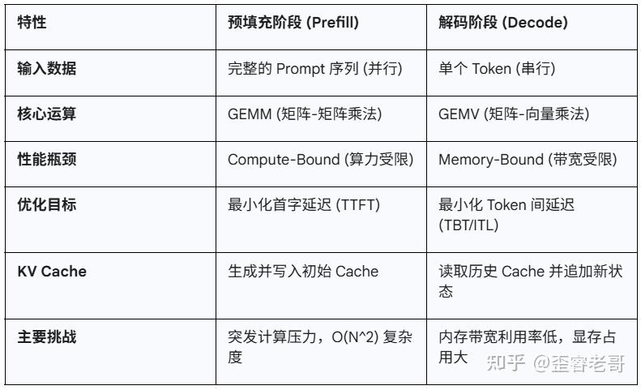

- MHA, MQA, GQA, KV Cache

- **Prefill 预填充**: Inference 中生成第一个 token 前的计算.

- **Decode 解码**: Inference 中生成除第一个 token 后的计算.

{#fig-prefill-decode width=80%}

- **KV Cache**: 在推理过程中将计算出的每个 token 的 K 和 V 存到
    - 只能用于 Decoder-Only 的 Transformer.

- FlashAttention

