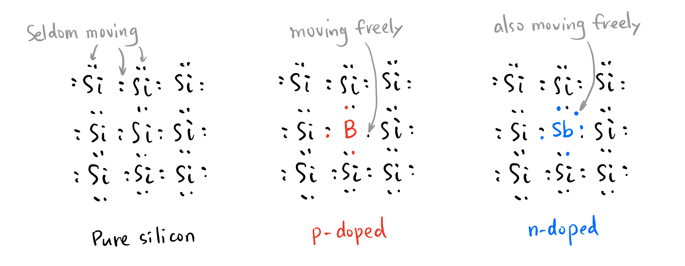

## Takeaways {.unnumbered}

## Motivation

Having studied the basic circuit components like resistors, capacitors, inductors, and ideal DC, AC voltage and current sources, we already have the following skills:

- Transient analysis (time domain) of RLC circuits.
- Steady state analysis (phasor domain) of RLC circuits[^phasor].

[^phasor]: We invent the idea of a **phasor** to represent the sinusoidal steady state of a circuit. It is based on the fact that the signal space of sinusoidal waves $\text{Sine}$ is isomorphic to the complex line: $$\text{Sine} \simeq \mathbb{C}.$$ We also generalize the concepts of *resistance* to complex field called **impedance**, it's also compatible with *capacitance* and *inductance*.

However, these components are not capable of the tasks like this (shown in @fig-RLC-limitation):

{width=90% #fig-RLC-limitation}

In the language of math, the component RLC spans a subspace of the requirement space:
$$
\text{span } \{R, L, C, \cdots\} \subset \text{Requirement Space}.
$$

{width=90% #fig-RLC-basis}

We need more basis to span larger, such as **diode**, **BJT**, **FET**, to be able to do more things. We reach out to nature because

> Nature's imagination is so much greater than man's.
> -- Richard Feynman

## Diode

### P type and N type Doping

The electrons are bounded in the covalent bond inside pure silicon, so pure silicon is poor conductor. But if we mix some other atoms (e.g., B, Sb, etc., called **dopant**) into it (e.g., through high temperature to form chemical bond, called (P or N type) **doping**[^doping-types]), it suddenly becomes a good conductor[^semiconductor]. Why? Because they both somehow introduce **free charges**[^holes] into the silicon crystal (Stare at @fig-doping for a moment to understand):

{#fig-doping}

[^doping-types]: P for *positive*, N for *negative*. 

[^semiconductor]: Well ..., actually a **semiconductor**. I don't want to confuse you, but their conductivity is actually good in the circuit, so no problem for them to be considered as *conductor*.

[^holes]: I'm avoiding using *holes* to explain conductivity, because it's negatively charged particles that conducts electricity both in P and N type doping.

<!-- ----------------------------------------- -->
::: {.callout-note icon=true collapse=true}
Doping introduces free charges, but the material itself is still *neutral*! They don't carry net charges.
:::
<!-- ----------------------------------------- -->

### P-N Junction

When we put P and N type silicon together, there is an intrinsic attraction[^why-donation] from the P side to pull electrons from the N side. Electrons drift from N to P, making the P side slightly negative charged and the N side slightly positive charged[^charged]. While the electrons are drifting, they start to form a electric field. When this field balances the intrinsic attraction, the drift stops.

[^why-donation]: This force is due to the *strong tendency to form chemical bonds*. The reason why P/N silicon conducts current is different! P lacks electrons, making some electrons from Si single to be free (they are thirsty for electrons to form a stable bond!). N literally has surplus electrons. Due to the physics laws, there exists an intrinsic force on the P side to pull electrons from the N side.

[^charged]: This time they do carry net charges! It's amazing for two neutral materials to carry charges spontaneously, right? If we were to measure the potential of the two sides, N side is more positive because of lossing electrons.

The consequence is that there is a region that is depleted of free charges, called **depletion region**. 

### Forward Bias and Reverse Bias

What if we apply a voltage across the P-N junction?

#### Forward Bias