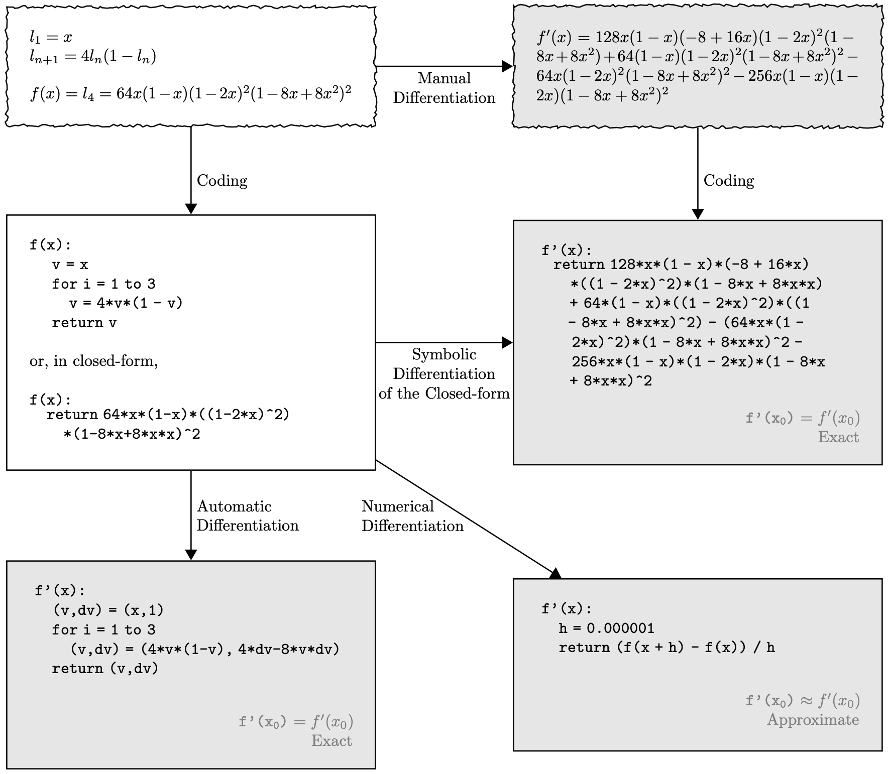
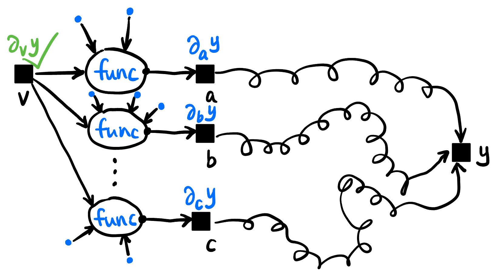
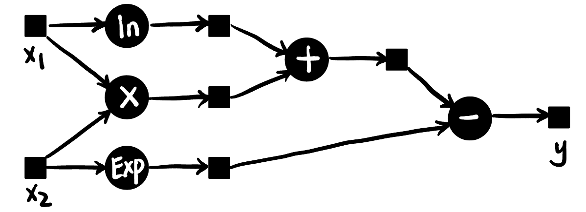
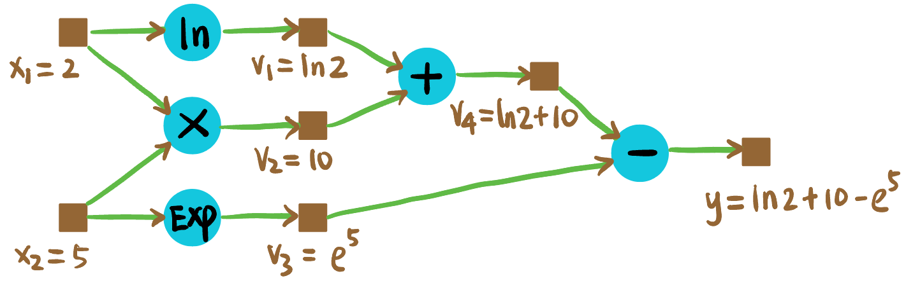
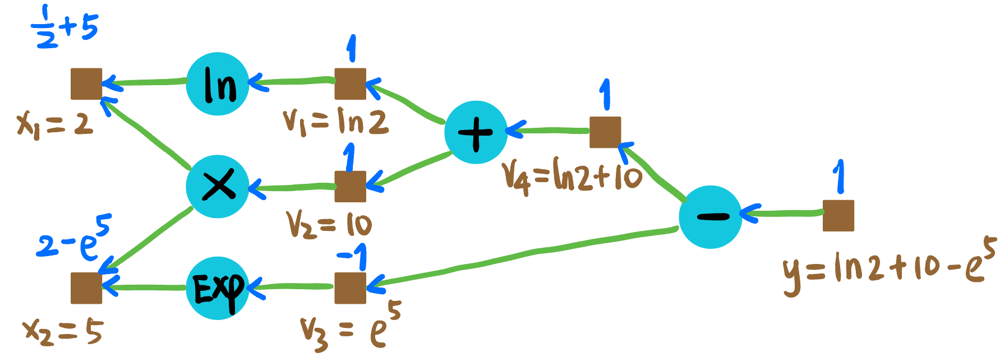
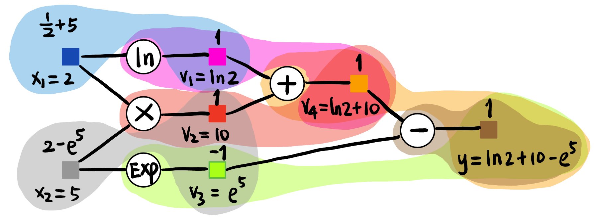
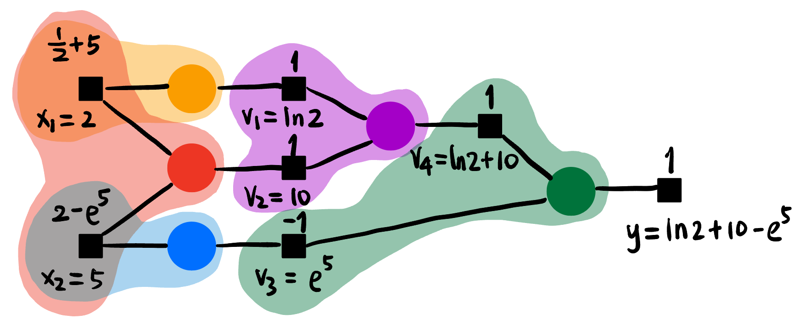

### Motivation

- 如何在计算机中进行微分?
    - **Manual Differentiation**: 人工推导导数公式, 然后写进代码.
    - **Symbolic Differentiation**: 计算机符号化地推导导数公式, 然后生成代码 (Mathematica 就是这么干的)
    - **Numerical Differentiation**: 用数值方法近似地计算导数.
    - **Automatic Differentiation**: 通过链式法则和计算图, 自动地计算导数.

        {#fig-diff-computer width=90%}


- 放在 ML 的场景下, 一个神经网络可能有几十亿的参数, 每个参数都要求梯度, 手动推导不可能完成! 符号化推导也会导致表达式爆炸, 数值方法精度又不够好. 但是神经网络的函数不是随意的函数, 它是**高度算子化和分层的**. 我们希望导数的信息能自动沿着计算的路径 (**Computational Graph**) 反向传播!
    - 用「传播」这个词是因为神经网络是高度分层的结构, 数据之间有明显的依赖关系 (partially-ordered).
    - 用「自动」这个词是因为我们希望一句 `loss.backward()` 就能像遍历一个树一样完成所有的梯度计算.
    - 而且我们希望在程序看来每个梯度计算都是「局部」的, 运行的函数并不知道自己在传播一个大计算图.
        - 这个理论基础是 **Chain Rule 链式法则**! 我们这样解读链式法则: 要求 $y$ 关于变量 $v$ 的导数, 只要知道下面三类信息 (在 @fig-chain-rule 标为蓝色):
            - $v$ 参与了**哪些算子的运算**;
            - 这些**算子的输出** (当然每个算子只有一个) **分别对 $y$ 的导数**;
            - 这些算子的**其它输入的值**.

            {#fig-chain-rule width=80%}


<!-- ----------------------------------------- -->
::: {.callout-note icon=true collapse=false}
## EXAMPLE: A scalar computational graph

考虑式子 @deep_thoughts_2021_derive:
$$
y := \ln x_1 + x_1 x_2 - e^{x_2}
$${#eq-example}

可以由以下图表示:

{#fig-example-plain width=70%}

我们希望计算 $y$ 关于 $x_1, x_2$ 在 $(x_1, x_2) = (2, 5)$ 处的梯度.

- **Forward propagation**: 首先进行前向传播, 目的是计算出中间变量的数值 (为什么要算呢, 因为链式法则需要知道中间变量的值!):

    {#fig-ex-forward width=70%}

- **Backward propagation**: 如 @fig-ex-backward, 蓝色数值代表 $y$ 对该节点的导数.

    {#fig-ex-backward width=70%}

可知:

$$
\begin{aligned}
\partial_{x_1} y &= 5.5 \\
\partial_{x_2} y &= -146.4
\end{aligned}
$$

:::
<!-- ----------------------------------------- -->


### Minimal Implementation

我们将 @fig-ex-forward 的棕色方块建模为 `Tensor` 类, 青色圆形建模为算子比如 `Add`. 这是 autograd 重点关注的两个结构. 现在我们实现 @eq-example 的 autograd 库 (只实现了必要的算子, adapted from @eduardoleito_2024_documented). **主要关注 `Tensor` 类的 `backward()` 方法和各个算子的 `backward()` 方法的相互调用!**


```{.python filename="mytorch/tensor.py" #lst-tensorpy}

```

写一个测试程序:

```{.python filename="tensor-backward.py" #lst-tensor-backwardpy}

```

运行结果:

```bash
loss = [-137.72001192]
x1.grad = [5.5]
x2.grad = [-146.41316]
```

{#fig-tensor width=80%}

{#fig-operator width=80%}
