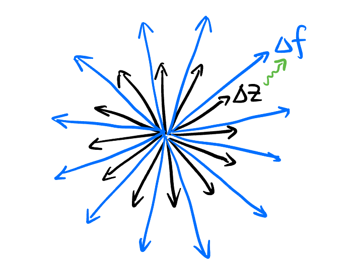

## Takeaways {.unnumbered}

## Hi!

This is my crash course on complex analysis without analysis and complex stuff. I will try to bring you the most beautiful and fascinating things about complex analysis **in the most intuitive sense**.

I'm sure you are already familiar with the addition, multiplication of complex numbers, maybe you are not yet familiar with computing the following expression or even don't think they make sense:
$$
i^i, \log(-1), \sin(2i)
$$

## Complex Field $\mathbb{C}$

### How to invent new math

Now I bet you feel a bit uncomfortable and at least not very freely using complex numbers. But you definitely feel comfortable using negative numbers, right? **Why is that?**

Why do you think something that squares to $-1$ is more weird than something that add $1$ to $0$? Let's rewind to the time to only positive numbers existed. Nothing is more *natural* and *inevitable* than positive numbers, because they represent the number of things when we count in an abstract way. Nothing is real life corresponds to the number $1$, but everything *can* be represented by $1$ when taken as a whole. However, what is exactly "$1$" is not so clear. Everyone just use that from our instinct.

Naturally, in our daily experience like counting or trading, we start to do operations on (positive) numbers. At first, we add numbers together. But sometimes, we accidentally add too much, so we need to subtract. Sometimes, there is too much to add, so we begin to multiply things. Inevitably, we also need to divide things. 

...

### Arithmetic from Real to Complex

## Complex Functions

## Differentiablility and Holomorphic Functions

### Differentiating Complex Functions

For a function $f: \mathbb{R}\to \mathbb{R}$, its derivative at a point $x_0 \in \mathbb{R}$ is the ratio of the change in $f$ when we nudge a little bit from $x_0$ to $x_0 + \Delta x$:
$$
\left. \frac{\mathrm{d}f}{\mathrm{d}x} \right|_{x_0} \approx 
\frac{f(x_0 + \Delta x) - f(x_0)}{\Delta x}.
$$

When we try to write similar thing for complex functions $f: \mathbb{C} \to \mathbb{C}$:
$$
\left. \frac{\mathrm{d}f}{\mathrm{d}z} \right|_{z_0} \approx
\frac{f(z_0 + \Delta z) - f(z_0)}{\Delta z}.
$${#eq-complex-derivative}
Remember both the numerator and denominator in @eq-complex-derivative is a complex number. This ratio may depend on the direction of $\Delta z$ in the complex plane, so maybe $\mathrm{d}f/\mathrm{d}z$ is not well-defined. But in some case (actually in most cases), we find that the limit is *independent* of the direction of $\Delta z$ we choose! In other words, the limit is the same no matter how we approach $z_0$ in the complex plane! Functions like this are called **differentiable** (or **holomorphic**, **analytic**) at $z_0$.

Recall the geometric meaning of the ratio between two complex numbers, $\mathrm{d}f/\mathrm{d}z = \text{const}$ means:

1. The ratio of the lengths of $\Delta f$ and $\Delta z$ is a constant (denoted $A$).
2. The angle between $\Delta f$ and $\Delta z$ is a constant (denoted $\theta$).

We if we plot all possible $\Delta z$ to form a pattern, the resulting pattern of $\Delta f$ will be *similar* to that pattern:

{width=50% #fig-plotting-dz-df}

That means the map from the neighborhood of $z_0$ to $f(z_0)$ is not only linear, but also like a *rotation* and *scaling* of the original pattern. If we regard $f(z)$ as a function from $\mathbb{R}^2 \to \mathbb{R}^2$:
$$
f: (x, y) \mapsto (g(x, y), h(x, y)).
$$

Neighborhood transformation is depicted by the jacobian. The jacobian of $f$ at $z_0 = (x_0, y_0)$:
$$
[J]|_{z_0} =
\begin{pmatrix} 
f_x & f_y \\ 
g_x & g_y \\
\end{pmatrix}
$$
should represent a rotation and scaling. We know all the rotation and scaling matrix have the form:
$$
\begin{pmatrix}
a & -b \\
b & a \\
\end{pmatrix}
$$
where $a, b \in \mathbb{R}$. Therefore, we have[^partial-derivative]:
$$
\boxed{
\begin{cases} f_x = g_y \\ f_y + g_x = 0. \end{cases}
}
$${#eq-cr}

[^partial-derivative]: The notation $f_x$ means $\frac{\partial f}{\partial x}$, and $g_y$ means $\frac{\partial g}{\partial y}$.

This is the **Cauchy-Riemann (CR) equations** that the real and imaginary part of a holomorphic function must satisfy. Any function $f, g: \mathbb{R}^2 \to \mathbb{R}$ satisfying the CR equations are called a **harmonic conjugate** pair.

### Residue Theorem

- **Laurent series**: A complex function $f(z)$ can be expressed as a series:
$$
\begin{aligned}
f(z) &= \sum_{n=-\infty}^{\infty} a_n (z-z_0)^n \\
&= \cdots + \frac{a_{-2}}{(z-z_0)^2} + \frac{\overbrace{a_{-1}}^{\text{Residue}}}{(z-z_0)} + a_0 + a_1(z-z_0) + a_2(z-z_0)^2 + \cdots
\end{aligned}
$$

if it is **holomorphic** on the annulus $A = \{z \in \mathbb{C} : r_1 < |z-z_0| < r_2\}$.

- The complex integral of $f(z)$ around a closed loop $C$ depends only on its *residue*s within the loop:
$$
\oint_C f(z) dz = 2 \pi i \sum_{k=1}^n \text{Res}(f, z_k),
$${#eq-residue}
where $z_k$ are the singularities of $f(z)$ inside $C$.

- Special case of @eq-residue: if $f(z)$ is **holomorphic** in $U \supset C$, then:
$$
\oint_C f(z) dz = 0.
$${eq-residue-0}

### Polya Vector Field and Complex Integration

- The real and imaginary part of the result of the complex integration of $f(z)$ along a path $\gamma$ are the *flow* and *flux* of a certain vector field, called the **Polya vector field**:
$$
\text{Polya}(f(z)) = \bar{f}(z),
$$
$$
\int_\gamma f(z) dz = \text{Flow}(\bar{f}) + i \text{Flux}(\bar{f}).
$$

- When $f(z)$ is holomorphic, its Polya vector field is a **potential flow** (i.e., steady, incompressible, irrotational flow):

