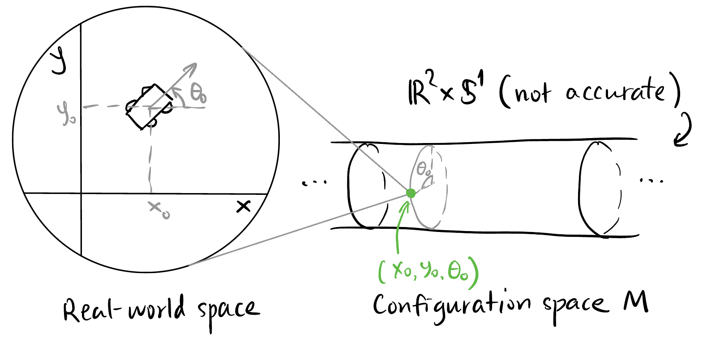

## Takeaway

- Configuration & Phase Space -- Mathematicians like to *gather* all things together to form a set and add additional structure to it to form a space.

## Welcome

## Configuration Space and Phase Space

### What is control?

Control is to manipulate the behavior of a system in a way that we want. Now what is the behavior of a system? Let's say we want to control the movement of a car. From a mathematician's point of view, we want to get a bird's-eye view of the positions of the car, i.e., we want to actually see where the configuration of the car is in a big big map, which contains all the possible configuration of the car.

In order to specify the position and orientation of the car, we need to give three numbers: $x$, $y$, and $\theta$. We call there are three *degrees of freedom* of the car. We construct an abstract space $M$ to collect all such triples $(x, y, \theta)$ called the *configuration space*[^configuration], as shown in @fig-configuration-space.

[^configuration]: The configuration space is **totally different** from the physical space where the car is! It is mathematical object in the back of our mind. In fact, it is a *manifold* (a generalization of a curved surface).

{#fig-configuration-space}

Is $M$ a 3-D space? Yes, but it is not Euclidean. In fact, it is $\mathbb{R}^2 \times \mathbb{S}^1$. This space cannot be drawn accurately in 3-D space, but we can imagine it like @fig-configuration-space.