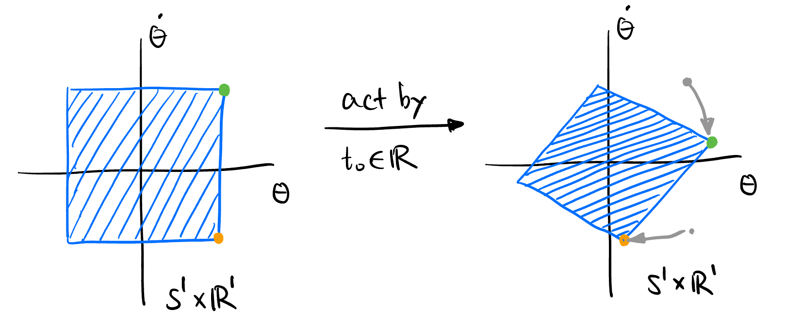

## Takeaway {.unnumbered}

- Configuration & Phase Space -- Mathematicians like to *gather* all things together to form a set and add additional structure to it to form a space.

- Dynamical System -- Just a monoid acts on a space.

## Welcome

## Configuration Space and Phase Space

### Autonomous system

In order to control a system, it's good idea to first understand and analyze the behavior of the system without any external influences. This is called the *autonomous system*.

Is there a systematic way to analyze a system, say the behavior of a simple pendulum, or the 

### Configuration space

**What is control?** Control is to manipulate the behavior of a system in the way that we want. **What is the behavior of a system?** Let's say we want to control the movement of a car. From a mathematician's point of view, we want to get a bird's-eye view of the positions of the car, i.e., we want to actually see where the configuration of the car is in a big big map, which contains all the possible configuration of the car.

In order to specify the position and orientation of the car, we need to give three numbers: $x$, $y$, and $\theta$. We call there are three *degrees of freedom* of the car. We construct an abstract space $M$ to collect all such triples $(x, y, \theta)$ called the *configuration space*[^configuration], as shown in @fig-configuration-space.

[^configuration]: The configuration space is **totally different** from the physical space where the car is! It is mathematical object in the back of our mind. In fact, it is a *manifold* (a generalization of a curved surface). Also called **"state space"**. The tuple $(q_1, q_2, q_3) \equiv (x, y, \theta)$ is also called the **generalized coordinates** of the system (usually in analytical mechanics). 

{#fig-configuration-space}

Is $M$ a 3-D space? Yes, but it is not Euclidean. In fact, it is $\mathbb{R}^2 \times \mathbb{S}^1$. This space cannot be drawn accurately in 3-D space, but we can imagine it like @fig-configuration-space.

### Phase space

A point in the configuration space $M$ does not totally determine the future behavior of the system. For example in @fig-configuration-space, if we know the configuration of the car is $(1, 2, 45^\circ)$, we still have no idea where is it moving. We may need the concept of "state" to serves as a "initial condition" to be able to predict the future behavior of the system:

<!-- ----------------------------------------- -->
::: {.callout-tip icon=false}
## State
::: {#def-state .callout-def}
The *state* of a dynamical system is a collection of variables that completely characterizes its future motion. The *phase space* (*state space*) is the set[^phase-space] of all possible states.
:::
:::
<!-- ----------------------------------------- -->

[^phase-space]: with some extra structures such as a smooth manifold.

It turns out that in order to determine the future behavior of a system, we also need to know -- and only know the time derivative of each coordinate (*without any higher-order derivatives*[^higher-order].)

[^higher-order]: This is a deep result in both mechanics and differential geometry. I convinced myself by the fact that **Newtonian and Lagrangian Mechanics Are Second-Order Theories**, and all second order ODEs can be reduced to first-order ODEs, which only includes $q$ and $\dot{q}$.

If we pick a point in the phase space and let it go, the point will draw a curve in the phase space. This curve is unique[^Mechanical]! This is like the fact that the solution of an ODE is unique when the initial condition is specified. In the language of phase space, the trajectory of the state point is unique, we call the *evolution* of the system with time. We will work mainly in phase space in the study of dynamical systems.

[^Mechanical]: This is called *Mechanical Determinism* in philosophy. It is a belief that if we know the precise initial conditions of all particles in the universe, the future is completely determined. The world is a **autonomous system**, its state is just a curve in a phase space of crazily large dimension. The dynamics of the universe is completely certain. The birth, love and death are independent of man's own will, we just need to sit and wait for everything to happen. The development of quantum mechanics challenge this.

[^predictable]: Certain $\neq$ Predictable. e.g., a chaos system is certain but unpredictable.

### Example: Simple Pendulum

Let's consider the phase space of a simple pendulum, as shown in @fig-simple-pendulum. 

{#fig-simple-pendulum}

As shown in @fig-simple-pendulum, the state of a simple pendulum is the angle $\theta$ and the angular velocity $\dot{\theta}$. The state point[^state-point] $x \in \mathbb{S}^1 \times \mathbb{R}^1$. 

[^state-point]: Some authors use the term *state vector* $\mathbf{x}$ because it can be viewed as a tangent vector to the configuration manifold.

## Dynamical System

{#fig-dynamical-system}

In engineering, you are dealing with dynamical systems all the time without realizing it. A dynamical system describes how the state of a system (circuit, robot, fluid flow, etc.) evolves over time. It is often given in the following forms:

1. **System of Differential Equation**
2. **Transfer Function**[^transfer-function]
3. **State Space Representation**

[^transfer-function]: In electrical engineering, we often use something like $\boxed{\frac{1}{s+1}}$ or $\boxed{z^{-1}}$ to describe the relationship between the input and output of a system in a certain domain (Laplace or Z domain). 

We will pay special attention to the **state space representation** as it is the easiest to visualize and most interesting one to me.

In the most abstract sense, a **dynamical system** is nothing but three things:

- $X$: The phase space of the system.
- $T$: A monoid of time ($\mathbb{R}$ (continuous system), $\mathbb{Z}$ (discrete system), or $\mathbb{N}$ (discrete system with no negative time)).
- $\phi$: Evolution function (a monoid action of $T$ on $X$). 

<!-- ----------------------------------------- -->
::: {.callout-tip icon=false}
## Dynamical System
::: {#def-dynamical-system .callout-def}
A *Dynamical System* is a tuple $(X, T, \phi)$ where $T$ is any monoid, $X$ is any non-empty set, and $\phi$ is a monoid action of $T$ on $X$, i.e., 
$$
\phi: T \times X \to X
$$
such that 
$$
\begin{equation}
    \begin{cases}
        \phi(e_T, x) = x & \forall x \in X, \\
        \phi(t_1 + t_2, x) = \phi(t_1, \phi(t_2, x)) & \forall t_1, t_2 \in T, \forall x \in X,
    \end{cases}
\end{equation}
$$
where $e_T$ is the identity of $T$.
:::
:::
<!-- ----------------------------------------- -->

<!-- ----------------------------------------- -->
::: {.callout-note icon=true collapse=true}
## Structures on $X$
Usually the set $X$ have some extra structures. For example, a phase space has symplectic structure. $\phi$ should also be *preserving* the structure, i.e.,
$$
\phi(t) \in \text{End}(X).
$$
There are many subfield of mathematics that study the dynamical system of a particular structure. For example,

- **Ergodic Theory**: $X$ is a measure space, $\phi$ is a measure-preserving transformation.
- **Topological Dynamics**: $X$ is a topological space, $\phi$ is a homeomorphism.
- **Differential Dynamics**: $X$ is a smooth manifold, $\phi$ is a diffeomorphism.

:::
<!-- ----------------------------------------- -->

In the example of a simple pendulum, the dynamical system is $(\mathbb{S}^1 \times \mathbb{R}^1, \mathbb{R}, \phi)$, where $\phi$ is hard to write down, but it exists:

{#fig-action}

These are some special cases of dynamical systems that you may already know:

- [**Markov Chain**](https://en.wikipedia.org/wiki/Markov_chain#Index_of_primitivity)[^markov-chain]

- [**Automata**](https://en.wikipedia.org/wiki/Automata_theory#Formal_definition)
    - [**Finite State Machine**](https://en.wikipedia.org/wiki/Finite-state_machine#Mathematical_model)
    - [**Hybrid Automata**](https://en.wikipedia.org/wiki/Hybrid_automaton#Formal_definition)
    - [**Cellular Automata**](https://en.wikipedia.org/wiki/Cellular_automaton)

[^markov-chain]: $X = \Sigma^\mathbb{N}$ is a probability space, $T = \mathbb{N}$, $\phi$ is a shift operator that is measuring preserving.

## Hybrid Automaton

A hybrid automaton is a system that exhibits different *continuous* behavior in different *discrete* states. 

<!-- ----------------------------------------- -->
::: {.callout-tip icon=false}
## Hybrid Automaton
::: {#def-hybrid-system .callout-def}
A hybrid automaton 
:::
:::
<!-- ----------------------------------------- -->

For example,

1. **Bouncing Ball**: 