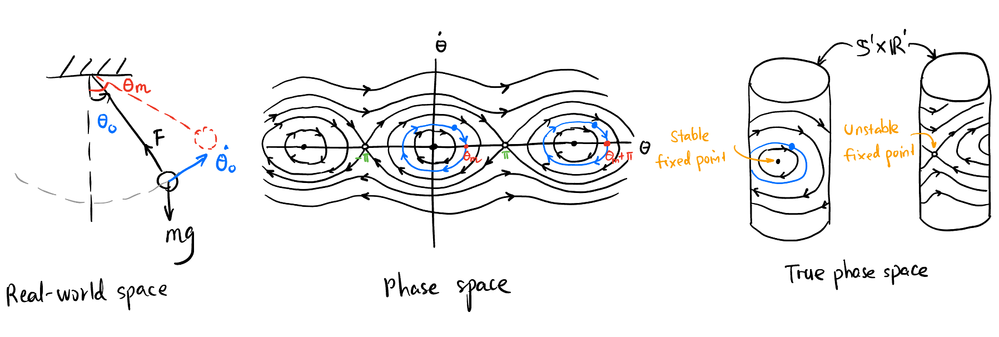

## Takeaway

- Configuration & Phase Space -- Mathematicians like to *gather* all things together to form a set and add additional structure to it to form a space.

## Welcome

## Configuration Space and Phase Space

### Autonomous system

In order to control a system, it's good idea to first understand and analyze the behavior of the system without any external influences. This is called the *autonomous system*.

Is there a systematic way to analyze a system, say the behavior of a simple pendulum, or the 

### What is control?

Control is to manipulate the behavior of a system in a way that we want. Now what is the behavior of a system? Let's say we want to control the movement of a car. From a mathematician's point of view, we want to get a bird's-eye view of the positions of the car, i.e., we want to actually see where the configuration of the car is in a big big map, which contains all the possible configuration of the car.

In order to specify the position and orientation of the car, we need to give three numbers: $x$, $y$, and $\theta$. We call there are three *degrees of freedom* of the car. We construct an abstract space $M$ to collect all such triples $(x, y, \theta)$ called the *configuration space*[^configuration], as shown in @fig-configuration-space.

[^configuration]: The configuration space is **totally different** from the physical space where the car is! It is mathematical object in the back of our mind. In fact, it is a *manifold* (a generalization of a curved surface).

{#fig-configuration-space}

Is $M$ a 3-D space? Yes, but it is not Euclidean. In fact, it is $\mathbb{R}^2 \times \mathbb{S}^1$. This space cannot be drawn accurately in 3-D space, but we can imagine it like @fig-configuration-space.

### State space

<!-- ----------------------------------------- -->
::: {.callout-tip icon=false}
## State
::: {#def-state .callout-def}
The *state* of a dynamical system is a collection of variables that completely characterizes its future motion. The *state space* (*phase space*) is the set[^state-space] of all possible states.
:::
:::
<!-- ----------------------------------------- -->

[^state-space]: with some extra structures such as a smooth manifold.

If we pick a point in the phase space and let it go, the point will draw a curve in the phase space. This curve is unique[^Mechanical]! This is like the fact that the solution of an ODE is unique when the initial condition is specified. In the language of phase space, the trajectory of the state point is unique, we call the *evolution* of the system with time.

[^Mechanical]: This is called *Mechanical Determinism* in philosophy. It is a belief that if we know the precise initial conditions of all particles in the universe, the future is completely determined. The world is a **autonomous system**, its state is just a curve in a phase space of crazily large dimension. The dynamics of the universe is completely certain. The birth, love and death are independent of man's own will, we just need to sit and wait for everything to happen. The development of quantum mechanics challenge this.

[^predictable]: Certain $\neq$ Predictable. e.g., a chaos system is certain but unpredictable.

### Example: Simple Pendulum

Let's consider a simple pendulum, as shown in @fig-simple-pendulum. 

{#fig-simple-pendulum}

As shown in @fig-simple-pendulum, the state of a simple pendulum is the angle $\theta$ and the angular velocity $\dot{\theta}$. The state vector $\mathbf{x} \in \mathbb{S}^1 \times \mathbb{R}^1$. 

