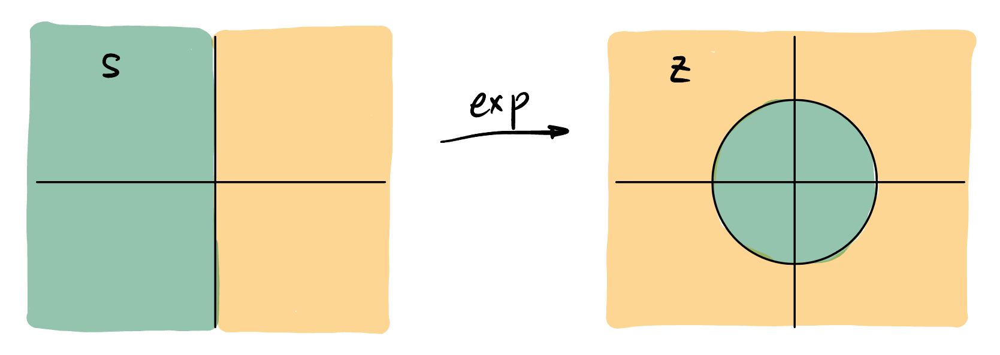
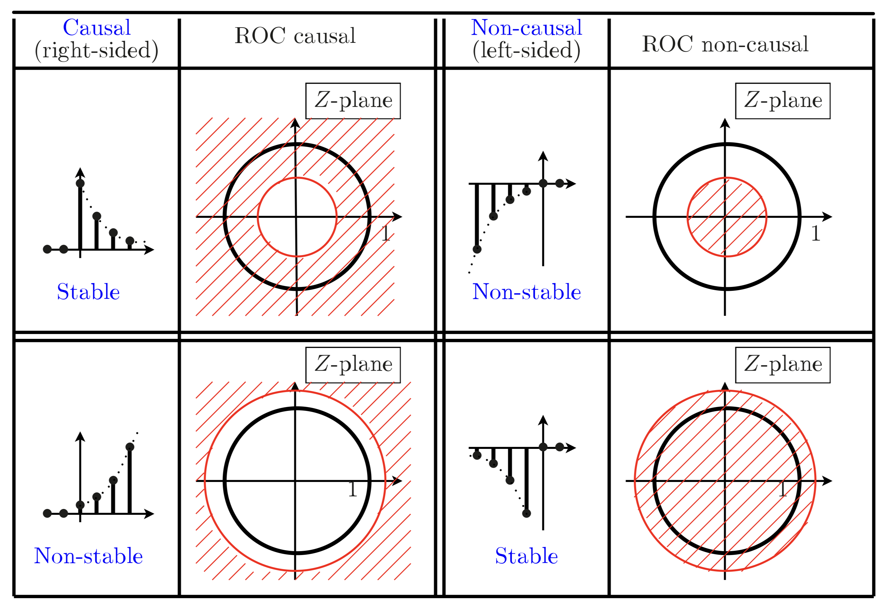

> 本笔记是本人电子科技大学格院大三《数字信号处理》课程的期末考试复习笔记, 遵循个人学习习惯与轨迹, 不保证严谨性和绝对正确性.

## FFT 快速傅里叶变换

## Fourier Transform 傅里叶变换

## Complex Analysis Basics 复变函数基础

## $\mathcal{Z}$ 变换, $\mathcal{L}$ 变换

在傅立叶分析中我们用 **线性空间和内积** 的思维框架来处理信号, 但是在 $\mathcal{Z}$ 变换和 $\mathcal{L}$ 变换中, 一般用 **级数** 来思考.

- **$\mathcal{Z}$-Transform**: 我们可以将每一个离散时间信号 $x[n]$ 都对应一个复变函数 $X(z)$:
    $$
    X(z) := \sum_{n=-\infty}^{+\infty} x[n] z^{-n}.
    $${#eq-z-transform}
    即将 $x[n]$ 作为一个 Laurent 级数的系数. 称 $X(z)$ 为 $x[n]$ 的 **$\mathcal{Z}$ 变换**. 

	- 使 @eq-z-transform 收敛的 $z$ 的集合称为 **ROC (收敛域)**.
	- 任何一个复变函数[^any] $X(z)$ 在单位圆上的取值即为 其 Laurent 级数的系数 Fourier 变换的结果.
	- 由对偶性知: 任何一个复变函数 $X(z)$ 在单位圆上取值的 Fourier 变换的结果即为 其 Laurent 级数的系数.
    
[^any]: 这个复变函数应该在包含单位圆的一个 Annulus 上解析 (holomorphic).

- **$\mathcal{L}$-Transform**: 多一个对数映射, 单位圆变成了虚轴: $$ X(s) := \int_{-\infty}^{+\infty} x(t) e^{-st} dt. $${#eq-l-transform}

	- 使 @eq-l-transform 收敛的 $s$ 的集合称为 **ROC (收敛域)**.
	- $X(s)$ 在虚轴上的取值即为 $x(t)$ 的 Fourier 变换的结果.

	

<figure>
  <iframe width="748" height="388" 
          src="https://www.youtube.com/embed/EuZv229Yf54" 
          title="Visualizing Euler's formula" 
          frameborder="0" 
          allow="accelerometer; autoplay; clipboard-write; encrypted-media; gyroscope; picture-in-picture; web-share" 
          referrerpolicy="strict-origin-when-cross-origin" 
          allowfullscreen>
  </iframe>
  <figcaption style="text-align:center">
    指数函数的 Mental picture
  </figcaption>
</figure>

```{ojs}
//| code-fold: true
import {PlotContext, ComplexVariable, DomainColoringLayer, glslFunctionMapping} from "39fe342decb60c30"

viewof expr = Inputs.text({
  label: "Function f(z)=",
  value: "(z-0.5)*(z+0.7)/((z+0.4*i)*(z-0.4*i))",
  placeholder: "e.g. (z-i)/(z+1)"
})

domainColoringConfig = ({
  phaseColoring: 1,
  phaseShading: 0,
  magnitudeShading: 0
})

plot = PlotContext({
  yrange: [-1.2, 1.2],
  width: width,
  height: Math.max(400, Math.floor(width * 0.8))
})

plot([DomainColoringLayer(expr, "z", domainColoringConfig)])
```

### ROC (Region of Convergence) 收敛域

- 关键信息:
	- **包不包含单位圆**: 包含 -> BIBO Stable
	- **向外还是向内**: 
		- 外 -> Right-sided
		- 内 -> Left-sided
		- 环 -> Finite-length
	- Causal 是 Right-sided 的特例, 仅看 ROC 不能判断 causal.


- $s$ 平面**右侧** 和 $z$ 平面**圆外** 为 原信号乘上**衰减**的指数信号后 Fourier 变换的结果.

- $s$ 平面**左侧** 和 $z$ 平面**圆内** 为 原信号乘上**增长**的指数信号后 Fourier 变换的结果.

- **ROC 的边界一定有 pole! ROC 的内部一定不包含 pole!**

	

## Transfer Function 的分类

### Time 时间上

- FIR
- IIR

### Freq 频域上

- 幅度 $|H|$: 
	- 理想: Passband, Stopband
	- **BR (Bounded Real)**: 因果、稳定、实系数系统, $|H| \leq 1$, 由 Parseval's 定理知: 能量减少 $\implies$ **Passive structure**.
	- **LBR (lossless BR)**: 因果、稳定、实系数系统, $|H| = 1$. 能量无损耗.
	- **All pass 全通**: 仅仅 $|H| = 1, \forall \omega$.

- 相位 $\angle H$:

	- **Group Delay 群延迟**: $\omega$ 的频率成分通过系统后延迟了多少秒. 反过来思考, 我们知道延迟 $\tau$ 会导致不同的频点有**不同**的相位变化 (乘了 $e^{-j\omega \tau}$), 相位变化为 $-\omega \tau$. 那对于一般的系统, 在频点 $\omega$ 的相位变化就是 $\angle H(\omega)$, 如何从中获取 $\tau$? $$ \tau_g (\omega) = - \frac{\mathrm{d} (-\omega \tau)}{\mathrm{d} \omega} = \frac{\mathrm{d} \angle H(\omega)}{\mathrm{d} \omega}. $$
	- **Zero-Phase 零相位系统**: $H \in \mathbb{R}$ 且 $|H| \ge 0$. **注意幅值也要非负!** 对因果系统不存在??
	- **Linear-Phase 线性相位系统**: 就是时域延迟系统 (群延迟为常数), i.e., 波通过系统后在 $\omega$ 频点上的相位变化 $\propto \omega$, 正比系数就是 $\tau$, 表现为信号延迟了 $\tau$ 秒.
	- **Minimum Phase 最小相位系统**: $H$ 的 zeros 都在单位圆内.
	- **Maximum Phase 最大相位系统**: $H$ 的 zeros 都在单位圆外.
	- **Mixed Phase 混合相位系统**: $H$ 的 zeros 在单位圆内外都有.


## Digital Filter 数字滤波器

- **dB 分贝**: 人类的构造决定了感知物理量 (声音、光强等) 是对数的, 我们引入 **dB 分贝**: $$ (-) \quad 10 \lg |H|^2. $$

	- $10$ 表示 **d**, 平方表示功率.
	- 放大 $-0.1 \text{ dB}$ 也称 **attenuate $0.1 \text{ dB}$**, 包含负号.

### Characteristics 数字滤波器指标

以 LPF 为例, 关键参数:

- **Tolerance 容差**: $\delta_p, \delta_s$.
- **Edge Frequency 边界频率**: $\omega_p, \omega_s$.
	- 若不在 $[0, \pi]$ 内, 则需要 **数字归一化**: $\omega_p = 2\pi \frac{F_p}{F_{\text{sample}}}.$

:::{#note-normalization .callout-note}
## Example
Let the specified passband and stopband edge frequencies of a digital highpass filter operating at a sampling rate of $25 \text{ kHz}$ be $7 \text{ kHz}$ and $3 \text{ kHz}$, respectively. We determine the corresponding band edge frequencies of the *digital filter*:
$$
\omega_p = \frac{2\pi (7 \times 10^3)}{25 \times 10^3} = 0.56\pi, \quad
\omega_s = \frac{2\pi (3 \times 10^3)}{25 \times 10^3} = 0.24\pi.
$$
:::

- **Peak Passband Ripple 峰值通带波纹**: $\boxed{\alpha_p = -20 \lg (1- \delta_p)}$, 越小越好.
- **Minimum Stopband Attenuation 最小阻带衰减**: $\boxed{\alpha_s = -20 \lg \delta_s}$, 越大越好.

	