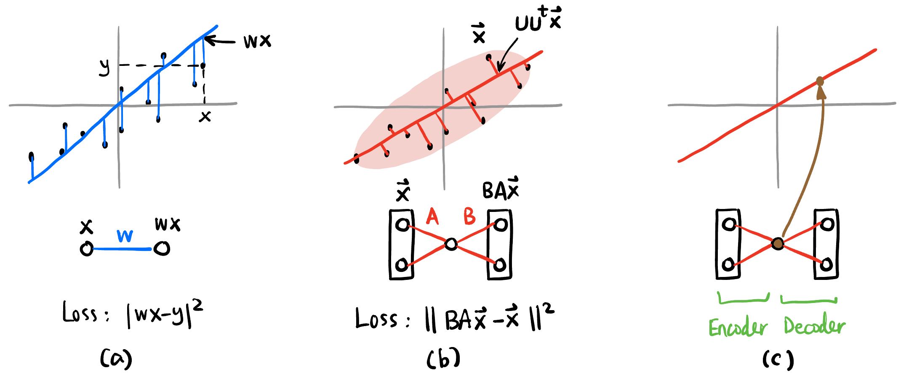
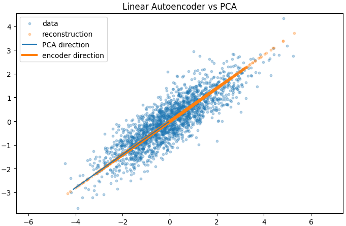
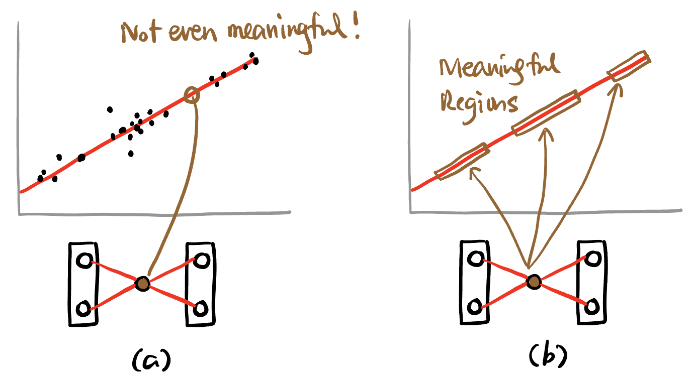
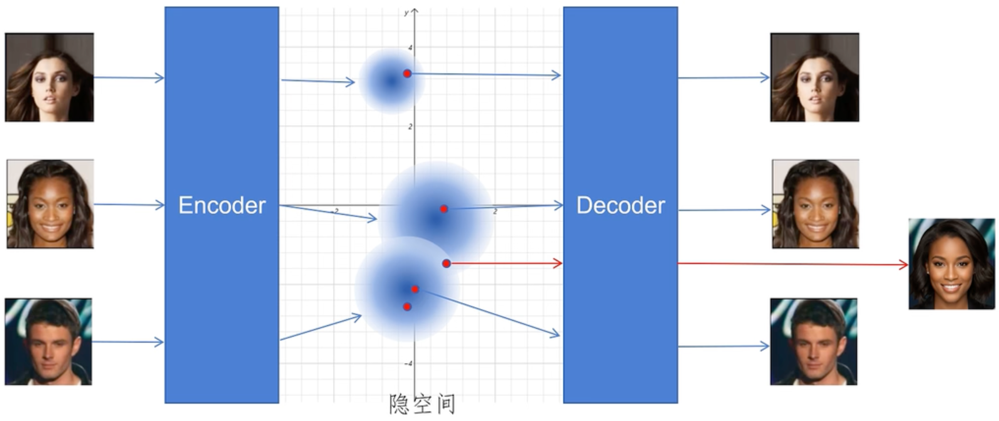
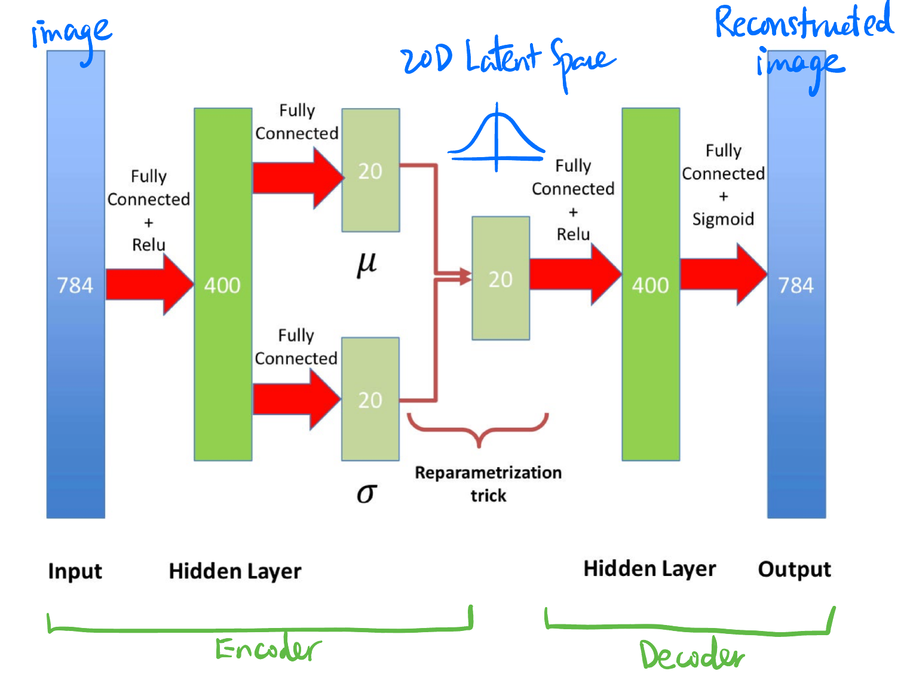
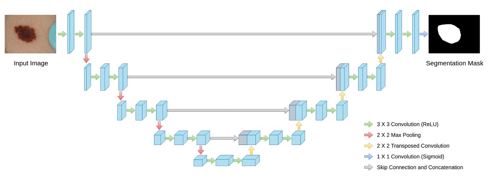

## Auto-Encoder

### PCA

- **PCA 原问题描述**: 设有一大堆 $d$ 维的数据点 $\{x_1, x_2, \ldots, x_n\}$ ($x_i \in \mathbb{R}^d$), 我们想找到一个 $k$ 维的子空间 ($k < d$), 使得数据点在这个子空间上的投影能最大程度地保留原数据的方差.
    - 可以用投影矩阵 $P = UU^t$ 作用在 $x$ 上得到点 $UU^t x$ (见 @fig-pca-vs-linear-regression), 目标就是最小化: $$\sum_{i=1}^n \|x_i - UU^t x_i\|^2$$ 其中 $U$ 是一个 $d \times k$ 的矩阵且 $U^t U = I$.
    - PCA 和 Linear Regression 的关系: 乍一看有关系, 实则没关系. 感觉它们有关系是因为它们度量 Loss 的方式很像, 但一个是竖直一个是垂直. 而且 Linear Regression 是拟合多变量到实数的线性函数, 而 PCA 直接就是在给高维数据降维.

{#fig-pca-vs-linear-regression width=90%}

- PCA 相当于**知道**数据是分布在一个**低维的线性子空间上** (而不是复杂的非线性的流形), 比如 @fig-pca-vs-linear-regression 假设原本 $d=2$ 维的数据分布在一个斜着的直线上 ($k=1$). 而且可以用中间那个神经元来生成数据.
    - 如果用 @fig-pca-vs-linear-regression (b) 中的神经网络, 恰好能训练出 PCA 的效果, 虽然还有几个问题我还没解决:
        - 为什么不需要要求 $B=A^t$ 且 $BA=I$ 就能训练? 而且训练出来的结果: 
            $$
            A = \begin{bmatrix}0.4618 &  0.3248 \end{bmatrix},
            B = \begin{bmatrix}1.4487 \\ 1.0189 \end{bmatrix}
            $$
            并不满足 $BA=I$ 和 $B=A^t$. 但是投影是对的:
            
            {#fig-pca width=50%}

### VAE

- 如果没有数据分布的先验的信息, 一般也会假设数据分布在一个低维的流形上 (**低维流形假说**), 注意这是一个假说, 目前我的理解是比如你随机在 image space 中挑一个图片, 基本上都是没有意义的图片, 可能图片子集在 image space 中的测度为 0, 而子流形的测度也为 0, 所以就**猜测**数据分布在一个低维的流形上 (也可能只是分布地有些稀疏呢, 并不一定是子流形, 所以是假说, 但是这个假说被很多实验加强过.)

- 在 @fig-pca (c) 中, 我们可以**随便选择**一个棕色的数值从而生成一个比较有价值的点. 但是可能会出现 @fig-pca-not-meaningful (a) 这种生成出来的点没有意义的情况, 这是因为 Latent Space 可能只有极少部分区域的点 (或某种特定分布的点) 才能生成有意义的点, 大部分区域的点生成的都是没有意义的点. 

    {#fig-pca-not-meaningful width=50%}

    - 所以现在有两个问题:
        - Latent Space 中的点分布很复杂.
        - Latent Space 中可以生成有意义的图片的点测度很小.
    - VAE 针对这两个问题分别的解决方法是:
        - 在训练时让 Encoder 输出一个**分布 (通常是一个高斯分布) 的参数** $\nu, \sigma$, 然后随机在这个分布中**随机采样**一个点 $z$ 来输入 Decoder (见 @fig-vae-encoder).
            - 这会带来反向传播中断的问题, 解决方法是**重参数化技巧** (reparameterization trick).
                - Omitted.
        - 让 Latent Space 中的点分布尽可能地接近**多元标准正态分布** (将 KL 散度作为 Loss 的一部分来优化).

    {#fig-vae-encoder width=50%}

{#fig-vae width=80%}

### CNN

- 一些问题:
    - 为什么几乎所有的 CNN-based 结构都是空间维度减少、channel 数量增加的?
        - CNN 更关注图片的整体语义, 而不是局部特征的位置信息.
    - Downsampling 能改变空间维度 (而不改变 channel 数量), 作用是什么? 
        - 比如 Maxpooling 保留了与 kernel 非常相似的强 feature 而舍弃了弱 feature.
    - Stride = 1 加 $2\times 2$ Maxpooling 跟 Stride = 2 没有 Pooling 有什么区别?
        - TBD.
    - Upsampling 是怎么工作的?
        - 一种方法是直接将像素分散中间插入 0, 然后再进行卷积 (channel 数量一般会减小, 通过设置 kernel 的数量).

- **U-net**: 就是 CNN, 而且是一个对称的 CNN, 唯一一点不同就是 decoder 的每一层都要将对应的 encoder 的 tensor 原封不动拼接过来 (所以 channel 数量会增加一倍).

    {#fig-unet width=90%}
    - @fig-unet 中黄色的 Transposed Convolution 就是上采样, 只不过一般的上采样是填 0 或直接拷贝附近的值, `nn.ConvTranspose2d()` 可以让**插入的值也可以被训练** (通过 deconvolution 来实现).
    - @fig-unet 中 channel 数量的变化: `[64, 128, 256, 512, 1024]` (左侧的 encoder) 和 `[1024, 512, 256, 128, 64]` (decoder), 每层都翻倍或者减半.
    - Concatenation 的作用是**我们希望在 decoder 的语义信息中加入 encoder 编码过程中的空间信息**.
        - 那为什么是 concatenation 而不是 addition? **因为语义不同, 不是「同一层面上的信息」**.
    - 为什么 U-Net 的 skip connection 要连接 **同一尺度的层** (而不是任意层)?
        - TBD.
    - 一般的 CNN (比如 ResNet) 在提取完特征后通常会接一个全连接层来进行分类或回归，而 U-net 最后没有全连接层 (所以称为 **FCN** (Fully Convolutional Network)), 为什么?
        - 因为 U-net 的用途不一样, 它主要处理输入与输出空间尺寸一样的东西 (比如 image2image 的图像分割问题), 而不是图片分类.
    - 画成 U 的形状纯粹就是为了方便展示对称的结构和画 concatenation 的箭头, 没有任何其它的意义.
    - U-net 经常用于 Diffusion Models, 一般还会在 encoder 和 decoder 中间加 attention 层 (不仅仅是 convolution).

