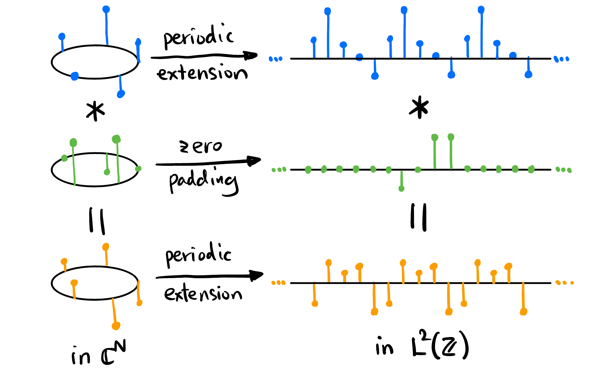

## Takeaway {.unnumbered}

## Introduction 

We will discuss and understand these 4 types of Fourier transforms in engineering in the following sections:

{#fig-fourier-types}

<!-- ----------------------------------------- -->
::: {.callout-note icon=true collapse=true}
## Claim and Convention

**This blog is not a rigorous mathematical treatment of Fourier theory!** 

1. **"Series" and "Transform"**: 
    - Series -- Discrete in frequency domain.
    - Transform -- Continuous in frequency domain.

2. 
:::
<!-- ----------------------------------------- -->

## Structures in Signal Spaces

### Vector space structure

*Signals* are just another name for *functions*. It's natural to collect different types of signals into different sets, and then endow as many structures as possible. One of the most natural structures is *linear structure* -- we view each of the signals as vectors in some vector spaces[^vector-spaces] ($V$ for the general name) over the field $\mathbb{C}$ ($V$ could be $\mathbb{C}^N$, $\mathcal{L}^2(\mathbb{S}^1)$, $\mathcal{L}^2(\mathbb{Z})$, or $\mathcal{S}'(\mathbb{R})$ as shown below). 

| Vector Space (Time)              | Correponding Mapping | Description                                      | Mental Picture[^mental-picture]                             | Transform Type                          | Space after FT (Frequency)               |
|---------------------------|---------------------------------|--------------------------------------------------|---------------------------------------------|----------------------------------|------------------------------|
| $\mathbb{C}^N$           | $\mathbb{Z}/N\mathbb{Z} \to \mathbb{C}$ | Discrete signals on $\mathbb{S}^1$[^s1]        |  | DTFS   | $\mathbb{C}^N$             |
| $\mathcal{L}^2(\mathbb{S}^1)$ | $\mathbb{S}^1 \to \mathbb{C}$ | Square-integrable signals on $\mathbb{S}^1$     |         | CTFS        | $\ell^2(\mathbb{Z})$       |
| $\mathcal{L}^2(\mathbb{Z})$  | $\mathbb{Z} \to \mathbb{C}$ | Square-integrable signals on $\mathbb{Z}$        |                         | DTFT | $\mathcal{L}^2(\mathbb{S}^1)$ |
| $\mathcal{S}'(\mathbb{R})$   | $\mathbb{R} \to \mathbb{C}$ | Tempered distributions[^tempered] on $\mathbb{R}$ |  | CTFT | $\mathcal{S}'(\mathbb{R})$ |

[^vector-spaces]: They are also *Hilbert spaces* because they are complete inner product spaces. But $\mathcal{S}'(\mathbb{R})$ is a different beast, not even an inner product space! So we would pretend to work in $\mathcal{L}^2(\mathbb{R})$ when we use the notation $\langle x(t), e^{j\omega t} \rangle$.

[^mental-picture]: The blue objects actually live in $\mathbb{C}$ not $\mathbb{R}$, just to remind you.

[^s1]: Also called discrete *periodic* signals (think about why!). These signals live exactly in $N$-dimensional complex space!

[^tempered]: We could instead, use the space $\mathcal{L}^2(\mathbb{R})$ for continuous time signals. But this space fails to include common signals such as the heaviside function, Dirac delta function and their derivatives, impulse trains, etc. But mathematically define the space that includes these signals is tedious. To prevent get into the dark side of analysis, we introduce the space of *tempered distributions* $\mathcal{S}'(\mathbb{R})$ without defining it. This space includes all above signals and those that are "nice" enough to be Fourier transformed.

All the analysis below are based on the above vector spaces. 

### Inner product structure {#sec-inner-product-struct}

We can natually define an inner product structure[^conjugation-position] on the above vector spaces respectively:

$$
\begin{align*}
\langle x_1, x_2 \rangle &:= \sum_{n \in \mathbb{Z}_N} x_1[n] \overline{x_2[n]}, & x_1, x_2 &\in \mathbb{C}^N \\
\langle x_1, x_2 \rangle &:= \int_{\mathbb{S}^1} x_1(\theta) \overline{x_2(\theta)}\ \mathrm{d}\theta, & x_1, x_2 &\in \mathcal{L}^2(\mathbb{S}^1) \\
\langle x_1, x_2 \rangle &:= \sum_{n \in \mathbb{Z}} x_1[n] \overline{x_2[n]}, & x_1, x_2 &\in \mathcal{L}^2(\mathbb{Z}) \\
\langle x_1, x_2 \rangle &:= \int_{\mathbb{R}} x_1(t) \overline{x_2(t)}\ \mathrm{d}t. & x_1, x_2 &\in \mathcal{L}^2(\mathbb{R}) \subset \mathcal{S}'(\mathbb{R})
\end{align*}
$$

[^conjugation-position]: The conjugation can be either on $x_1$ (physics convention) or $x_2$ (math convention). We follow the math convention here.

### Induced Norm

The inner product structure in @sec-inner-product-struct naturally induces an Euclidean 2-norm[^physical-meaning] on each of them:
$$
\begin{align*}
\|x\|^2 &:= \langle x, x \rangle \\
&= \sum_{n \in \mathbb{Z}_N} |x[n]|^2, & x &\in \mathbb{C}^N \\
&= \int_{\mathbb{S}^1} |x(\theta)|^2\ \mathrm{d}\theta, & x &\in \mathcal{L}^2(\mathbb{S}^1) \\
&= \sum_{n \in \mathbb{Z}} |x[n]|^2, & x &\in \mathcal{L}^2(\mathbb{Z}) \\
&= \int_{\mathbb{R}} |x(t)|^2\ \mathrm{d}t, & x &\in \mathcal{L}^2(\mathbb{R}) \subset \mathcal{S}'(\mathbb{R})
\end{align*}
$$

[^physical-meaning]: The 2-norm, *squared*!, has physical meaning: The *total energy* of the signal!

### Algebraic structures

There are two important algebraic structures[^algebraic-structures] on the above vector spaces ($V$ s): **Convolution** and **pointwise multiplication**. These two structures makes them into more interesting mathematical object -- commutative algebras over the field $\mathbb{C}$. We will see later that they can be converted from each other beautifully by the convolution theorem! This is *the* piece of math that blew my mind when I first learned it!

[^algebraic-structures]: Apart from Convolution and pointwise multiplication, **correlation** is also an algebraic structure. Does **pointwise addition** count? No! It's already been the vector space structure.

#### Pointwise multiplication {#sec-pointwise-multiplication}

This is trivial[^trivial], the codomain of all types of signals is $\mathbb{C}$ (viewed as a [monoid](https://en.wikipedia.org/wiki/Monoid)). The four signal spaces naturally inherit this monoid structure, forming a commutative algebra over $\mathbb{C}$.

[^trivial]: Just to get a little interesting: Although it's trivial, the reason why sometimes the extensions of some structures on a category to another is "natural" is due to **[Yoneda lemma](https://en.wikipedia.org/wiki/Yoneda_lemma)**.

#### Convolution

We can also define **convolution**[^convolution-motivation] on the above vector spaces to make them become algebras (different from @sec-pointwise-multiplication):

[^convolution-motivation]: Convolution arises naturally in the context of linear systems. If you are confused with the motivation of convolution, refer to the linear systems course. As for the notation, $x_1(t) * x_2(t)$ is a contradiction in terms to my eyes, because the objects doing convolution are functions $(x_1 * x_2)$ not function values!

$$
\begin{align*}
\text{Circular convolution: } & (x_1 * x_2)[n] := \sum_{m \in \mathbb{Z}_N} x_1[m] x_2[n - m], & x_1, x_2 &\in \mathbb{C}^N \\
& (x_1 * x_2)(\theta) := \int_{\mathbb{S}^1} x_1(\alpha) x_2(\theta - \alpha)\ \mathrm{d}\alpha, & x_1, x_2 &\in \mathcal{L}^2(\mathbb{S}^1) \\
\text{Linear convolution: } & (x_1 * x_2)[n] := \sum_{m \in \mathbb{Z}} x_1[m] x_2[n - m], & x_1, x_2 &\in \mathcal{L}^2(\mathbb{Z}) \\
& (x_1 * x_2)(t) := \int_{\mathbb{R}} x_1(\tau) x_2(t - \tau)\ \mathrm{d}\tau, & x_1, x_2 &\in \mathcal{L}^2(\mathbb{R}) \subset \mathcal{S}'(\mathbb{R})
\end{align*}
$${#eq-convolution}

<!-- ----------------------------------------- -->
::: {.callout-note icon=true collapse=true}
## Minus signs on RHS in @eq-convolution
The "minus" operations take place in the domain of the signals, which have different group structures for different types of signals! "minus" in general means take the inverse element, then do the group operation. For example, in the first equation in @eq-convolution, suppose the domain of the signals is $\mathbb{Z}/5\mathbb{Z}$, 
$$
(x_1 * x_2)[2] = x_1[0] x_2[2] + x_1[1] x_2[1] + x_1[2] x_2[0] + x_1[3] x_2[4] + x_1[4] x_2[3].
$$

Also, it's worth noting that the convolution in $\mathbb{C}^N$ is intimitely connected to the convolution in $\mathcal{L}^2(\mathbb{Z})$ in the sense when one of two signals in $\mathbb{C}^N$ is mapped to $\mathcal{L}^2(\mathbb{Z})$ through **periodic extension** and another through **zero padding**, their convolution outcome in their respective space (defined in @eq-convolution) can be **periodic extended** to one another (as shown in @fig-convolution-equiv)! For this reason, some textbook define two different convolutions on $\mathcal{L}^2(\mathbb{Z})$: Native convolution and periodic convolution. However, periodic convolution is borrowed from $\mathbb{C}^N$.

{#fig-convolution-equiv}
:::
<!-- ----------------------------------------- -->

Convolution also makes the above four vector spaces (commutative) **algebras**[^commutative] over $\mathbb{C}$.

[^commutative]: Surprise!! Convolution is commutative! i.e., $f*g = g*f$. This is not obvious at all, but we will make it inevitable, very very soon, that it's exactly because the *pointwise multiplication* is commutative!

## Complete Orthonormal Basis in $V$

### Standard basis

When it comes to $\mathbb{R}^3$, the (complete orthonormal[^complete-orthonormal]) basis $\begin{pmatrix} 1 \\ 0 \\ 0 \end{pmatrix}$, $\begin{pmatrix} 0 \\ 1 \\ 0 \end{pmatrix}$, and $\begin{pmatrix} 0 \\ 0 \\ 1 \end{pmatrix}$ will appear subconsciously in your mind. What's their analog in $V$? (Shown in @fig-standard-basis).

[^complete-orthonormal]: "Complete" means the basis spans the whole space $V$; "Orthonormal" means any two basis vectors are orthogonal and have unit 2-norm. By the way, sometimes orthonormal matrices are confusingly called "orthogonal matrices".

{#fig-standard-basis}

<!-- ----------------------------------------- -->
::: {.callout-note icon=true collapse=true}
## Orthonormality and Completeness
1. **Orthogonality**: Trivial.

2. **Normality**: Trivial in $\mathbb{C}^N$ and $\mathcal{L}^2(\mathbb{Z})$, 

3. **Completeness**: 
:::
<!-- ----------------------------------------- -->

### Exponentials on $\mathbb{C}$

Exponentials are very special in the sense that they form a closed set under two operations: Differentiation and translation:

{#fig-exp-closed}

Don't forget sinusoidals are also exponentials ("complex version")! In fact, we can define the family of exponentials as:
$$
\mathcal{E}_\mathbb{C} := \{ e^{\lambda t} : \lambda \in \mathbb{C} \},
$${#eq-exp-on-c}
where $t$ is just a symbol in $\mathbb{R}$. It's easy to see:

- $(\mathcal{E}_\mathbb{C}, \cdot)$ forms a group and $(\mathcal{E}_\mathbb{C}, \cdot) \simeq (\mathbb{C}, +)$.
- Define the family of real exponentials:
    $$
    \mathcal{E}_\mathbb{R} := \{ e^{a t} : a \in \mathbb{R} \}
    $$
    and the family of "winding" exponentials (most important exponentials):
    $$
    \mathcal{E}_{i\mathbb{R}} := \{ e^{i \omega t} : \omega \in \mathbb{R} \}.
    $$
    We have
    $$
    \mathcal{E}_\mathbb{R} \simeq \mathcal{E}_{i\mathbb{R}} \simeq \mathbb{R} < \mathcal{E}.
    $$

    {#fig-exp-combine}

    {#fig-exp-combine-iso}

### Exponentials on $\mathbb{Z}/m\mathbb{Z}$

Exponentials on groups other than $\mathbb{C}$ are also interesting. Substituting $\mathbb{C}$ with $\mathbb{Z}/m\mathbb{Z}$ in @eq-exp-on-c, we have:
$$
\mathcal{E}_{\mathbb{Z}_m} := \{ e^{i \frac{2\pi}{N}n} : N \in \mathbb{Z}/m\mathbb{Z} \},
$${#eq-exp-on-znz}
where $n$ is just a symbol in $\mathbb{Z}/m\mathbb{Z}$.

### Orthogonality of Exponentials

Elements in $\mathcal{E}_{i\mathbb{R}}$ and $\mathcal{E}_{\mathbb{Z}_m}$ are also elements in 

## Change of Basis and Linear Transformations

The whole story of Fourier theory for engineers starts with the change of basis in a particular vector space $V$. Basis appeared in the context of **vector spaces**, so it's extremely important to keep the underlying vector space at the back of our mind (shown in @fig-fourier-types) when doing Fourier analysis.

