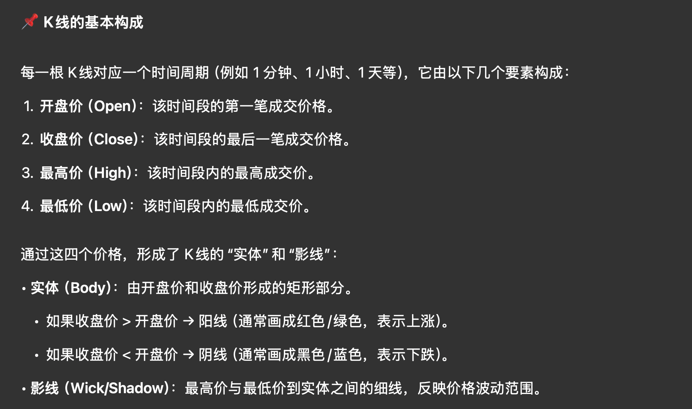
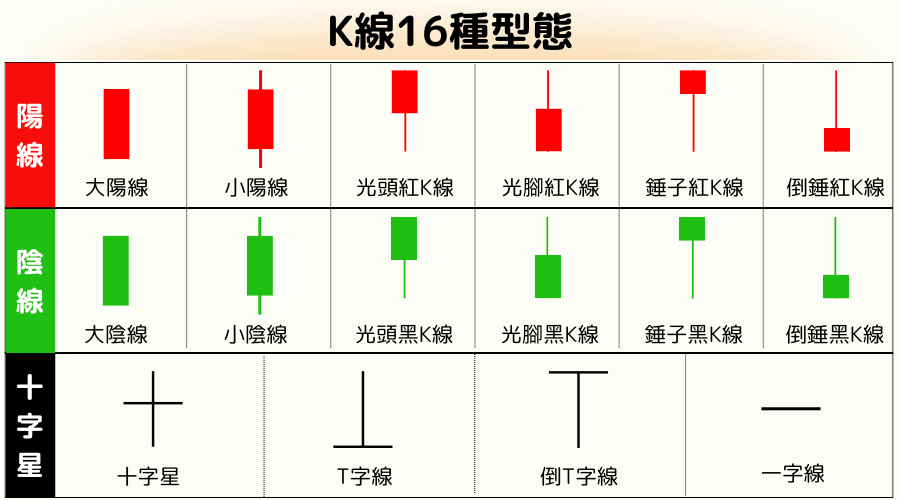

## Questions

- 为什么价格会变化?

## Concepts

- **Candlestick chart (K 线)**

    

:::{.column-margin}

:::

- **Unit trust 单位信托基金**: 你把钱交给基金公司或信托机构, 由专业经理代你投资股票、债券等.

- **Bond 债券**: 买债券 = 把钱借出去. 发行人定期付你利息, 到期还本金. 一般风险较低 (fixed income).

- **Structured product 结构性产品**: 债券 + 衍生品 (例如期权) 的结合体. 

- **Investment-linked assurance plan (ILP) 投资连结保险**: 保险 + 投资基金的结合体.

- **Efficient-market hypothesis (EMH) 有效市场假说**: 认为市场价格已经反映了所有可用信息.
    - 也许可以理解为「大多数人的决定定义了什么是正确的决定」.
    - 比如你去菜市场, 很难买到 “别人都没发现的超级便宜好菜”, 因为一旦谁在那边悄悄砍到好价, 马上就会有人围上来把价格抬回去.

- **Futures 期货**: 当两个人对某件事的预测相反时, 比如我担心糖的价格会涨, 糖厂老板正好担心价格会跌, 我们就可以今天签个合同: 三个月后, 不管那时候市场价是多少, 我都按 5 元一斤向你买 1000 斤.
    - **Polymarket** 的运作方式非常类似, 也许可以理解为可以撕毁合同的 Futures (随时“抛”掉).
        - *The Use of Knowledge in Society* (Hayek 论文): 社会中最重要的知识并非科学真理, 而是分散在无数个个体头脑中的关于特定时间和地点的零碎的局部知识, 这些知识无法被任何的中央计划者所掌握,「价格」是聚拢这些分散知识的唯一有效机制.

- **UMA Protocol**: 去中性化的 **Oracle 预言机**. 比如 Polymarket 某个事件的结果很难界定时 (比如哪个 LLM 最火), UMA 的预言机会通过一个去中心化的投票机制来确定结果.

- **Fifth Estate 第五权利**: 互联网和各种非传统媒体 (社交媒体、个人博客、独立内容创作者) 形成的一股新的社会影响力.
    - 前四个: 政府、立法机关、司法机关、传统大众媒体 (如新闻网).