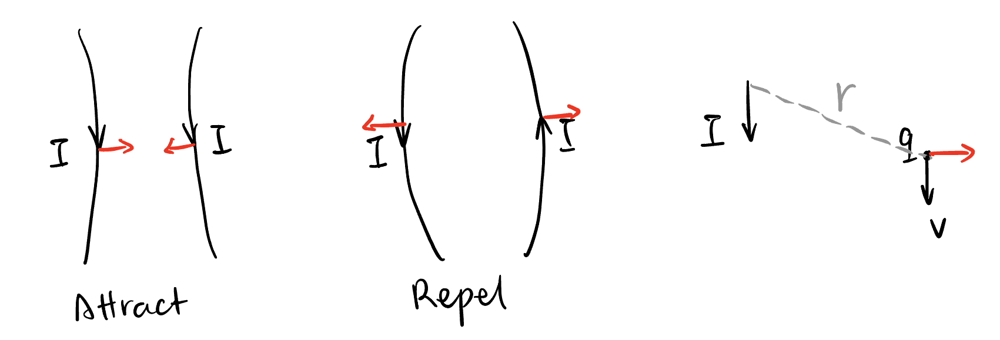

## Takeaway {.unnumbered}

## Welcome!

This is the second chapter of my electromagnetics series. In this chapter, we will find out what happens when charges are *moving*.

## Introduction to a Different Field $\mathbf{B}$

New physics originates from new discoveries. Human found this phenomenon particularly interesting:

- Two parallel wires attract or repel each other when current is applied!

Since human already knows that current is a flow of charge, this observation is equivalent to:

- It we make a charge moving near a segment of wire with current, the charge will be pushed by a force!

{#fig-interaction-current}

From our experience in [hyperlinks], an introduction to *fields* could make it much easier to describe new phenomena. Could we reuse the electric field $\mathbf{E}$? No. If you play around with the experiment[^the-experiment] in @fig-current-wire-segment and measure thing carefully, you will find out that this field (denoted $\mathbf{B}$, called the **magnetic field**[^magnetic-field]) behaves very differently from $\mathbf{E}$:

[^the-experiment]: You may ask to how to expose only a segment of the wire and observe the effect of that segment. I don't know actually, but I create this scenario just to make the logic fluent. (The idea is the same in [@sec-welcome] in [hyperlinks].)

[^magnetic-field]: The effect of the field due to current wires happens to be exactly the same as the effect due to *magnets*! We bet they generate the same field (it turns out to be true!), so we name it *magnetic field*.

{#fig-current-wire-segment}

1. The new field $\mathbf{B}$ is a vector field ($\mathbf{B}: \mathbb{R}^3 \to \mathbb{R}^3$) whose magnitude and direction satisfies:
    $$
    \begin{aligned}
    B &\propto \frac{I \mathrm{d}l}{r^2}, \\
    \mathbf{\hat{B}} &= \mathrm{d} l \times \mathbf{\hat{r}}.
    \end{aligned}
    $$

2. The magnitude and direction of the force $\mathbf{F}$ on $q$ satisfies:
    $$
    \begin{aligned}
    F &\propto q v B, \\
    \mathbf{\hat{F}} &= \operatorname{sign}(q) \mathbf{\hat{v}} \times \mathbf{\hat{B}}.
    \end{aligned}
    $$