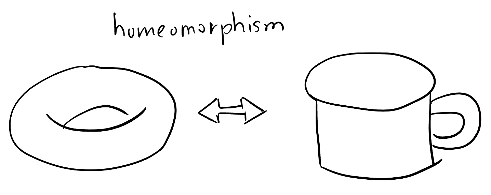
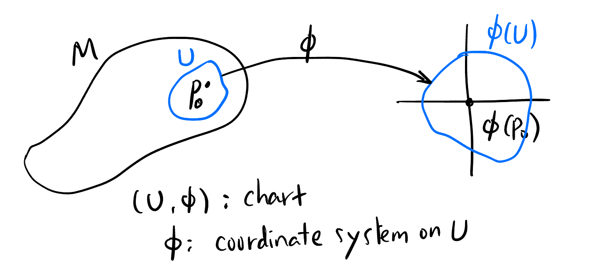
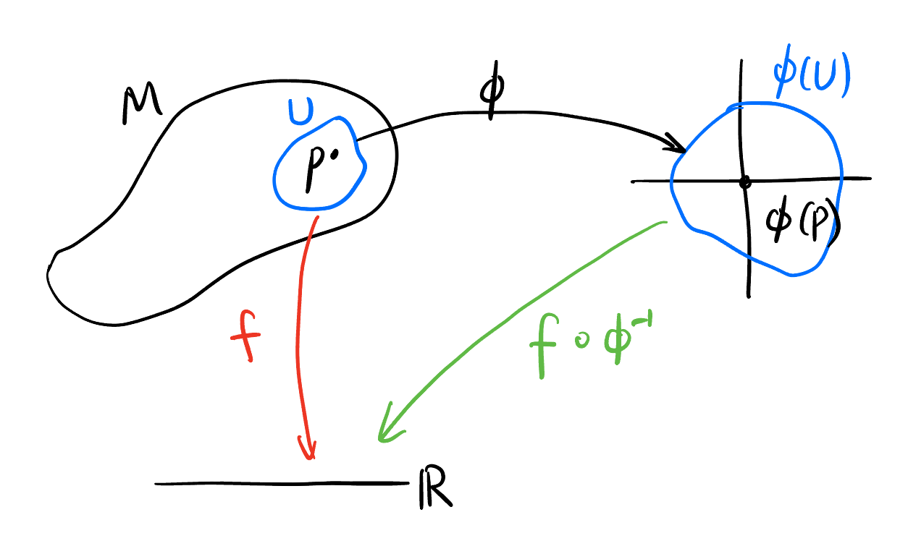
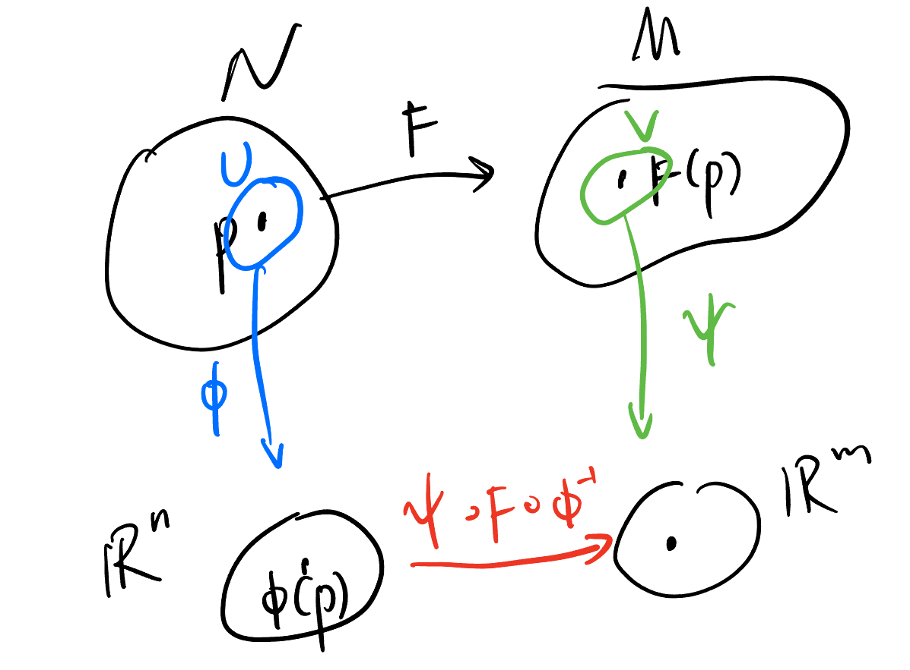

## Overview

Now we have the idea of a "curved space", which we will called it *manifold* $M$, that is exactly $\mathbb{R}^n$ if you zoomed in at every point of $M$. We want to perform calculations on this abstract space. All concepts on $\mathbb{R}^n$ should be able to transplanted in the world of manifolds so that we "pushforward" all the math we know to this unfamiliar realm.

## Defining Manifolds

So we said a "curved space" that is locally resemble $\mathbb{R}^n$, how do we define it without ambiguity?

Every object is math is a *set*, so a manifold must also be a set. What else do we need? We must be able to compare it with Euclidean space, well, *locally*. This means we should be able to which points in that set are closer (i.e., which of them are neighborhood). "Distance" is a fair choice. So we may need the set to also be a [metric space](https://en.wikipedia.org/wiki/Metric_space). But in math, we want our claim as general as possible. There is another mathematical object called [topological space](https://en.wikipedia.org/wiki/Topological_space) that solves the problem of neighborhood without ever defining a "distance". So this set should be a topological space in the most general sense. This also brings the concepts like "open sets".

What else do we need? Well, what do we mean by "resemble"? What we expected it to be? One shouldn't be able to tell the difference between them, i.e., they should be resemble as much as possible! What mapping between a topological space and $\mathbb{R}^n$ identifies them? Homeomorphisms! 

Is this enough for our manifold? Well, almost. Mathematicians found if we include *Hausdroff* and *Second countable* conditions, they would be must easier to deal with it. (Mathematicians are lazy.) So that's it! This is the definition[^definition]:

[^definition]: For precise definition, check out Tu's *Introduction to Manifold* book P48 or wiki.

<!-- ----------------------------------------- -->
::: {.callout-tip icon=false}
## Manifold
::: {#def-manifold .callout-def}
A ***manifold*** $M$ is a Hausdorff, second countable, locally Euclidean topological space. 
:::
:::
<!-- ----------------------------------------- -->

## Transplant *coordinate system*, *dimension*

If $U$ is mapped to $\mathbb{R}^2$, we say the dimension of $U$ part of the manifolds is $2$. Does the dimension agree throughout the entire manifold? We can prove this fact indeed. 

Therefore, we successfully transplant the concepts of *coordinate system* and *dimension* from $\mathbb{R}^n$ to a manifold! Though we use the same words to name them, they have a much broader meanings in the future.

## Transplant *smooth maps*

### Smooth map from $M$ to $\mathbb{R}$

We know function $f: \mathbb{R}^n \to \mathbb{R}$ is called *smooth* at $p \in \mathbb{R}$ if all partial derivatives 
$$
\frac{\partial^j f}{\partial x^{i_1}\cdots\partial x^{i_j}}
$$
for all $j$ exists (and continuous) at $p$. 

If this holds for all $p \in \mathbb{R}$, we called $f$ a smooth function[^local2global].

[^local2global]: In mathematics, we often define things at a point then make this holds for all such points to define it globally. Other concepts like: *vector field* as derivations, etc.

How to define a *smooth function* from $M$ to $\mathbb{R}$? Very simple:

{#fig-smoothm2r}

<!-- ----------------------------------------- -->
::: {.callout-tip icon=false}
## Smooth map from $M$ to $\mathbb{R}$
::: {#def-smoothm2r .callout-def}
As shown in @fig-smoothm2r, we call $f$ is a smooth ($C^\infty$) function iff $f \circ \phi^{-1}$ is $C^\infty$:
$$
f \text{ is } C^\infty \text{ at } p :\iff f \circ \phi^{-1} \text{ is } C^\infty \text{ at } \phi(p).
$$
:::
:::
<!-- ----------------------------------------- -->

<!-- ----------------------------------------- -->
::: {.callout-caution icon=true collapse=false}
## Distinguish $f$ and $\phi$
In @fig-smoothm2r, $f$ are smooth functions while $\phi$ are coordinate map (bijective homeomorphism). Do not confuse them. 
:::
<!-- ----------------------------------------- -->

### Smooth map between two manifolds

The smooth map between two manifolds can be defined in roughly the same way:

{#fig-smoothm2m}

<!-- ----------------------------------------- -->
::: {.callout-tip icon=false}
## Smooth map from $N$ to $M$
::: {#def- .callout-def}
As shown in @fig-smoothm2r, we define
$$
F \text{ is } C^\infty \text{ at } p : \iff \psi \circ F \circ \phi^{-1} \text{ is } C^\infty \text{ at } \phi(p)
$$
:::
:::
<!-- ----------------------------------------- -->

