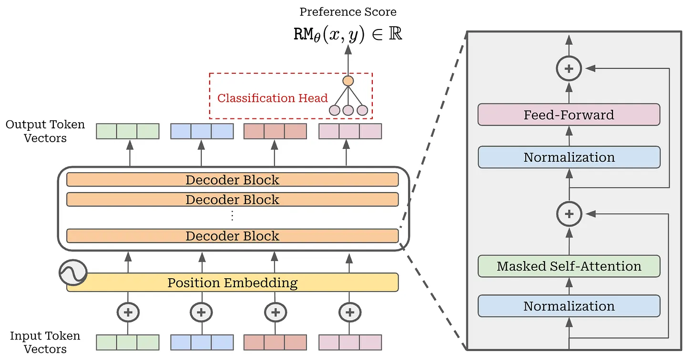
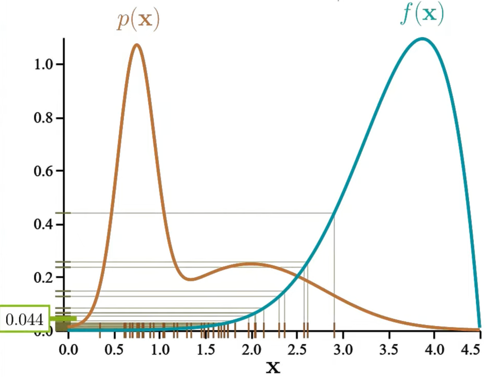
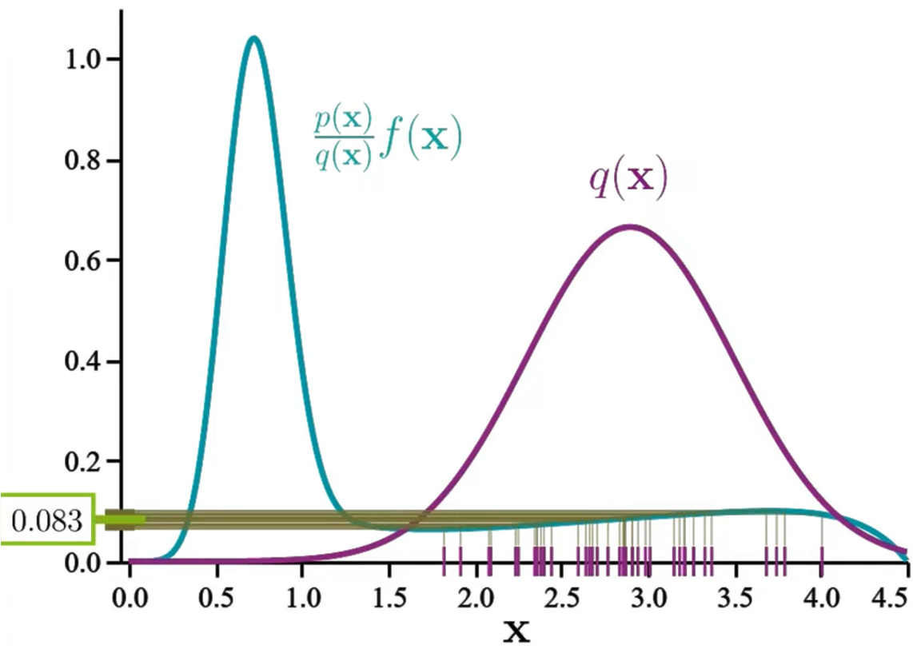
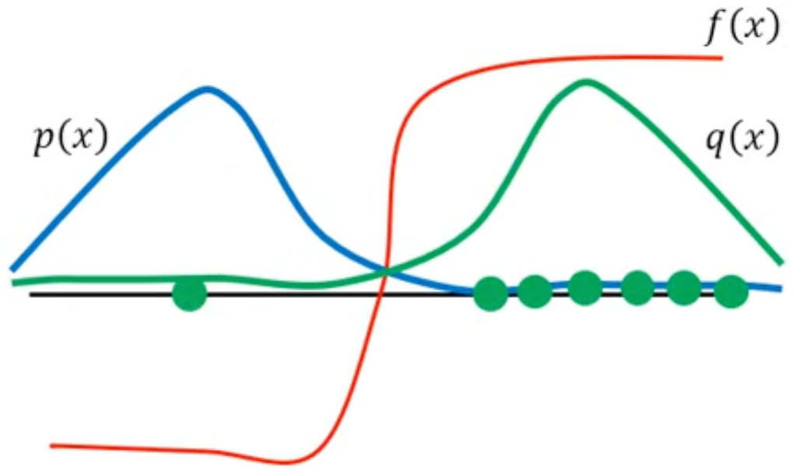

## Notation

- $\pi_\theta, \pi_\text{ref}$ 代表 student 和 teacher.
    - Student 是要训练的模型, teacher 冻结. 
    - $\pi_\theta(y|x)$ 和 $\pi_\theta(y_t|x,y_{<t})$ 代表 sequence-level 和 token-level 的概率分布.
- $x$ 代表整条问题, $y$ 代表整条回答.
    - $y$ 可以是 teacher 生成的回答 (off-policy) 或 student 生成的回答 (on-policy).
    - $y_t$ 代表回答的第 $t$ 个 token, $y_i$ 代表对问题 $x$ 的第 $i$ 次 rollout, $|y|$ 或 $T$ 代表这次回答的长度.
- $r(x,y)$ 代表环境对问题回答对 $(x,y)$ 给出的 reward.

- 我们需要 maximize $J$, minimize $L$.

- 本文省略所有求期望的操作, 公式里有几个变量就要自动求几次期望, 比如 $r(x,y)$ 代表 $\mathbb{E}_{x \sim \mathcal{D}} \mathbb{E}_{y \sim \pi_\theta(\cdot|x)} [r(x,y)]$.
    - 这样一个 loss 的式子既能表达无限计算资源下准确的 loss, 又能表达单样本估计 (只采样一次的 MC 估计).

## Classical RL

- Policy 策略 (可以是确定性, 也可以是概率性的):
    - $s \to a$
- Environment 环境 (可以是确定性, 也可以是概率性的):
    - $(s,a) \to s'$
    - $(s,a) \to r$

## Reward Model (RM)

首先我们假定人类的审美和偏好都是不同的, 对于同一个问题 $x$, 有些人会觉得 $y_1$ 更好, 有些人觉得 $y_2$ 更好.

Bradley-Terry 模型进一步**假定**每个人其实是这样进行决定的 (这很扯对不对): 所有的人, 虽然审美不同, 但是会对 $(x,y)$ 有一个**统一**的分数 (scalar), 大家都一样. 对于 prompt $x$, 大家都会对于回答 $y_1, y_2$ 产生相同的两个分数 $p_1, p_2 (>0)$, 但是不同人会按照分数的高低**概率性地**选择分数高的那个回答作为 preference. 怎么个概率法呢? 就是他选择 $y_1$ 的概率为:

$$
P_1 = \frac{p_1}{p_1 + p_2}
$$

所以我们需要**一个 (不是多个) 给问题-回答对 $(x,y)$ 打分的模型**, 让分数能反映人类的偏好 (越好越高分).

具体如何训练呢? 我们可以在一个 base model 的基础上加一个 head (可冻结 base model 的参数?), 使其输出一个 scalar:

如果让 RM 输出 $p$, 不能保证它是正的, 所以我们换一种参数化形式, 让它生成 $r$, 然后将 $e^r$ 看作 $p$. 简单想一下, 这相当于定义下面的最大化目标:

$$
\frac{e^{r_1}}{e^{r_1} + e^{r_2}}
$$

其实就是 $\sigma(r_1, r_2)$, 当然我们也可以取一个 $\log$ 和相反数从而定义一个 loss:

$$
L_\text{RM} := - \log \sigma(r(x,y_1) - r(x,y_2))
$${#eq-rm-loss}

来进行训练. 注意这样每一个训练数据 $(x, y_1, y_2)$ 都会前向传播两次.

注意: 一般只训练 1 epoch 来避免 overfitting.

### RM Regularization

当数据集中对问题 $x$ 的回答 $y_1, y_2$ 都一致地认为比如 $y_1$ 更好时 (这种情况叫 deterministic preference / separable data). RM 输出的分数的差 $r_1-r_2$ 会在训练中被拉得越来越大 (或者说只要不是 $r_1 = +\infty, r_2 = -\infty$, 拉大 $r_1-r_2$ 就一定能降低 loss. 这和 logistic regression 在 linearly separable dataset 上的现象相同.)

所以实际上我们在训练 RM 的时候会加各种各样的 regularization, 比如 label smoothing (将 separable data 变成 non-separable data, hard label 1 变成 $1-\epsilon$), etc. **正是这些 regularization 才让 RM 不会过拟合**. (后面我们会看到 DPO 规避了 RM, 所以会有过拟合的风险.)

## 无限资源下的训练

Token-level forward/reverse KL:

$$
\text{FKL}_t = \text{KL}(\pi_{\text{ref}}(\cdot|x,y_{<t}) \Vert \pi_\theta(\cdot|x,y_{<t}))
$$

$$
\text{RKL}_t = \text{KL}(\pi_\theta(\cdot|x,y_{<t}) \Vert \pi_{\text{ref}}(\cdot|x,y_{<t}))
$$

- FKL 是 mode-covering, RKL 是 mode-seeking.

$$
\text{KL} := \mathbb{E}_{x \sim \mathcal{D}} \mathbb{E}_{y \sim \pi_\theta(\cdot|x)} \sum_{t=1}^{T} \mathrm{KL}_t
$$

## Policy Gradient Methods

分为 RLHF 和 RLVR, 前者需要先利用 Bradley-Terry 模型来训练一个 reward model, 而后者不需要. 由于 RM 不是完美的, 所以 RLHF 往往会要求 RL 后的模型不能偏离 reference model 太远 (加 KL), 但 RLVR 这方面很宽松 (因为奖励信号很准确), 甚至不用加 KL. 下面我们先讨论 RLVR.

Policy gradient 方法非常直接, 就是要最大化期望的 reward, 即:

$$
\boxed{
- L_\text{PG} := \mathbb{E}_{xy} [r(x,y)]
}
$${#eq-sequence-level}

上面式子中, 由于 $r(x,y)$ 不是「算」出来的, 所以不能直接反向传播. 怎么办呢? 难道训练不了了吗? 我们先直接算一下 $L$ 的梯度看看, 先把对 $y$ 的期望用加权形式展开:

$$
-L_\text{PG} = \mathbb{E}_x \left[\sum_{y} \pi_\theta(y|x) \cdot r(x,y)\right]
$$

然后再求梯度:

$$
\begin{aligned}
- \nabla L_\text{PG} &= \mathbb{E}_x \left[ \sum_{y} \nabla \pi_\theta(y|x) \cdot r(x,y) \right] \\
&= \mathbb{E}_x \left[ \sum_{y} \underbrace{\pi_\theta(y|x) \nabla \log \pi_\theta(y|x)}_{\text{log trick}} \cdot r(x,y) \right] \\
&= \mathbb{E}_{xy} \left[\nabla \log \pi_\theta(y|x) \cdot r(x,y) \right]
\end{aligned}
$${#eq-loss-grpo-grad}

计算它相当于 (但**不等价于**) 对下面的数值进行反向传播:

$$
-L_\text{VPG} := \mathbb{E}_{xy} \left[ \log \pi_\theta(y|x) \cdot r(x,y) \right]
$${#eq-loss-vpg}

称为 $L_\text{PG}$ 的 **surrogate loss**. 思考一下为什么! 这很重要. 注意 $r(x,y)$ 不是「算」出来的, 所以它是 detach 的状态!

我们把利用 @eq-loss-vpg 进行反向传播的算法称为 VPG (Vanilla Policy Gradient), 这是 PG 的最原始的形式, 后面会有很多方法对它的效果进行改良.

## Baseline 思想

(引入动机: VPG 的梯度在每个方向上的方差很大)

我们用:

$$
-L_\text{baseline} := \mathbb{E}_{xy} \left[ \log \pi_\theta(y|x) \cdot (r(x,y) - b(x)) \right]
$${#eq-loss-baseline}

即只添加了一个只依赖 $x$ 的函数 $b$ (**任何只依赖 $x$ 的函数都可以!**), 称为 **baseline**. 可以这么做的原因是后一项的梯度为 0:

$$
\begin{aligned}
\nabla \mathbb{E}_{xy} [\log \pi_\theta(y|x) \cdot b(x)] &= \mathbb{E}_x \left[ b(x) \cdot \sum_y \underbrace{\pi_\theta(y|x) \nabla \log \pi_\theta(y|x)}_{\text{log trick}} \right] \\
&= \mathbb{E}_x \left[ b(x) \cdot \sum_y \nabla \pi_\theta(y|x) \right] \\
&= \mathbb{E}_x \left[ b(x) \cdot \nabla \left( \sum_y \pi_\theta(y|x) \right) \right] \\
&= \mathbb{E}_x \left[ b(x) \cdot \nabla 1 \right] \\
&= 0
\end{aligned}
$$

我们将 @eq-loss-baseline 的后一项记为 $\Psi(x,y) := r(x,y) - b(x)$, 于是 @eq-loss-baseline 变为:

$$
\boxed{
-L_\text{baseline} := \mathbb{E}_{xy} \left[ \log \pi_\theta(y|x) \cdot \Psi(x,y) \right]
}
$$

### Baseline 的选取: Group Average

既然要对固定的一个 $x$ 选取一个 baseline, 最简单的想法就是对同一个问题 $x$ rollout $G$ 次得到 $y_1, y_2, \ldots, y_G$, 然后取它们的 reward 的平均值作为 baseline:

$$
\boxed{
\hat{b}(x) = \frac{1}{G} \sum_{i=1}^G r(x,y_i)
}
$$

以这个 baseline 来训练的算法称为 **REINFORCE**.

### Baseline 的选取: Group Average Leave One Out

But wait, 有一些 nuance 需要注意, 我们可以看到在估计中 $\hat{b}$ 是取决于 $y_i$ 的, 而不是独立的. 这样估出来的 $\nabla \hat{L}_\text{baseline}$ 真的无偏吗? 其实是有偏的, 正如统计学中我们在估算一组 iid 数据 $\{x_i\}_{i=1}^n$ 的方差时, 如果使用的是样本均值, 需要用 $n-1$ 而不是 $n$ 作为分母 (Bessel's correction):

$$
s^2 = \frac{1}{n-1} \sum_{i=1}^n (x_i - \bar{x})^2
$$

我们引入 REINFORCE 的无偏估计版本 **RLOO**: 它的唯一区别是第 $i$ 次 rollout 的 centered return $\Psi_i$ 是用组内其它 $G-1$ 次 rollout 的 reward 的平均值来计算的:

$$
\boxed{
\hat{b}(x) = \frac{1}{G-1} \sum_{j \neq i} r(x, y_j)
}
$$

## Importance Sampling (IS) 改变了损失函数的样子

由于 on-policy 方法更新模型之后需要用**新的模型** $\pi_\theta$ 来产生回答, 这个过程很慢 (如果很快的话 PPO 不会诞生), 我们希望能通过看**旧的模型** $\pi_\text{old}$ 的输出来学习 (并非 off-policy! 虽然不是用 $\pi_\theta$ 采样, 但是我们会看到在 IS 处理后相当于还是在 $\pi_\theta$ 上采的样). 能否*直接*用 @eq-loss-vpg 但是用旧模型来采样呢? **不能!**

当我们写出来一个具体的 loss 式子时, 后续的训练其实就是对这个 loss 的 MC 估计.

抽象一点来说, 假设 $x$ 是一个分布为 $p$ 的随机变量. 我们要通过 MC 估计 $f(x)$ 的期望, 显然可以根据 $p$ 来采样出很多 $x$ 的样本, 然后:

$$
\hat{f}^p = \frac{f(x_1) + f(x_2) + \cdots + f(x_n)}{n}
$$

但如果我们不想用 $p$ 测度来采样, 而是用另一个分布 $q$ 来采样, 不能直接使用上面的公式了, 而是每个样本的 $f$ 值要加一个体现它「重要性」的权重 $\rho_i := p(x_i) / q(x_i)$, 变成了:

$$
\hat{f}^q = \frac{\frac{p(x_1)}{q(x_1)} f(x_1) + \frac{p(x_2)}{q(x_2)} f(x_2) + \cdots + \frac{p(x_n)}{q(x_n)} f(x_n)}{n}
$$

如何论证它计算出来的期望是无偏的? 很简单:

$$
\mathbb{E}_{x \sim p}[f(x)] = \int f(x) p(x) dx = \int \frac{f(x) p(x)}{q(x)} q(x) dx = \mathbb{E}_{x \sim q}\left[\frac{p(x)}{q(x)} f(x)\right]
$$

::: {layout = "[50,50]"}
{#fig-is-p}

{#fig-is-q}
:::

我们可以利用 IS 通过选取合适的 $q$ 来降低估计的方差, 这意味着我们能从较少的样本中获得更准确的估计. 如 @fig-is-p 所示, 样本较少的话 (比如只采样一次), 很容易低估 $f(x)$ 的大小; 但是用 @fig-is-q 的 $q$ 来采样的话, 由于在 $q(x)$ 比较大的区域, 加权后的 $f$ 曲线比较平缓, 这样采样能够获得更稳定的估计.

在 PPO 中, 如果我们要用几代之前的模型来采样, @eq-loss-grpo-grad 需要变成 (注意这里是 $\pi_\text{old}$ 而不是 $\pi_\text{ref}$):

$$
- \nabla L_\text{PPO} = \mathbb{E}_{xy} \left[ \frac{\pi_\theta(y|x)}{\pi_{\text{old}}(y|x)} \nabla \log \pi_\theta(y|x) \cdot r(x,y) \right]
$$

为了推导 $L_\text{PPO}^\text{surr}$, 我们展开一下:

$$
\begin{aligned}
-\nabla L_\text{PPO} &= \mathbb{E}_{xy} \left[ \frac{1}{\pi_{\text{old}}(y|x)} \nabla \pi_\theta(y|x) \cdot r(x,y) \right] \\
&= \nabla \left( \mathbb{E}_{xy} \left[ \frac{\pi_\theta(y|x)}{\pi_{\text{old}}(y|x)} \cdot r(x,y) \right] \right)
\end{aligned}
$$

于是:

$$
-L_\text{PPO}^\text{surr} = \mathbb{E}_{xy} \left[ \frac{\pi_\theta(y|x)}{\pi_{\text{old}}(y|x)} \cdot r(x,y) \right]
$$

## Clipping -- 解决 distribution shift 带来的问题

但是当 $q$ 和 $p$ 的**形状相差很大**时 (比如 @fig-is-diff), 假如只采样一个样本, 按 $p$ 估计出来的大概率是一个负数, 而 $q$ 估计出来的大概率是一个正数. 只有当 $q$ 上采的样足够多以至于出现了 @fig-is-diff 左边那个绿色的样本时, 估计才能变得相对准确.

{#fig-is-diff}

所以我们希望旧模型的输出分布不要与新的差太远. 在这个问题上, 我们有 TRPO 和 PPO 提出的两种解决方法:

- TRPO 直接限制让 policy 和 old policy 的 KL 散度不能超出 $\delta$. (具体实现数学上有些复杂, omitted).
- PPO 不从 KL 散度出发, 而是直接限制 importance sampling 的比值 $\rho$ 的范围, 让它不要太大或太小 (clip).
    - 如果 advantage 是正的, 说明我们希望在这个位置上增大 $\pi_\theta$. 如果 $\pi_\theta$ 本身出来甚至小于 $\pi_{\text{old}}$ ($\rho < 1$), 说明模型没有鼓励一个好的 token, 那放心大胆地更新, 不加任何 clipping; 但是如果 $\pi_\theta$ 已经大于 $\pi_{\text{old}}$ ($\rho > 1$), 为了避免过度更新, 我们就在 $\rho = 1+\epsilon$ 的位置上截断, 让它不要再增大了.
    - 如果 advantage 是负的, 说明我们希望在这个位置上减小 $\pi_\theta$. 如果 $\pi_\theta$ 本身出来甚至大于 $\pi_{\text{old}}$ ($\rho > 1$), 说明模型鼓励了一个不好的 token, 那放心大胆地更新, 不加任何 clipping; 但是如果 $\pi_\theta$ 已经小于 $\pi_{\text{old}}$ ($\rho < 1$), 为了避免过度更新, 我们就在 $\rho = 1-\epsilon$ 的位置上截断, 让它不要再减小了.

## Sequence-level to Token-level

我们之前一直是将一整个回答 $y$ 看作一个 action, 所以才有了 @eq-sequence-level 的 loss. 能不能将每个 token 看作一个 action 呢? 我们先试下直接把 @eq-sequence-level 的 loss 变成 token-level 的:

$$
-L := \mathbb{E}_{xy_1} \left[\log \pi_\theta(y_1|x) \cdot r(x,y_1) \right]
$$

这样我们只预测每个 $x$ 后面一个 token $y_1$. 但是你会发现 $r(x, y_1)$ 由于回答太短 RM 给不了! 那怎么办? 其实这里我们就按照 0 来处理. 但是这样我们就完全没有利用 RM 的能力了, 于是我们可以让 policy 继续 on-policy 地生成 $T$ 个 token (一个完整的回答, 直到 RM 可以给出 reward), 然后把他们加起来取平均:

$$
-L := \mathbb{E}_{xy_t} \left[\frac{1}{T} \sum_{t=1}^{T} \log \pi_\theta(y_t|x,y_{<t}) \cdot r(x,y_{<t}) \right]
$$

如果是经过 IS 处理的, 就变成了:

$$
-L := \mathbb{E}_{xy_t} \left[\frac{1}{T} \sum_{t=1}^{T} \frac{\pi_\theta(y_t|x,y_{<t})}{\pi_{\text{old}}(y_t|x,y_{<t})}  \cdot r(x,y_{<t}) \right]
$$

但是假如我们有一个预测机器 $V_\phi(x,y_{<t})$, 他可以给出生成到一半时如果继续按照当前策略生成下去的**期望** reward, 他就可以在某种意义上作为 baseline 来使用. 在 PPO 中, 这个预测机器就是一个 value network $V_\phi$, 最终 $\Psi$ 我们取成 $A_t^\text{GAE}$, 于是 loss 就变成:

$$
-L := \mathbb{E}_{xy_t} \left[\frac{1}{T} \sum_{t=1}^{T} \frac{\pi_\theta(y_t|x,y_{<t})}{\pi_{\text{old}}(y_t|x,y_{<t})}  \cdot A_t^\text{GAE} \right]
$$

这就是 PPO 未经 clipping 的 loss.

### Advantage Estimation

PPO 单独训练了一个 value network $V_\phi$ 来估计从 $(x, y_{<t})$ 出发的期望 reward (跟着 policy 一起更新).

如果这个 value network 是 exactly 精确的, 这意味着:

$$
V_\phi(s_{t+1}) = r_t + \gamma V_\phi(s_t)
$$

其中 $s_{t+1}$ 代表 $(x, y_{<t})$. 但是 $V_\phi$ 只是训练出来的网络, LHS 和 RHS 不可能完全相等, 但是 RHS 要更准确一些, 因为 agent 已经做出了 action 并且获得了奖励 $r_t$ (当然在 LLM 里面 $r_t$ 除了最后一个 token 其他都是 0), 这件事已经是发生了的, 自然比 LHS 没有发生时的预测更准. 我们将每一步后面一个 state 的 value 估计值作为「标准」, 看前面 state 的 value 估计值比它超出了多少, 这个差值就是 advantage 的一种「估计」: (LLM 中 $\lambda=1$)

$$
\hat{A}_t^{(1)} = r_t + \gamma V_\phi(s_{t+1}) - V_\phi(s_t)
$$

角标 $^{(1)}$ 代表 1-step TD (Temporal Difference). 当然你也可以用两步 (2-step) 的观测值来估计 advantage:

$$
\hat{A}_t^{(2)} = r_t + \gamma r_{t+1} + \gamma^2 V_\phi(s_{t+2}) - V_\phi(s_t)
$$

这个 2-step 的式子还恰好能用两个 1-step 的 advantage 来表示:

$$
\hat{A}_t^{(2)} = \hat{A}_t^{(1)} + \gamma \hat{A}_{t+1}^{(1)}
$$

少 step 的 advantage 估计 bias 大, variance 小; 多 step 的 advantage 估计 bias 小, variance 大. PPO 用的 GAE (Generalized Advantage Estimation) 就是将 1-step, 2-step, ..., K-step 的 advantage 做指数加权 ($\lambda$) 平均来在 bias 和 variance 之间做 trade-off:

$$
\hat{A}_t^\text{GAE} = \hat{A}_t^{(1)} + \lambda \hat{A}_{t+1}^{(2)} + \lambda^2 \hat{A}_{t+2}^{(3)} + \cdots
$$

也可以展开成全用 1-step 的 advantage:

$$
\hat{A}_t^\text{GAE} = \hat{A}_t^{(1)} + (\gamma \lambda) \hat{A}_{t+1}^{(1)} + (\gamma \lambda)^2 \hat{A}_{t+2}^{(1)} + \cdots
$$

### DPO

#### RLHF 等价于 KD

我们知道所有的 RLHF 都是在最小化:

$$
L := \mathbb{E}_{xy} \left[ -r(x,y) + \beta \log \frac{\pi_\theta(y|x)}{\pi_\text{ref}(y|x)} \right]
$${#eq-rlhf-loss}

或者等价于:

$$
\begin{aligned}
& \min_\theta \mathbb{E}_{xy} \left[\log \frac{\pi_\theta(y|x)}{\pi_\text{ref}(y|x)} - \frac{1}{\beta} r(x,y) \right] \\
\iff & \min_\theta \mathbb{E}_{xy} \left[\log \frac{\pi_\theta(y|x)}{\pi_\text{ref}(y|x)e^{\frac{1}{\beta} r(x,y)}} \right]
\end{aligned}
$${#eq-rlhf-as-kd}

我们可以将分母看作一个分布, 哦不对, 他没有归一化! 不过很简单, 只需要求出下面这个只跟 $x$ 有关的量:

$$
Z(x) := \sum_y \pi_\text{ref}(y|x) e^{\frac{1}{\beta} r(x,y)}
$$

然后将 @eq-rlhf-as-kd 的分母归一化得到一个分布:

$$
q(y|x) = \frac{1}{Z(x)} \pi_\text{ref}(y|x) e^{\frac{1}{\beta} r(x,y)}
$$

于是, @eq-rlhf-as-kd 可等价于求解:

$$
\begin{aligned}
& \min_\theta \mathbb{E}_{xy} \left[\log \frac{\pi_\theta(y|x)}{\frac{1}{Z(x)} \pi_\text{ref}(y|x)e^{\frac{1}{\beta} r(x,y)}} - \log Z(x) \right] \\
\iff & \min_\theta \mathbb{E}_{xy} \left[ \text{KL}(\pi_\theta(y|x) \Vert q(y|x)) - \log Z(x) \right] \\
\iff & \min_\theta \mathbb{E}_{xy} \left[ \text{KL}(\pi_\theta(y|x) \Vert q(y|x)) \right]
\end{aligned}
$$

容易看出当且仅当 $\pi_\theta(y|x) = q(y|x)$ 时, KL 散度最小, 也就是 RLHF 的最优解:

$$
\boxed{
\pi_\theta^*(y|x) = q(y|x) = \frac{1}{Z(x)} \pi_\text{ref}(y|x) e^{\frac{1}{\beta} r(x,y)}
}
$${#eq-rlhf-optimal}

也就是说假如我们得到了 RM $r(x,y)$, 我们也就得到了 RLHF 微调后的模型! (不需要再训练了). 但是这需要通过 @eq-rlhf-optimal 来计算! 这意味着我们还是需要加载 $\pi_\text{ref}$ 和 $r(x,y)$ 两个模型. 我们希望用一个模型来直接输出 $\pi_\theta^*(y|x)$.

#### LLM is Secretly a Reward Model

我们不要盯着 RM 来训练了, 我们将 @eq-rm-loss 中的 $r$ 换成 $\pi_\theta^*$, 这样发向传播更新的就不是 RM 而是 policy 了. 由 @eq-rlhf-optimal 逆推得到:

$$
r(x,y) = \beta \left( \log Z(x) + \log \frac{\pi_\theta^*(y|x)}{\pi_\text{ref}(y|x)} \right)
$${#eq-rm-from-llm}

这个式子也体现了一个观点: **任何一个 LLM $\pi_\theta^*(y|x)$ 相对于 reference model $\pi_\text{ref}$ 都是一个 reward model.**

将 @eq-rm-from-llm 代入 @eq-rm-loss:

$$
\begin{aligned}
L_\text{RM} &= -\log \sigma(r(x,y_1) - r(x,y_2)) \\
&= - \log \sigma\left(\beta \log \frac{\pi_\theta^*(y_1|x)}{\pi_\text{ref}(y_1|x)} - \beta \log \frac{\pi_\theta^*(y_2|x)}{\pi_\text{ref}(y_2|x)} \right) \\
& =: L_\text{DPO}
\end{aligned}
$$

按这个 $L_\text{DPO}$ 定义出来的 loss 就是 DPO 的 loss, 这样我们直接训练的就是 policy 而不是 RM 了.

### $\Psi$-PO

RLHF 实际上用到了两个公理化的前提:

1. BT 模型是合理的.
2. RM 有一定的泛化能力, 以至于可以对**没有**出现在数据集里的回答对给出较为准确的分数.

而 DPO 由于没有用到 RM, 但仍然用了 BT 模型, 所以它只规避了第二条公理, 仍然承认第一条公理.

让我们甚至不承认有第一条公理 (即没有 RM, 也就没有 @eq-rlhf-loss), 但是我们还是把人们 prefer $y$ 而非 $y'$ 看作概率性的, 并且有一个确定的概率 $p$. 从第一性原理出发, 其实我们就是想最大化:

$$
\max_\theta \mathbb{E}_{xyy'} \left[ p(y \succ y'|x) - \beta \log \frac{\pi_\theta(y|x)}{\pi_\text{ref}(y|x)} \right]
$$

当然概率这样一个数值太特殊了, 我们可以外面套一个不改变单调性的函数 $\Psi: [0,1] \to \mathbb{R}$ 来去特殊化这个概率的数值. $\Psi$ 只需要不减即可.

$$
\max_\theta \mathbb{E}_{xyy'} \left[ \Psi \left(p(y \succ y'|x)\right) - \beta \log \frac{\pi_\theta(y|x)}{\pi_\text{ref}(y|x)} \right]
$${#eq-psipo-nloss}

$x$ 在给定的问题数据集上取期望, $y$ 取自 $\pi_\theta(\cdot|x)$, $y'$ 一些关于 $x$ 的回答, 但是质量要不是很好才行, 所以肯定不能再用 $\pi_\theta$, 而是一个弱一点的模型 $\mu(\cdot|x)$ 或者甚至不是大模型而是人为写出来的回答集合.

但是我们不知道 $p$ 啊, 如何用 @eq-eq-psipo-nloss 来训练呢? <未完待续>

### VPG (Vanilla Policy Gradient)

REINFORCE 的问题是它的方差非常大, 我们可以直接再训一个网络 $V_\phi$ (Critic) 来估计从 $(x, \bar{y}_{<t})$ 出发的 reward (每生成一个 $\bar{y}_t$ 就可以估计一次), 称为 Actor-Critic 网络. 由于这次是逐 token 来估计的 reward, 我们要在 token-level 来写公式, 这次由于有 critic, 可以用单样本估计!

首先把 $\log \pi_\theta(\bar{y}|x)$ 逐 token 展开成:

$$
\log \pi_\theta(\bar{y}|x) = \sum_{t=1}^{T} \log \pi_\theta(\bar{y}_t|x,\bar{y}_{<t})
$$

而且当一整条 $\bar{y}$ 生成完毕之后, 其中的任何一个 token 都对应一个 reward:

$$
A_t = r(x,\bar{y}) - V_\phi(x, \bar{y}_{<t})
$$

于是:

$$
\begin{aligned}
-\tilde{L}_{\text{actor}} &:= \mathbb{E}_{x \sim \mathcal{D}} \left[\frac{1}{T} \sum_{t=1}^{T} \log \pi_\theta(\bar{y}_t|x,\bar{y}_{<t}) \cdot A_t\right] \\
\tilde{L}_{\text{critic}} &:= \mathbb{E}_{x \sim \mathcal{D}} \left[\frac{1}{T} \sum_{t=1}^{T} \big(r(x,\bar{y}) - V_\phi(x, \bar{y}_{<t})\big)^2\right]
\end{aligned}
$$

最后两个 loss 加起来作为最终的 loss:

$$
L_{\text{VPG}} := L_{\text{actor}} + \alpha \cdot L_{\text{critic}}
$$

### GRPO

就是 REINFORCE + Baseline + clip.

## Off-policy Method

Off-method 的动机就是**让 $\pi_\theta$ 模仿 $\pi_\text{ref}$ 的行为**, 那么有两个问题需要决定:

- 如果用 KL 来度量, KL 散度不对称, 用哪个方向呢?
- 模仿 $\pi_\text{ref}$ 采样前 (soft-label) 还是采样后 (hard-label/one-hot) 的 $y$?

对于第一个问题, 用 FKL (因为 xxx).

对于第二个问题, 两种方法都可以, 且我们把 soft-label 方法称为 KD, hard-label 方法称为 SFT, 它们的 loss 分别是:

$$
\boxed{
L_{\text{KD}} := -\mathbb{E}_{x \sim \mathcal{D}} \mathbb{E}_{y \sim \pi_\text{ref}(\cdot|x)} \left[\sum_t \text{FKL}_t \right]
}
$${#eq-loss-kd}

$$
\boxed{
L_\text{SFT} := -\mathbb{E}_{x \sim \mathcal{D}} \mathbb{E}_{y \sim \pi_\text{ref}(\cdot|x)} \left[\sum_t \log \pi_\theta(y_t|x,y_{<t})\right]
}
$${#eq-loss-sft}

假设在 $t$ 位置 4 个 token 的概率分布如下:

$$
\begin{aligned}
\pi_\text{ref}^\text{soft} &= [0.6, 0.2, 0.1, 0.1] \\
\pi_\text{ref}^\text{hard} &= [1.0, 0.0, 0.0, 0.0] \\
\pi_\theta &= [0.2, 0.3, 0.4, 0.1]
\end{aligned}
$$

SFT 完完全全就是 teacher 的概率分布从 $\pi_\text{ref}^\text{soft}$ 坍缩到 $\pi_\text{ref}^\text{hard}$ 后的 KD! (只是 SFT 的数据集可以是 teacher 生成的, 也可以是人类标注的)

> SFT is distribution-collapsed KD, KD is soft-label SFT.

对于 @eq-loss-kd 和 @eq-loss-sft, 由于它们是计算出来的, 直接可以对它们进行反向传播更新参数.

## On-Policy Method

On-policy method 跟 Off-policy 的区别在于, teacher 是顺着 student 的思路来提供监督信号的 (而不是反过来). Loss 可以严格写成:

$$
\boxed{
L_\text{OPD} := -\mathbb{E}_{x \sim \mathcal{D}} \mathbb{E}_{y \sim \pi_\theta(\cdot|x)} \left[\sum_t \text{FKL}_t\right]
}
$${#eq-loss-opd}

**能否直接对 @eq-loss-opd 进行反向传播?** 这一看这 loss 也是计算出来的, 也能进行反向传播, 但我们用单样本 (或有限样本) 估计出来的 loss 数值进行反向传播的时候其实是有偏的!!!

为了简化式子: 由于当 $x$ 固定时, @eq-loss-opd 后面的 $\sum_t \text{FKL}_t$ 仅仅是一个与 $\theta$ 和 $y$ 有关的函数, 不妨记为 $f(\theta, y)$.

我们计算一下 $L_\text{OPD}$ 的梯度, 首先也把后面一个期望用求和展开, 

$$
L_\text{OPD} = -\mathbb{E}_{x \sim \mathcal{D}} \sum_{y} \pi_\theta(y|x) \cdot f(\theta, y)
$$

然后我们求梯度:

$$
\begin{aligned}
- \nabla L_\text{OPD} &= \mathbb{E}_{x \sim \mathcal{D}} \sum_{y} \nabla (\pi_\theta(y|x) \cdot f(\theta, y)) \\
&= \mathbb{E}_{x \sim \mathcal{D}} \sum_{y} \left( \underbrace{\nabla \pi_\theta(y|x)}_\text{log trick} \cdot f(\theta, y) + \pi_\theta(y|x) \cdot \nabla f(\theta, y) \right) \\
&= \mathbb{E}_{x \sim \mathcal{D}} \sum_{y} \Big( \pi_\theta(y|x) \nabla \log \pi_\theta(y|x) \cdot f(\theta, y) + \pi_\theta(y|x) \cdot \nabla f(\theta, y) \Big) \\
&= \mathbb{E}_{x \sim \mathcal{D}} \mathbb{E}_{y \sim \pi_\theta(\cdot|x)} \Big[ \nabla \log \pi_\theta(y|x) \cdot f(\theta, y) + \nabla f(\theta, y) \Big]
\end{aligned}
$$

用单样本 $\bar{y}$ 来估计这个梯度:

$$
- \nabla L_\text{OPD} \approx \mathbb{E}_{x \sim \mathcal{D}} \Big[ \nabla \log \pi_\theta(\bar{y}|x) \cdot f(\theta, \bar{y}) + \nabla f(\theta, \bar{y}) \Big]
$${#eq-loss-opd-sample-grad}

我们可以将 $f(\theta, \bar{y})$ 看作 @eq-loss-grpo-sample-grad 里面的 reward, 虽然他与 $\theta$ 有关, 但是可以 detach 掉不让它传播回去. 所以计算 @eq-loss-opd-sample-grad 等价于对下面的数值进行反向传播 (无偏估计):

$$
- \tilde{L}_\text{OPD} := \mathbb{E}_{x \sim \mathcal{D}} \Big[ \log \pi_\theta(\bar{y}|x) \cdot f(\theta, \bar{y}).\texttt{stop\_grad} + f(\theta, \bar{y}) \Big]
$$

| | Off-policy | On-policy |
|---|---|---|
| Hard-label | SFT | - |
| Soft-label | KD | OPD |
| Verifiable Reward | - | GRPO |

### More on OPD

- Full-vocabulary OPD: 直接用整个词表的概率分布来计算 FKL.
- Sampled-token OPD: 只用一个 sample 出来的 token 来计算 FKL.
- Top-$k$ OPD: 只用 top-$k$ 的 token 来计算 FKL (要重新归一化).

## Questions

- 所谓训练范式到底是什么?

- 既然环境能给问题-回答对 $(x,y)$ 打分, 为啥不能直接将 reward 作为 -loss 来反向传播优化?

- 为什么 GPRO 的式子里面有一个 probability ratio? 如何理解 importance sampling?

- 仿真里面为什么 pretrain 的 loss landscape 看起来很平滑而 GRPO 的 loss landscape 很 rough? 是比例尺的问题吗? 如果在 GRPO 的尺度下看 pretrain 的 loss landscape, 是不是也很 rough?

- $f(\theta, y)$ 需要类似归一化的操作吗? 万一序列长度非常长, 这个数字会很大, 有影响吗?

- PPO-style RLHF often starts with one scalar reward for the whole completion. How does that become a per-
token training signal?

- credit assignment 的数学本质是什么? 如何用集合论的思想来思考? 如何理解为什么 credit assignment 好了会得到更好的训练结果?

## Thing to explain

- 无限资源下的训练, loss 与 surrogate loss.
    - batch, rollout 都是有限资源下用样本近似期望的手段.
    - 梯度算子和期望算子不可交换 (前提是期望跟参数相关 (比如 on-policy))

- 一些具体的算法, 如: REINFORCE

- 工程实践的引入的事实、问题和解决方案
    - 评估速度显著快于生成.
    - 为什么要引入概率比值 $\rho$? 重要性采样是什么? 为什么要 clip 函数?

- 为什么需要优势函数 (baseline+normalization)? 

- Off-policy 和 on-policy 的区别, 以及它们的 trade-off.
    - 一个不在自身模型上求期望, 一个在自身模型上求期望.
    - Off-policy（exposure bias）：优化了错误的目标。目标本身没问题（teacher 在 data prefix 上是可靠的），但它覆盖的 prefix 集合跟推理时不一致。
    - On-policy（teacher unreliability）：优化了正确的目标（prefix 分布对了），但目标里的 teacher 信号可能在这些 prefix 上不可靠。

- SFT 和 KD 的区别: soft label 和 hard label.

- forward KL 和 reverse KL 的区别.
    - reverse KL: mode-seeking
    - forward KL: mode-covering

- 一些隐含的假设:
    - 预训练: 如果 next token 预测得越好, 模型就越会说话、甚至记住一些知识.
        - 一旦前面的 token 出现问题, 后面的预测会越走越偏 (生成的 token 不能改).
    - off-policy training: teacher 生成回答 (SFT 的话就是用数据集里的 $(x,y)$), student 用 teacher 的 prefix 来评估, 它们的分布越相似, 学习效果越好.
        - Exposure bias: 训练到极致时, student 和 teacher 针对相同的 $x$ 给出的 next token prediction 完全一样, 这也是 KD 的理论极限. 但实际训练后 student 和 teacher 不可能完全一样. 推理时是用 student 推理而不是 teacher, 如果 student 逐渐生成的时候产生了一些「不太好」的 token, 而这样的 prefix 在训练时几乎没有出现过 (因为从来都没有让 student 自己生成, 而是直接给 teacher 生成的), student 在这个稀有 prefix 上的行为几乎完全靠泛化, 这样误差就会被逐步放大.
    - on-policy training: student 生成回答, teacher 用 student 的 prefix 来评估 (学生产生的有多差), 利用这个差距来更新学生.
        - Teacher unreliability: 核心问题就是: **teacher 在 student 的垃圾 prefix 上给出的分布是一个值得模仿的目标吗?** 如果学生一窍不通, 比如生成了一大堆胡言乱语, teacher 在 student 的每个 token 上产生的信号可能就显得没什么参考价值. 而且我确实也 have no idea 这样的训练目标为什么能 work.
        - 不过 on-policy 的好处就是学生有大量机会学习如何处理很垃圾的 prefix (因为回答是自己产生的, 所以 prefix 的分布和推理时完全一样), 这样就能缓解 exposure bias 的问题, 但是 teacher 的信号又感觉没什么意义.

- LLM = 泛化能力 + 拟合能力

- **Goodhart's Law**: When a measure becomes a target, it ceases to be a good measure.
    - 在 LLM 的 policy-gradient 中, **需要 KL 的原因就是 RM 不是完美的**, 如果不用 KL:
        - **Reward hacking**: 策略模型会开始过度优化, 寻找奖励模型中的漏洞. LLM 可能会发现, 只要生成极其冗长的排比句 (Verbosity), 或者使用过度礼貌和奉承的语气 (Sycophancy), 就能骗过奖励模型拿到极高的分数.

- 关于我为什么要发明这套 notation: 公式应该描述人的第一反应, 不要有任何的其它符号, 其它的靠人脑的自动补全功能, 他们除了提高学习门槛没有任何的信息量.

- 「完整 $y$ + $y$ 中每一个 next token 的单采样 KL」等价于以 $y$ 为单位的 单采样 KL.

- Imitation Learning (IL) 给我们的 insight: 当我们难以手写 reward、dynamics 或 controller, 但能够让 expert 演示正确行为时, 直接从 expert trajectories 中学习一个可执行 policy.
    - 它最主要是和 RL 比较, RL 通过 reward 定义目标 (具体 action 要靠 policy 来自行探索.)