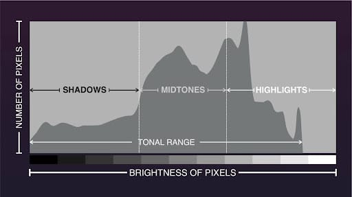

## Exposure Triangle 曝光三要素

- **Aperture 光圈**: 控制进入相机的光线量.
    - 光圈越大, 景深越浅 (背景越模糊).

- **Shutter Speed 快门速度**: 控制光线进入传感器的时间长短.
    - 快门越慢, 拍运动物体越容易模糊.
    - **安全快门**: E.g., 焦距 = $400$ mm, 安全快门速度 = $1/400$ s.

- **ISO 感光度**[^iso]: 控制传感器对光线的 sensitivity.

[^iso]: International Organization for Standardization 定义了 sensitivity 的标准.

## 一些常规调法

### 较暗图片

- 增加 Exposure、降低 Highlights/Whites (亮部太亮了)、提 Shadow (增加暗部细节)、压一点 Blacks (让暗部看起来更黑而不是灰灰的)

## Some Terms

- **HSL (Hue, Satuation, Lightness)**

- **HSV (Hue, Satuation, Value)**

- **对比色**: 色轮上相对的颜色.

- **Raw**: 相机传感器捕捉到的**所有**未经加工的光影数据 (如曝光、白平衡、色彩等).
    - Raw 格式拥有更加强大的后期能力.
    - MRAW, SRAW: 表示不同大小的 Raw 格式.
    - 后缀名: `.cr2` (Canon), `.nef` (Nikon), `.arw` (Sony), `.raf` (Fujifilm).

- **Blacks, Shadows, Midtones, Highlights, Whites**: 黑色色阶, 阴影、中间调、高光、白色色阶.

    {#fig-smh}

- **CA (Chromatic Aberration, 色差)**: 物体出现彩色边缘, 常见的有紫色、绿色等.

- **Vignetting 暗角**: 图像边缘比中心更暗的现象. 有人为的, 也有由于摄像机广角的原因.