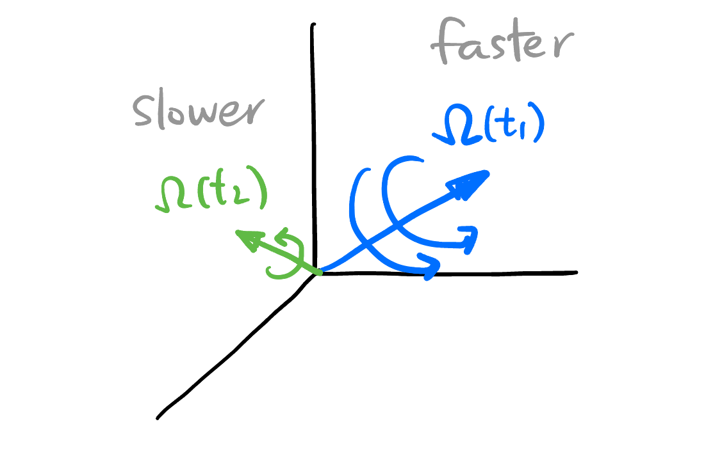

## Basic Rigid Body Dynamics

### Attitude Representation

> One attitude of a quadrocopter can be represented by either an $R \in SO(3)$ or two quaternions $\pm q \in U(\mathbb{H})$.

Every possible attitude of a quadrocopter corresponds an element in $SO(3)$ uniquely. We also know that the space of unit quaternions $U(\mathbb{H})$ double covers $SO(3)$:
$$
U(\mathbb{H}) \overset{2:1} \twoheadrightarrow SO(3).
$${#eq-double-cover}

This means one rotation can also be expressed by *two different* unit quaternions, $q$ and $-q$. 

<!-- ----------------------------------------- -->
::: {.callout-note icon=true collapse=true}
## How do unit quaternions represent rotations?
A rotation around an axies $\mathbf{v} \in \mathbb{S}^2$ by an angle $\theta$ can be represented by a quaternion $q$:
$$
q = \cos\left(\frac{\theta}{2}\right) + \sin\left(\frac{\theta}{2}\right) \mathbf{v}.
$$

Therefore, $\forall q \in U(\mathbb{H})$,
$$
\begin{aligned}
q &= q_0 + q_1 \mathbf{i} + q_2 \mathbf{j} + q_3 \mathbf{k} \\
&\equiv q_0 + \mathbf{u} \\
&= \underbrace{q_0}_{\cos \frac{\theta}{2}} + \underbrace{\lVert\mathbf{u}\rVert}_{\sin \frac{\theta}{2}} \cdot \underbrace{\frac{1}{\lVert\mathbf{u}\rVert} (q_1 \mathbf{i} + q_2 \mathbf{j} + q_3 \mathbf{k})}_{\text{rotation axies}}.
\end{aligned}
$$
i.e., **the imaginary part of $q$ encodes the rotation axis and the real part encodes the rotation angle**. 

Compare this with how the *angular velocity vector* $\boldsymbol{\Omega}$ encodes the rotation information: @fig-angular-velocity.
:::
<!-- ----------------------------------------- -->

<!-- ----------------------------------------- -->
::: {.callout-note icon=true collapse=true}
## Quick proof on the double covering
We will approach @eq-double-cover from the following simple steps:

1. Mental picture for the manifold $SO(3)$: Three dimensional solid ball modulo the antipodal points on its surface:
   $$
   SO(3) \simeq D^3/\sim
   $$

   {#fig-d3-modulo-antipodal}

2. Unit quaternions sits bijectively on the 3-sphere $S^3$:
   $$
   U(\mathbb{H}) \simeq \mathbb{S}^3.
   $$

   This is easy to see from the definition of unit quaternions:
   $$
   \begin{aligned}
   U(\mathbb{H}) &:= \{ q \in \mathbb{H} : |q| = 1 \} \\
   &\simeq \{ (a, b, c, d) \in \mathbb{R}^4 : a^2 + b^2 + c^2 + d^2 = 1 \} \\
   &=: \mathbb{S}^3
   \end{aligned}
   $$
   where $q = a + b\mathbf{i} + c \mathbf{j} + d \mathbf{k}$.

3. Natural double cover projection from sphere to the equator plate:
   $$
   \mathbb{S}^3 \overset{2:1} \twoheadrightarrow \frac{\mathbb{S}^3}{\sim} \simeq \frac{D^3}{\sim}.
   $$

   Just have a look at 2-dimensional case:

   {#fig-2d-covering}

4. From the above, we derived @eq-double-cover.
:::
<!-- ----------------------------------------- -->

### Kinematics of rigid body: Quaternions version

::: {.column-margin}
{#fig-angular-velocity}
:::

> The time evolution of the attitude of a quadrocopter $q(t)$ and the angular velocity vector[^angular-vv] $\boldsymbol{\Omega}(t)$ satisfy[^vector2quat]: $$\dot{q} = \frac{1}{2} q \cdot \Omega.$${#eq-kinematics-quat}

{#fig-path-in-d3}

In other words, the attitude $q(t)$ of a quadrocopter can be represented as a path in $D^3 / \sim$ (shown in @fig-path-in-d3), how to know the angular velocity vector $\mathbf{\Omega}(t)$ at a time $t_0$? @eq-kinematics-quat tells us just take the tangent vector (actually a quaternion $\dot{q}$) of the path at time $t_0$, multiplied by 2 then divide by $q$.

[^angular-vv]: The angular velocity vector (shown in @fig-angular-velocity) $\boldsymbol{\Omega}(t_1) \in \mathbb{R}^3$ encodes the rotation axis ($\boldsymbol{\hat{\Omega}}$) and the angular velocity around that axis ($\lVert\boldsymbol{\Omega}\rVert$). 

[^vector2quat]: You may be confused by how a quaternion could multiplied with a vector. It's just because every vector $v = v^1 \mathbf{i} + v^2 \mathbf{j} + v^3 \mathbf{k} \in \mathbb{R}^3$ naturally embedded into $\mathbb{H}$ by a map $p: \mathbb{R}^3 \to \mathbb{H}$, $p(v) := 0 + v^1 \mathbf{i} + v^2 \mathbf{j} + v^3 \mathbf{k}$. @eq-kinematics-quat is actually $\dot{q} = \frac{1}{2} q \cdot p(\boldsymbol{\Omega})$.

<!-- ----------------------------------------- -->
::: {.callout-note icon=true collapse=true}
## Proof of @eq-kinematics-quat

If both the attitude of the quadrocopter and the angular velocity vector is given at time $t$, then the *attitude* configuration at time $t + \Delta t$ can be determined and can be considered as the composition of two consecutive *rotations*: 

- First, rotate the quadrocopter by $q(t)$.
- Second, rotate the quadrocopter by a quaternion $r(t)$ defined by $\boldsymbol{\Omega}(t)$ and $\Delta t$, which represents a small rotation (where $\Delta \theta$ is a small angle around the axis $\hat{\Omega}(t)$):
   $$
   \begin{aligned}
   r(t) &= \cos\left(\frac{\Delta \theta}{2}\right) + \sin\left(\frac{\Delta \theta}{2}\right) \hat{\Omega}(t) \\
   &= \cos\left(\frac{\lVert\boldsymbol{\Omega}(t)\rVert \Delta t}{2}\right) + \sin\left(\frac{\lVert\boldsymbol{\Omega}(t)\rVert \Delta t}{2}\right) \hat{\Omega}(t).
   \end{aligned}
   $$

Therefore, the attitude at time $t + \Delta t$ can be expressed as[^order]:
$$
\begin{align*}
   &\begin{aligned}
   q(t + \Delta t) &= q(t) \cdot r(t) \\
   &= q(t) \cdot \left( \cos\left(\frac{\lVert\boldsymbol{\Omega}(t)\rVert \Delta t}{2}\right) + \sin\left(\frac{\lVert\boldsymbol{\Omega}(t)\rVert \Delta t}{2}\right) \hat{\Omega}(t) \right) \\
   &= q(t) \cdot \left( 1 + \frac{\lVert\boldsymbol{\Omega}(t)\rVert \Delta t}{2} \frac{\Omega(t)}{\lVert\boldsymbol{\Omega}(t)\rVert} \right)  + o(\Delta t) \quad \text{(First order approximation)}
   \end{aligned} \\
   \implies\quad & \frac{q(t + \Delta t) - q(t)}{\Delta t} \approx \frac{1}{2} q(t) \cdot \Omega(t) \\
   \implies\quad & \dot{q}(t) = \frac{1}{2} q(t) \cdot \Omega(t).
\end{align*}
$$

We are done!

[^order]: In this post, $q \cdot p$ reads from left to right, i.e., $q$ is rotated first and then $p$.
:::
<!-- ----------------------------------------- -->

<!-- ----------------------------------------- -->
::: {.callout-warning icon=true collapse=true}
## Q&A for @eq-kinematics-quat
1. **Q1**: The attitude of the quadrocopter can be represented by two quaternions $\pm q \in U(\mathbb{H})$, but there's only one possible $\mathbf{\Omega}(t)$ at a given time. Why?

   **A1**: Both $q$ and $-q$ satisfy @eq-kinematics-quat with the same $\mathbf{\Omega}(t)$:
   $$
   \begin{aligned}
   \frac{\mathrm{d}}{\mathrm{d} t} q &= \frac{1}{2} q \cdot \Omega \\
   \frac{\mathrm{d}}{\mathrm{d} t} (-q) &= \frac{1}{2} (-q) \cdot \Omega
   \end{aligned}
   $$
   
2. **Q2**: Given *any* path[^any-path] $q(t)$ in $D^3/\sim$, the angular velocity vector can be computed by:
   $$
   \Omega = 2 \frac{\dot{q}}{q}.
   $$
   Does this result $\Omega$ guaranteed to be purely imaginary? (Because angular velocity vector must be purely imaginary).

   **A2**: Yes. We give the following theorems first:

[^any-path]: *Any* path in $D^3/\sim$ is a legitimate attitude change of the quadrocopter. 

<!-- ----------------------------------------- -->
::: {.callout-tip icon=false}
## Quaternion product rule
::: {#thm-quaternion-product-rule .callout-thm}
Let quaternions
$$
\begin{aligned}
p &\equiv a + \mathbf{u}, \\
q &\equiv b + \mathbf{v}.
\end{aligned}
$$

Their product is given by:
$$
p \cdot q = ab - \mathbf{u} \cdot \mathbf{v} + a \mathbf{v} + b \mathbf{u} + \mathbf{u} \times \mathbf{v}.
$$
:::
:::
<!-- ----------------------------------------- -->

<!-- ----------------------------------------- -->
::: {.callout-tip icon=false}
## Inner product in $\mathbb{H}$
::: {#thm-inner-product-in-H .callout-thm}
Since $\mathbb{H} \simeq \mathbb{R}^4$ as vector spaces, we can borrow the inner product structure on $\mathbb{R}^4$ to $\mathbb{H}$. Let $p, q \in \mathbb{H}$, define:
$$
\langle p, q \rangle = \sum_{i=0}^3 p_i q_i.
$$
Also we have:
$$
\Re(p \cdot q) = \langle p, \bar{q} \rangle = \langle \bar{p}, q \rangle.
$$
:::
:::
<!-- ----------------------------------------- -->

<!-- ----------------------------------------- -->
::: {.callout-note icon=false collapse=true}
## Proof of @thm-inner-product-in-H
By @thm-quaternion-product-rule,
$$
\begin{aligned}
\Re(p \cdot q) &= \Re(\overbrace{ab - \mathbf{u} \cdot \mathbf{v}}^{\text{scalar}} + \overbrace{a \mathbf{v} + b \mathbf{u} + \mathbf{u} \times \mathbf{v}}^{\text{vector}}) \\
&= ab - \mathbf{u} \cdot \mathbf{v} \\
&= p_0 q_0 - p_1 q_1 - p_2 q_2 - p_3 q_3 \\
&= \langle p, \bar{q} \rangle \\
&= \langle \bar{p}, q \rangle.
\end{aligned}
$$
:::
<!-- ----------------------------------------- -->

   Remember $q(t)$ also lives on the surface $\mathbb{S}^3$, so:
   $$
   \frac{\dot{q}}{q} = \dot{q} \bar{q}.
   $$

   Since $\dot{q}(t)$ is a tangent vector to the surface $\mathbb{S}^3$, $\dot{q} \perp q$ as vectors in $\mathbb{R}^4$, i.e.,
   $$
   \langle \dot{q}, q \rangle = 0.
   $$
   By @thm-inner-product-in-H,
   $$
   \langle \dot{q}, q \rangle = \Re (\dot{q} \cdot \bar{q}) = 0,
   $$
   i.e.,
   $$
   \Re (\Omega) = 0.
   $$

   So $\Omega$ is purely imaginary. Done!
:::
<!-- ----------------------------------------- -->

## Model

