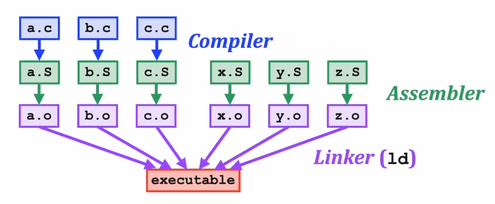
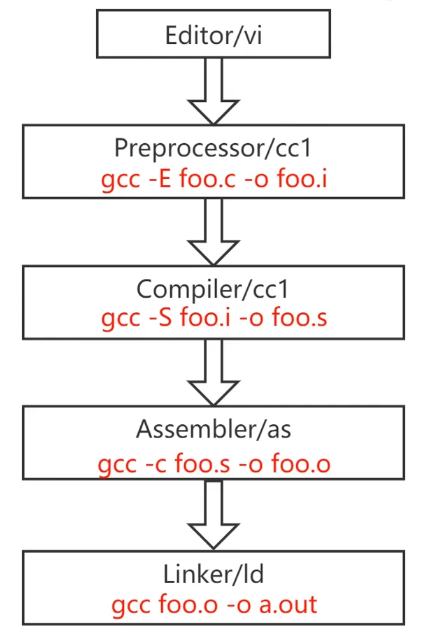

- **IR (Intermediate Representation)**: 中间代码的作用: 相当于有一个中间缓冲, 可以看成编译器的前端, 通过增加这一个模块, 可以让编译器的前端和后端解耦, 方便支持多种语言和多种目标架构.

    ```txt
                 frontend                              backend
               +----------+                        +------------+
          C -> |  Clang   | -+                 +-> |  llvm-x86  | -> x86
               +----------+  |                 |   +------------+
               +----------+  +-> +----------+ -+   +------------+
    Fortran -> | llvm-gcc | ---> | llvm-opt | ---> |  llvm-arm  | -> ARM
               +----------+  +-> +----------+ -+   +------------+
               +----------+  |                 |   +------------+
    Haskell -> |    GHC   | -+                 +-> | llvm-riscv | -> RISC-V
               +----------+  LLVM IR      LLRM IR  +------------+
    ```

- `volatile` 关键字: 告诉编译器不要优化这个语句.

- 在 C 中插入汇编代码 @Lazyparser_2025_bilibili:
	- 一般我们不会显式地指明用哪些寄存器或者内存地址, 让编译器来决定!

	```c
	// 相当于 add c, a, b
	// r 代表用寄存器来做对应 (m 表示用内存来做对应)
	int foo (int a, int b)
	{
		int c;
		asm volatile (
			"add %0, %1, %2\n" // 指令内容用双引号
			: "=r" (c) // 输出
			: "r" (a), "r" (b) // 输入
		);
		return c;
	}
	```

	也可以用:

	```c
	asm volatile (
		"add %[sum], %[add1], %[add2]\n"
		: [sum] "=r" (c) // 输出
		: [add1] "r" (a), [add2] "r" (b) // 输入
	);
	```

## C 编译过程

- Compiler, Assembler, Linker:
	- Watch [this video](https://www.youtube.com/watch?v=FD_nuXkhWbY)

	{width=90%}


- gcc 编译选项:
    - `-E`: 只预处理, 不编译.
    - `-S`: 生成汇编代码 (`.s` 文件)
    - `-c`: 只编译, 不链接. (生成 `.o` 文件)
    - `-o <file>`: 指定输出文件名.
    - `-g`: 在输出的文件中加入支持调试的信息.
    - `-v` (verbose): 显示编译过程中的详细信息.


:::{.column-margin}    

:::

装好 RISCV 编译工具链, 创建一个简单的 C 语言程序 `hello.c`:

```{.c filename="hello.c"}

```

运行:

```bash
riscv32-unknown-elf-gcc -c hello.c -o hello.o # 只编译, 不链接
```

用 `riscv32-unknown-elf-readelf` 查看生成的 `.o` 文件:

```bash
riscv32-unknown-elf-readelf -h hello.o > header_info.log # 查看 Header 信息, 并输出到文件
```

得到:

```{.log filename="header_info.log"}

```

再查看 Section 信息:

```bash
riscv32-unknown-elf-readelf -S hello.o > section_info.log # 查看 Section 信息, 并输出到文件
```

得到:

```{.log filename="section_info.log"}

```

对 `.o` 文件进行反汇编:

```bash
riscv32-unknown-elf-objdump -S hello.o > disassembly.s # 反汇编, 并输出到文件
```

得到:

```{.s filename="disassembly.s"}

```

### 动态链接

- 动机: C 的库函数 (比如 `printf()`) 在很多代码里会重复用到, 如果将这些库编译出来的代码直接插入到每个使用它的程序里, 会造成可执行文件体积太大的问题. 于是我们单独编译每个库文件为 `.so` (shared object) 文件 (windows 下为 `.dll`), 程序**运行时**再动态地重定位到这些文件的真实地址处.
	- 如果 `main.c` 需要用到 `mylib.c` 中的函数, 可以这样动态链接:

		```bash
		gcc -shared -fPIC mylib.c -o libmylib.so	# 先单独编译 mylib.c 为动态链接库
		gcc main.c -lmylib -L. -o main	# 编译 main.c 生成可执行文件 main
		./main	# 运行 main 可执行文件
		```
		其中 `-l` 表示指定动态库文件, 后面不要加空格, 而且省略前缀 `lib` 和后缀 `.so`; `-L` 后面接的是动态库文件所在的路径 (当前目录 `.`). 但是当运行 `./main` 时还是会提示找不到动态链接库, 因为 linux 默认去系统路径 `/usr/local/lib` 下找动态链接库, 可以:

		```bash
		export LD_LIBRARY_PATH="$(pwd)"
		```
	- 这些繁琐的命令行可以用 CMake 避免.

- 动态链接的另一个好处是: 在库变化时可以单独编译库文件而不用编译所有的可执行文件!

## RISCV 汇编语言

- 基本格式:

	```s
	<label>: <operation> # <comment>
	```

	- `<operation>` 的类型 @Lazyparser_2025_bilibili:
		- instruction (指令)
		- pseudo-instruction (伪指令): `li x6, 5`, `nop`, RISCV 中有定义
		- directive (伪操作): `.macro ... .endm`, `.end`, `.text`, `.global _start` 告知汇编器的指示, 与 RISCV 规范无关.
		- macro (宏):

			```s
			.macro do_nothing
				nop
			.endm

			_start: do_nothing # 调用宏, 汇编器会将它展开
			```

- 标签其实表示地址:

	```s
	_start: li x6, 5 # _start 标签其实就是这条指令的地址
	```

## References