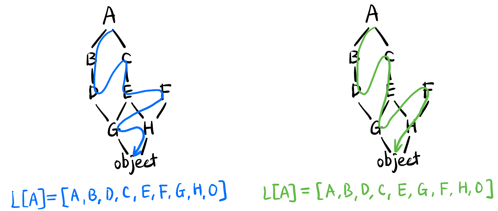

## C3 算法 {#sec-c3-algo}

> C3 线性化算法是 Python 用来确定类继承顺序 (MRO, Method Resolution Order) 的算法.

- Motivation: 具有多重继承的 **一些 class** 可以抽象为一个 **poset 偏序集**, 我们需要设计一种方法将其 **拉直**, 这样当一个子类没有某方法时可以按照某种 **确定** 的顺序去父类中寻找该方法!

    - 稍微严谨一点来说: 对于一个 poset, 任意挑选一个节点 $A$, 我们需要定义一个方法 $L$, 它返回**唯一**的一条以这个节点开头的 list $L[A]=[A, \cdots]$

    - 当然我们对 $L$ 有一些限制条件:
        - **所有的父类都应该在它的子类之前出现**
        - **父类也有顺序** (由代码中继承的顺序决定), 比如下面就要求 `F` 在 `G` 前面, `G` 在 `H` 前面 (但不一定挨着, 只要出现在之前就行):
            
            ```python
            class I(F, G, H):
                pass
            ```
    - 显然满足以上条件的 $L$ 不止一种, 比如:

        {#fig-c3-candidate}
    - Python 里可以用 `print(ClassName.__mro__)` 查看这个类返回的 list (称为 MRO).

- C3 算法的开发者想出了一个 ad hoc 的方法 (我感觉这个定义相当随意, 我有可能错): 定义 `merge()` 函数, 它将不同的有序 list 合并, **合并的结果保持所有 list 的序关系!**
    - 每次**从上往下**选择 head 中第一个出现的 valid 的节点.
    - valid 的定义是: 该节点不在任何其它 list 的 tail 中出现 (这一步的原因是比如 $A$ 在 tail 中出现了, 说明 $A$ 前面肯定还有它的父类没有被选中, 不能选 $A$).
    - 选中后将该节点从所有 list 中删除.
    - 直到所有 list 都为空为止.

<!-- ----------------------------------------- -->
::: {.callout-note icon=true collapse=false}
## EXAMPLE: C3 `merge()` 函数的工作过程
@fig-c3-demo 展示了:

$$
\text{merge}([B,A,O],[C,A,O],[D,O],[B,C,D]) = [B,C,D,A,O]
$$
的计算过程.

{#fig-c3-demo}
:::
<!-- ----------------------------------------- -->

- 利用 `merge()` 函数写出 C3 算法的递归表达式: 

    $$
    L[\text{Node}] = [\text{Node}] + \text{merge}(L[\text{Parent}_1], \cdots, L[\text{Parent}_n], [\text{Parent}_1, \cdots, \text{Parent}_n])
    $$

    其中 $\text{Parent}_1, \cdots, \text{Parent}_n$ 是类 $\text{Node}$ 的所有父类.

    - 比如对于 @fig-c3-candidate 中节点 $E$:

        $$
        L[E] = [E] + \text{merge}(L[G], L[H], [G,H])
        $$
    - 基于这个式子递归即可.