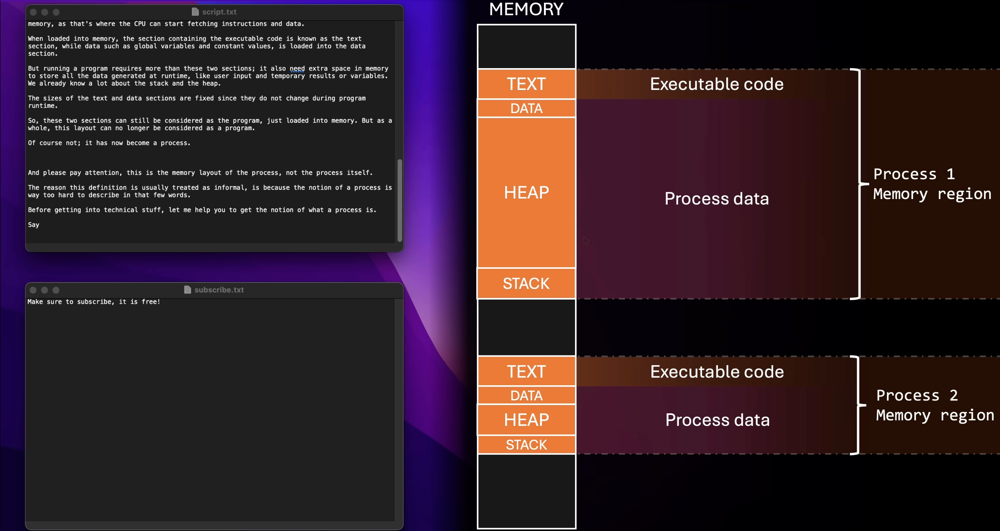
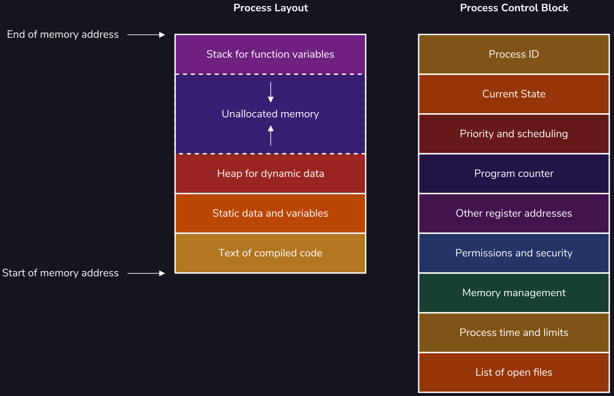

- 操作系统:
    - 狭义: 内核
    - 广义: 发行版

- 快捷参考表:

    | Unit | \# Bytes | Hex |
    |------|-----------------|-----|
    | 1 KB | $2^{10}$ B | 0x00000400 |
    | 4 KB | $2^{12}$ B | 0x00001000 |
    | 1 MB | $2^{20}$ B | 0x00100000 |
    | 128 MB | $2^{27}$ B | 0x08000000 |
    | 1 GB | $2^{30}$ B | 0x40000000 |

## 基本概念

### Process 进程

- **Program vs Process**:
    - **Program**: 理解为一段汇编程序加上一些用到的内存中的数据.
        - 汇编程序和数据其实都在内存中, 其实从本质上来看无法将他们区分. 数据和指令是等价的.
        - 也可以理解为一个 process 的 **代码段 (`.text`)** 和 **数据段 (`.data`)**.
    - **Process**: A program in execution.
        - 一个 Process 除了包含 Program 的内容, 还有在运行的时候动态增长的**堆 (`heap`)** 和 **栈 (`stack`)**.
        - 一个 Program (比如一个 C 编译出来的可执行文件) 可以被同时运行两次, 这时候就会有两个 Process, 只有他们的代码段部分是一样的, 但是数据段、堆和栈一般都不一样.
        - **Address Space**: 每个 Process 都有自己独立的地址空间 (见 @fig-program-process 的红色区域).

    {#fig-program-process}

- **Process Control Block (PCB)**: OS 用来管理 Process 的数据结构, 包含 @fig-process-layout 所示的信息.

    {#fig-process-layout}

- **Context Switch 上下文切换**

- 安全问题:
    - 安全问题的实现需要两个前提: 
        - 必须软硬件协同完成 (不能单靠软件)
        - OS 必须是可信任的.
    - 硬件上有标志位来区分当前 CPU 运行在哪种 Mode 上 (Kernel / User).
    - CPU 必须支持 Interrupt, 触发后 PC 自动跳到指定地址 (Interrupt routine), 并自动切换到 Kernel Mode.
        - 这说明该地址的 program 有完全的权限来操作硬件.
        - 所以该地址将不能允许被加载用户程序, 只能存放 OS 内核代码.

- Kernel (Privileged) Mode / User Mode
    - 仅 **Kernel Mode** 能做的事情
        - 执行 Privileged Instructions.
        - 访问网卡、硬盘、显卡、键盘、操作 MMU (如果能操作 MMU 就相当于可以对整个 Physical Memory 进行操作了)

- **System calls 系统调用**
    - 动机: User 程序显然需要以某种方式执行特权指令 (比如读写硬盘), OS 提供了一组 API (如 `fork()`, `open()`, etc.) 

- **Process Schedule 进程调度**

    {#fig-proc-sche}

## References