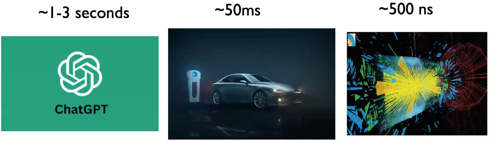

## Hi there!

This is my graduation project titled **System-Level Co-Design and AI-EDA of RISC-V Accelerators for TinyML at the Edge** under my supervisor [*Prof. Yun Li*](https://scholar.google.com/citations?user=1NT1jFMAAAAJ&hl=en). His PhD student *Jintao Li* also helps me greatly. This is a place where I record my learning journey into TinyML and RISC-V accelerators -- **from scratch**. The contents are actively updating. Some of the content may be too basic or even technically incorrect up to now, but they are, hopefully, informative and motivation-boosting. English documentation will be available soon.

> Correctness is the enemy of progress. -- Myself

本项目有关的代码主要存放在两个仓库:

- [My TinyML Repo](https://github.com/Marcobisky/TinyML)
- [My Forked CFU Playground](https://github.com/Marcobisky/CFU-Playground)

## Intended Outcomes

1. Developing an intelligent co-design framework that integrates RISC-V architecture customization with TinyML workload characteristics to enable joint optimization.

2. Designing and implementing hardware-accelerated TinyML kernels that are adaptable and efficient for edge computing scenarios.

3. Exploring a large multi-dimensional design space using automated methods (such as heuristic or evolutionary algorithms) to identify optimal configurations balancing accuracy, energy, and latency.

4. Advancing the understanding of system-level TinyML accelerator optimization, pushing the boundary beyond traditional manual design methods.


## Motivation 动机

- **Reduced bandwidth usage**: 大量应用程序都配备了图像处理的深度学习算法 (如 Animoji), 若想要利用服务器的算力资源, 则每秒至少需要输入 $30$ 帧图片到网络当中, 对于 ResNet-50 这种小网络, 模型运行时也需要占用 $3\text{ GB/s}$ 的带宽 @Hack_2025_CSDN. 因此, 需要 **将云端的一部分计算任务下放到端设备, 以减轻云端和网络带宽的压力**. 然而端设备大多采用嵌入式处理器 —— 嵌入式处理器受到功耗、体积、散热等多方客观因素的限制, 其性能远不如桌面平台. 我们可以利用 FPGA、ASIC 等 **低功耗、高能效** 的器件, 为相应的应用场景定制该领域所专用的加速器 @a2021_deep.

- **Low latency scenarios** @Intel_2025_intel: 在很多实时性的场景里面 (@fig-latency-level), 比如**自动驾驶** (自动驾驶汽车需要在本地处理视频流 @sali2025realtimefpgabased, 在 $50$ ms 内做出决策 @Asking_Questions_2025_youtube), **可控核聚变** (用 RL 在 DIII‑D National Fusion Facility 的 tokamak 装置上，对等离子体的撕裂不稳定 (tearing instability) 进行实时控制, 以避免这些不稳定导致反应中断@Asking_Questions_2025_youtube, @Duarte:2018ite, @Fusion_Energy_Sciences_2025_energy), etc. 我们需要在极短的时间内做出反应, 这就要求**计算设备必须在本地完成所有的计算任务**.

:::{.column-margin}
{#fig-latency-level}
:::

- **Why not GPUs?** @Asking_Questions_2025_youtube
    - Neural network layers on GPUs are often executed sequentially, with extra scheduling overhead.
    - GPUs provide limited flexibility for custom numeric precisions (though this has been improving recently).
    - Less control over memory hierarchy and data movement.

- **Privacy concerns**: Cloud-centric paradigms 可能会带来隐私泄露的问题, 比如医疗图像数据. 因此, **在边缘设备上处理敏感数据** 可以减少数据传输到云端的需求, 从而降低隐私泄露的风险 @deng2025edgeintelligencespikingneural. 另外, **FL** (Federated Learning) 可以将边缘设备上学到的内容汇总到云端, 避免直接传输数据本身 [@deng2025edgeintelligencespikingneural; @somvanshi2025tinymachinelearningtiny].

## 🗓️ Change Logs 更新日志


```{mermaid}
---
displayMode: compact
---
%%| label: fig-graduation-timeline
%%| fig-cap: "Gantt Chart"
%%| fig-width: 10
%%| fig-height: 6

gantt
    title Gantt chart: Graduation Project timeline and Relevant Activities
    dateFormat  YYYY-MM-DD
    axisFormat  %m-%d
    tickInterval 14d

    section Project
        CFU Environment :done, 2025-07-06, 2025-07-22
        CPU Design :done, 2025-10-30, 2025-11-14
        Target Net :milestone, 2025-12-10, 0d
        Coral NPU :active, 2025-12-28, 2026-01-23
        Interim :milestone, 2026-01-15, 0d

    section Research
        Heterogeneous Arch :done, 2025-10-09, 2025-11-25
        ViT :active, 2026-01-03, 2026-02-12

    section Learn
        YSYX :done, 2025-07-23, 2025-07-31
        HDL :done, 2025-07-24, 2025-08-04
        YOLO :done, 2025-07-17, 1d
        CPU Arch :done, 2025-10-10, 2025-11-14
        Algorithm :done, 2025-10-22, 2025-11-14
        RVV :done, 2026-01-01, 2026-01-16
        GPU Arch :active, 2026-01-15, 2026-02-12

```


```{mermaid}
%%| label: fig-gitgraph
%%| file: my-riscv-gitgraph.mmd
%%| fig-cap: "Github commit history"
%%| fig-width: 10
```

```{mermaid}
---
displayMode: compact
---
%%| label: fig-phd-timeline
%%| fig-cap: "Gantt Chart"
%%| fig-width: 10
%%| fig-height: 6

gantt
    title Gantt chart: PhD Project timeline and Relevant Activities
    dateFormat  YYYY-MM-DD
    axisFormat  %m-%d
    tickInterval 14d

    section Project
        DB :done, 2025-11-28, 2025-12-10
        cupid :milestone, 2026-02-12, 0d

    section Research
        3D IC :done, 2025-11-17, 2025-12-10

    section Learn
        VLSI :done, 2025-12-01, 2025-12-10
        RTL2GDS :active, 2026-01-15, 2026-01-19

```


::: {.tbl tbl-colwidths="[15, 10, 75]"}

| Date         | Section | Update Message |
|----------------------------|---|----------|
| **2026-02-12** | Project | 完成 CUPID 的 GPU 版本运行. |
| **2026-02-10~11** | Learn | 继续学习 GEMM 的 CUDA 加速. |
| **2026-02-08~09** | Learn | 复习 MHA, 学习 Python 迭代器, 张量操作与 `einops` 库. |
| **2026-02-06~07** | Project | CUPID `make` 成功并 merge 最新分支, 添加 CUDA 12.2 支持. |
| **2026-02-03~05** | Learn | 复习 CMakeLists 语法, 学习 C3 算法和递归, C++ wrapper 等. |
| **2026-01-29~02-02** | Learn | 复习 Torch 框架 (Autograd 等), 复习 Python 下划线有关. |
| **2026-01-28** | Learn | 学习 Pybind11, 复习 C++ Polymorphism, CMakeLists 构建. |
| **2026-01-25~27** | Learn | 学习 NVIDIA GPU 架构, 包括 SM, warp, block, grid, CUDA 编程模型. |
| **2026-01-23~24** | Learn | 学习 Cache 淘汰机制, write policy, etc. |
| **2026-01-19~21** | Learn | 搭建 tiny-gpu 和 Cocotb 仿真环境. |
| **2026-01-16~18** | Learn | 学习从 RTL 到 GDSII 的 EDA 流程. 深入研究 GPU 架构. |
| **2026-01-15** | Project | 完成毕设中期答辩, 调研 NVIDIA, Bytedance 实习机会. |
| **2026-01-10~14** | Project | 完成中期报告和 PPT. |
| **2026-01-04~08** | Learn | 学习 Transformer, ViT 模型架构, 理解了 Inductive Bias. 实践了 Cocotb 测试模块的流程. 学习 RVV ISA, **将 target net 更改为 MobileViT**. |
| **2026-01-03** | Learn | 学习 MobileNet 模型量化, Convolution as GEMM, 数据布局格式等 ML infra 知识. |
| **2026-01-01~08** | Learn | 学习 RVV 指令集. |
| **2025-12-28~2026-01-03** | Project | 阅读 Google Coral NPU 仓库. |
| **2025-12-05~27** | - | 准备期末考试. |
| **2025-11-28~12-05** | Project | 研究 3D placement db 到 2D db 的转换方法. |
| **2025-11-24~25** | Project | 阅读 Timing 代码. |
| **2025-11-22~23** | Research | 阅读 Timing-driven placement 相关论文. |
| **2025-11-17~20** | Research | 阅读 D2D placement 相关论文. 了解 3D placement 问题背景建模. |
| **2025-11-05~14** | - | 继续准备 CUHK 面试. |
| **2025-11-04** | Project | 完成 Research Proposal. |
| **2025-11-01~03** | Project | Alu, Instructions (BitPat), RegFile 代码完成. AXI 总线 Vivado 仿真成功. |
| **2025-10-26~31** | Research | 阅读 CFU 加速 Sparse DNN 的论文 @sabih2025hardwaresoftwarecodesignriscvextensions, 了解了 weights 在内存中的存储格式, CFU 能直接接触的数据依然在寄存器里的, 神经网络的前向传播也不一定要操作系统参与. Target Net 初步定为 [RT-DETR](https://github.com/lyuwenyu/RT-DETR) 或 [YOLO-World](https://github.com/AILab-CVC/YOLO-World). |
| **2025-10-22~26** | Learn | 学习 Array, Linked Lists, Stacks, Queues, Hash Tables, Trees, Graphs 等数据结构, 二叉树的遍历, DP = Recursion with memory, Quicksort. |
| **2025-10-10~26** | Learn | 学习操作系统, 实现串口打印、`printf()`, Multitasking 功能, 并用 `QEMU` 调试成功. |
| **2025-09-20~10-25** | - | 申请学校, 课业任务、实验等, 科研进度推进. |
| **2025-09-19** | Learn | 学习 blockchain: Proof (NP hard prob), 创世区块, 签名和加密, 最长链, 51% 攻击, 非对称加密, 哈希函数. 当然也有很多问题没解决. 讨论了 LLM, CNN 和 Transformer 的本质是 pretrained FCNN (通过给 FCNN 加先验的结构信息); DSC, Transformer 中的 $W_V$ 矩阵 和「注意力 + 全连接」的机制都可以理解为降低了参数量 (自由度), 类比为 $(a+b)^2$ 与 $a^2 + b^2$ 的关系; 问题: 如何形式化理解张量的指标运算 (mental picture 是单个元素而不是整个 tensor). GNN 是如何工作的? RAG 的具体原理? |
| **2025-09-16** | - | 老子雅思 7 分考出来了! (小分: 8/7/7/6.5) |
| **2025-09-14~15** | Learn | 复习强化学习, 学习了 DQN, Q-learning, 独立成功实现了 Tic-tac-toe 的 DQN 实现 (虽然性能不好, 但 from scratch) |
| **2025-09-13** | - | 考雅思 |
| **2025-09-03~12** | - | 复习 IELTS. |
| **2025-09-02** | Learn | 学习了强化学习和 AnalogGYM 框架, 学习了 DSC (= DWC + PWC), Winograd加速算法没看懂 (与 FFT 的本质区别是什么?), 也跟与学长讨论了, 很有意思. |
| **2025-09-01** | - | 做了一套 IELTS 题目. |
| **2025-08-16** | - | 雅思出分 6.5, 小分 7/6/5.5/6.5, 还得考 lol. |
| **2025-08-13** | - | 考雅思 |
| **2025-08-09~12** | - | 复习 IELTS. |
| **2025-08-08** | Learn | 学习 APB 协议, 发现有时候工程学也需要一点数学思维, 要把每个存在物 (比如总线、decoder、switch hub, etc.) 当作某个抽象观点的特例! 不要背协议, 而是理解协议这样规定的本质原因. |
| **2025-08-05~07** | - | 复习 IELTS. |
| **2025-08-04** | Learn | 刷 Chisel 的时候感到很无力, 编程语言的本质到底是什么? 为什么 `when()` 在 Scala 里面是函数而在 C 语言里面是语句? 一定有一套统一的思维方式来思考所有的编程语言, 使得学某种特定语言的过程相当于把大脑中的这个思维方式实例化. I felt stuck in this path, maybe I need a little bit encouragement. This happens, I know. |
| **2025-08-03** | Learn | 入门 CUDA 编程, 学习 NVIDIA 的 GPU 架构. 也学习了 Transformer 的原理, 加强了对注意力机制的理解. |
| **2025-08-01** | Learn | 按照 [汪辰老师的课程](https://www.bilibili.com/video/BV1Q5411w7z5?spm_id_from=333.788.videopod.episodes&vd_source=42579e22289b6144ba0b2bdcf99834e3&p=21), 初步复习了操作系统的 Memory Management, Linker script, Control flow, exceptional control flow, interrupt处理等. |
| **2025-07-30~31** | Learn | 在学习 ysyx 的过程中感到 **extremely depressed**, 我开始浏览 ysyx 入学之后的学习资料, 发现这些资料存在明显的平行性, 没有必要严格按照顺序来学习. 重新拾起烂尾的 [my-riscv](https://github.com/Marcobisky/my-riscv) 项目, 决定退出依赖 ysyx 的学习方法. |
| **2025-07-29** | Learn | 继续 ysyx 的 E4 (即 PA1), `make run` 成功运行 |
| **2025-07-28** | Learn | 开始 ysyx 的 E4 (即 PA1), 发现 ysyx PA 的思路是自顶向下的 |
| **2025-07-27** | Learn | 在 MacOS 和 Ubuntu 上完成了 ysyx 环境的配置, 可同时在两台设备上开发, `man` 这个命令感觉挺有用的. |
| **2025-07-24~26** | Learn | 通过 HDLBits 刷了一些 verilog 题目. |
| **2025-07-23** | Learn | 报名一生一芯 (ysyx), 准备先造个 CPU 出来, 再来加速 ML. |
| **2025-07-17** | Learn | 准备进行 Vitis HLS 的学习, 初步学习了 YOLO V1 的原理. |
| **2025-07-12** | Project | 成功将 CFU-playground 的 `proj_template` 烧到 Arty 开发板上. 认识到开发环境的搭建和理解是一项较大的工程, 但是实际有用的信息并不多, 所以打算并行地学习环境的搭建和 CPU、GPU、Cuda 的知识. |
| **2025-07-11** | Project | 大致了解了各大 submodule 的功能. |
| **2025-07-10** | Project | 在 Ubuntu 24.04 和 MacOS 上成功搭建 iCESugar-UP5K 开发环境, 并成功烧录! 完善了教程内容, 建立了 [My TinyML Repo](https://github.com/Marcobisky/TinyML) 用来存放 iCESugar-UP5K 开发板的例子代码和 ML 加速器的代码. |
| **2025-07-09** | Project | 在 Ubuntu 24.04 上成功构建 `CFU-Playground` 的 `/proj/proj_template` 实例工程. 并且发现 MacOS 上也可以用 Docker 成功生成比特流文件. |
| **2025-07-08** | Project | 喜提新 Thinkbook, 由于显卡和网卡驱动找不到安装 Debian 失败特别狂躁, Tonic 上报复性狂练 3 小时降 E 大调音阶. 后来安装 Ubuntu 24.04 实体机成功编译. btw, [Spark](https://xqark.github.io) 推荐的 AtlasOS 太好用啦, [Synergy](https://symless.com/synergy) 同步 Win, Mac, IOS, Linux 剪切板太方便啦 (就是没有安卓hh) |
| **2025-07-07** | Project | 发现在 M 芯片 MacOS 上无法安装 `linux-64` 架构, 改用 Docker 搭建环境成功 ... 了一半, 最后因为 Docker 无法连接访问 MacOS 连接的 USB 而构建实例工程失败. |
| **2025-07-06** | Project | 尝试在 MacOS 上原生搭建和用 Docker 搭建, 无果, 遂改用 Parallel Desktop 上安装 Ubuntu 24.04. |
| **2025-06-29** | - | Initial commit. |
:::

<!-- %%{init: { "theme": "base", "themeVariables": {
    "fontSize": "14px",
    "textColor": "#1a1a1a",
    "taskTextColor": "#1a1a1a",
    "taskTextDarkColor": "#ffffffff",
    "taskBorderColor": "#202020ff",
    "taskBkgColor": "#e3f2fd",
    "taskBkgColorActive": "#bbdefb",
    "taskBkgColorDone": "#c8e6c9",
    "taskBkgColorCrit": "#ffcdd2",
    "taskTextOutsideColor": "#1a1a1a"
}}}%% -->


## References {.unnumbered}
