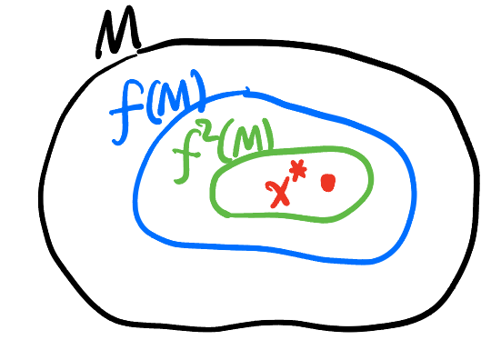
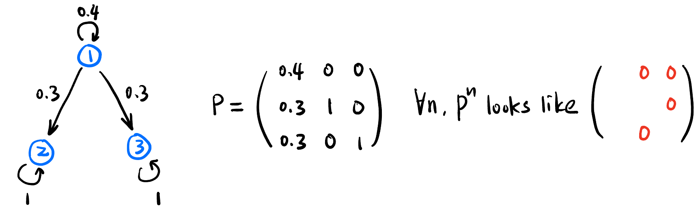
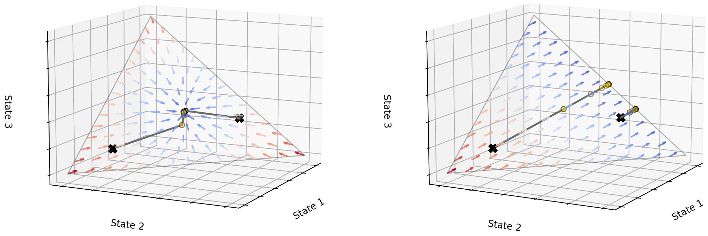
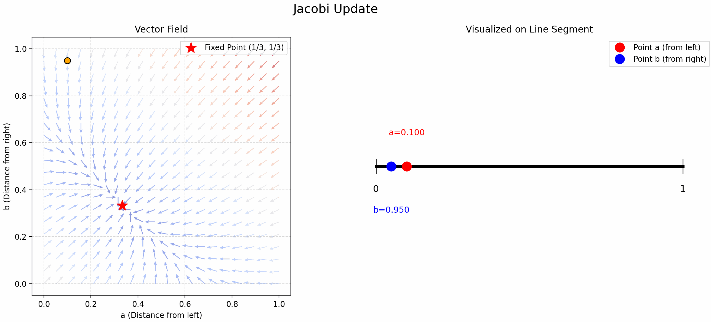
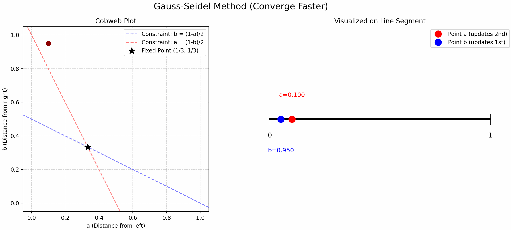

### Recursion

> Recursion 常出现在当你不能**一步**写出一个问题的解时, 试图通过描述问题的**某个局部所满足的性质** (不一定跟关心的问题有直接关系, 能知道什么写什么), 可能是某个时间片段、某个微小的空间 ..., 只要问题的**所有局部**都满足这个性质, 那这个不起眼的局部性质就**含有构建全局的所有信息**从而可以左脚踩右脚构建 (**Bootstrap**) 出问题的全貌, 构建的过程就是我们说的「解」某个差分或微分方程.

> 方程不同于赋值, 两侧一般都有相互纠缠的变量 (比如 HJB 方程), 毕竟它是方程嘛.

- 针对问题是否离散、是否随机, 可以有不同的方法来处理:

    | | Discrete in Time | Continuous in Time |
    | ---- | ---- | ---- |
    | Deterministic | Difference Equation | ODE |
    | Stochastic | Markov Chain | SDE |

- 一般情况下 Difference Equation 和 Markov chain 都是时不变的 (time-homogeneous), 但也可以是时变的 (time-inhomogeneous)!

- 下面是我遇到过的一些具体例子, 它们都可以通过这个框架统一起来 (我们不再区分 Discrete/Continuous):
    - **Deterministic**: Fibonacci sequence, 迭代法找三等分点, Simple pendulum, 自然数的定义.
    - **Stochastic**: 图上的随机游走, RL 中的 Value Iteration, MCMC Sampling (e.g., Metropolis-Hastings Algo), 朗之万动力学采样.

#### Banach Fixed Point Theorem

- **Contraction Map**: 设 $(M, d)$ 是一个 Metric Space, $f: M \to M$ 是一个映射. 若 $\exists \alpha \in [0,1)$, s.t., $\forall x, y \in M$ 都有
    $$
    d(f(x), f(y)) \leq \alpha \cdot d(x, y),
    $$
    则称 $f$ 是一个**收缩映射**.

::: {.column-margin}
{#fig-contraction}
:::

- **Banach Fixed Point Theorem**: 设 $f$ 是 $(M, d)$ 上的一个 contraction map, 则 $f$ 存在唯一的 fixed point $x^*$, i.e., $f(x^*) = x^*$.
    - 并且对于任意 $x_0 \in M$, 迭代 $x_{n+1} = f(x_n)$ 都会收敛到 $x^*$!

#### Markov chain (MC)

- **Stationary Distribution**: 满足 $P \pi = \pi$ 的分布 $\pi$.
- **Irreducible MC**: 任意两个状态 $s_1, s_2$ 之间都**可以**经过 $n$ 步后互相到达. 即: $\forall s_1, s_2, \exists n \ge 0$ s.t. $$[P^n]_{s_2, s_1} > 0$$
    - 只要存在一对状态 $s_1, s_2$ 之间永远无法互相到达就是 **Reducible MC**!

        {#fig-mc-reducible width=80%}

- **对 Irreducible Markov chain 来说, Stationary distribution 存在且唯一!**
    - 说明无论初始分布 $\pi_0$ 是什么, 在矩阵 $P$ 的作用下, 都会被吸引到 $\pi$ 上来.

    {#fig-mc-irreducible-vs-reducible}

#### Bellman Equation

- 设 $V^*$ 为在**给定 policy 和 environment** 下所有 state value 组成的向量, Bellman operator $T$ 将任意的 state value vector $V$ 映射到一个新的 state value vector $T V$.
    - **Bellman operator $T$ 是一个 contraction map!** (用 $\lVert \cdot \rVert_\infty$ 做度量.)
    - 这意味着我们可以随机初始化一个 state value vector $V_0$, 迭代 $V_{n+1} = T V_n$ 就会收敛到 $V^*$!

#### Finding Trisection Points Using Updates

- 小时候折纸时我总感觉中点找起来很舒服, 但是三等分点很难找. 当时的我想出了一个方法: 先随机取一个点, 这个点将线段分割成了两份, 在这两份上分别交替取中点 (见 @fig-find-point-async), 就能找到三等分点了! 现在发现这叫 Gauss-Seidel Update!

- 我们将这个问题抽象一下, “交替” 取中点就是用以下公式更新 $a,b$:

    $$
    \begin{cases}
    b &= \frac{1-a}{2} \\
    a &= \frac{1-b}{2}
    \end{cases}
    $${#eq-trisection}

    - **Jacobi Update**: 先随机取 $(a,b)$, 带入 @eq-trisection 的 RHS 计算出新的 $a$ 和 $b$, 循环迭代.
        - 可以证明: $$f: (a,b) \mapsto \left(\frac{1-b}{2}, \frac{1-a}{2}\right)$$ 是一个 contraction map! 它的不动点是 $(\frac{1}{3}, \frac{1}{3})$.
    - **Gauss-Seidel Update**: 先随机取一个 $a$, 根据第一个公式更新 $b$, 再用这个新的 $b$ 用第二个公式更新 $a$, 交替迭代.
        - 比 Jacobi Update 更快!

::: {layout = "[50,50]"}
{#fig-find-point-sync}

{#fig-find-point-async}
:::

#### M-H Algorithm

- 目标: 从一个任意的**已知分布** $p$ 中采样 (**假设我们只能生成均匀分布和高斯分布的随机数**). 有没有什么办法能让我们构造一个 **Markov chain**, 使得它的 stationary distribution 就是 $p$?
    - 有的兄弟有的! 这看起来非常不可能, 注意 Markov chain 可是**没有记忆的**, 它不能根据历史上它选了哪些点来调整后续的策略, 它根据上一次它选了哪个点来决定下一步怎么选点!

### Bellman Equation

| MDP (马尔可夫决策过程) | HJB (哈密顿-雅可比-贝尔曼方程) | 拉格朗日/哈密顿力学 | VGG-Flow |
|-----|-----|-----|-----|
| State $$s(t)$$ | State $$x(t)$$ | State $$q(t)$$ | Image $$x(t)$$ |
| Policy (Probabilistic) $$\pi(a\|s)$$ | Control (Deterministic) $$u(x,t)$$ | Velocity $$\dot{q}(q,t)$$ | Residual Field $$\tilde{v}_\theta(x,t)$$ |
| Environment (Stationary) $$\begin{cases} p: (s,a) &\mapsto s' \\ r: (s,a) &\mapsto \text{Reward}\end{cases}$$ | Dynamics (Time-varying) $$\begin{cases} f: (x,u,t) &\mapsto \dot{x} \\ L: (x,u,t) &\mapsto \text{Loss} \end{cases}$$ | Dynamics (Time-varying) $$\begin{cases} f: (q, \_, t) &\mapsto \dot{q} \\ \mathcal{L}: (q, \dot{q}, t) &\mapsto \text{Lagrangian} \end{cases}$$ | Dynamics (Time-varying) $$\begin{cases} v_\theta: (x, \tilde{v}_\theta, t) &\mapsto \dot{x} \\ L: (x, \tilde{v}_\theta, t) &\mapsto \text{Loss} \end{cases}$$ |
| State Value (Given $\pi$) $$V(s) = \mathbb{E}(\underbrace{\Sigma r}_{\mathclap{\scriptsize \text{discounted reward}}})$$ | Value (Given $u$) $$V(x,t) = \int_t^T L \mathrm{d}\tau + \underbrace{\Phi(x(T))}_{\mathclap{\scriptsize \text{terminal loss}}}$$ | Action (Given $\dot{q}$) $$S(q,t) = \int_t^T \mathcal{L} \mathrm{d}\tau$$ | Value (Given $\tilde{v}_\theta$) $$V(x,t) = \int_t^1 L \mathrm{d}\tau - \underbrace{r(x(1))}_{\mathclap{\scriptsize \text{terminal reward}}}$$ |
| State-action Quality $$q(s,a)$$ | Quality Density $$H(x,\nabla V,t) = L + \langle \nabla V, \dot{x} \rangle$$ | Hamiltonian $$\mathcal{H}(q, \nabla S, t) = \mathcal{L} + \langle \underbrace{\nabla S}_{\mathclap{\scriptsize \text{momenta } p}} \cdot \dot{q} \rangle$$ | Quality Density $$H(x, \nabla V, t) = L + \langle \nabla V, \dot{x} \rangle$$ |
| Bellman Equation (Given $\pi$) $$\begin{cases} V &= \langle q_i \rangle \\ q_i &= \langle r_j + \gamma V_k \rangle \end{cases}$$ | HJB Equation (Given $u$) $$-\frac{\partial V}{\partial t} = L + \langle \nabla V, \dot{x} \rangle \quad (= H)$$ | HJ Equation (Given $\dot{q}$) $$-\frac{\partial S}{\partial t} = \mathcal{H}$$ | HJB Equation (Given $\tilde{v}_\theta$) $$-\frac{\partial V}{\partial t} = L + \langle \nabla V, \dot{x} \rangle \quad (= H)$$ |
| Optimal Bellman (For deterministic $\pi^*$) $$\begin{cases} V^* &= \max_i q_i \equiv q^* \\ q^* &= \langle r_j + \gamma V'^* \rangle \end{cases}$$ | Optimal HJB $$-\frac{\partial V^*}{\partial t} = \min_u \left\{ L + \langle \nabla V^*, \dot{x} \rangle \right\}$$ | - | Optimal HJB $$-\frac{\partial V^*}{\partial t} = \min_{\tilde{v}_\theta} \left\{ L + \langle \nabla V^*, \dot{x} \rangle \right\}$$ |

- 一些解释:
    - Quality 和 Value 是一模一样的, 除了 Value 是严格按照 policy $\pi$, 而 Quality 虽然也给定了 $\pi$, 但第一步可以选择任何一个 action (不一定是 $\pi$ 里选择概率最大的那个), 后面都按 $\pi$ 来走的期望 reward 是多少.
        - 简单来说, 给定确定的 $\pi$, **Value 是针对 State, Quality 是针对 State-Action pair 的**.
        - Quality 天生有 Off-policy 的性质, 它喜欢冒险, 看看「如果我在这一步换个做法, 会不会更好」.

    - 第一个公式 $q_i$ 表示在 state $s$ 下执行所有可能的 action 后的 $q$ **被 policy** 加权平均后的值; 选择了某个 action $a_i$ 后环境可能可以给 reward $r_j$ 并转换到某个状态 $s_k$ (with state value $V_k$), 第二个公式就是**被环境**中的这些不确定因素加权平均后的值.

### Score-based Generative Model (SGM)

- 所有等大小 (设总共 $D$ 个像素) 的图片构成 **Image Space** $\mathbb{R}^D$.
    - Image space 中每个点都是一张图片.
    - 但大部分点对应的图片都没有意义, 设某点 $\mathbf{x} \in \mathbb{R}^D$ 对应的图片有意义的概率为 $p_{\text{data}}(\mathbf{x})$.
        - 这相当于说在 $\mathbb{R}^D$ 上存在一个**确定**的标量场, 只是没人知道它的表达式.
        - 你让我解释一下一张图片有意义的「概率」是个什么玩意儿? 这是人为定义出来的, 也许你可以理解为「这张图片有意义的概率为 $50\%$」意思是给 100 个人看平均会有 50 个人觉得它有意义. 但物理世界生活中有没有概率这件事都是有争议的, 也许压根不用定义「概率」这个变量就可以描述世界了呢 (就像费曼的路径积分一样).

- **Score vector field**:
    - **动机**:「图片生成」相当于在 $\mathbb{R}^D$ 中采样, 尽量采到概率大的点, 对吧? 想想看, 直接采样好像有点难实现. 如果能随便在 $\mathbb{R}^D$ 里面取一个点, 然后知道它的概率标量场的梯度, 那就可以沿着**梯度上升**的方向移动, 逐步向概率大的点靠近! 完美!
    - 但实际情况是: 即使我们知道了概率标量场的梯度场, $\mathbb{R}^D$ 中大部分点的梯度模长都几乎是 0, 根本动不了.
    - 小怎么办? 先取 $\log$ 再求梯度呗, 鱼逝定义: $$S \equiv \nabla \log p_{\text{data}}: \mathbb{R}^D \to \mathbb{R}^D$$ 为 $p_{\text{data}}$ 的 **Score vector field**! (记为 $S$).
        - score 听起来像是一个标量, 但它其实是一个向量场.
        - 这个向量场就是我们要找的 (用一个神经网络 $S_\theta$ 来拟合它!)
        - $S$ 不是随时间变化的, 是固定的!

- 如何训练呢?

### DDPM

- **Motivation**
    - 初始的 idea 是为了构建训练数据, 将一张图片 $\mathbf{x}_0$ 逐步加噪声 $\varepsilon$, 用反过来的过程来训练模型从有噪声的图片预测前一步较为干净的图片.

