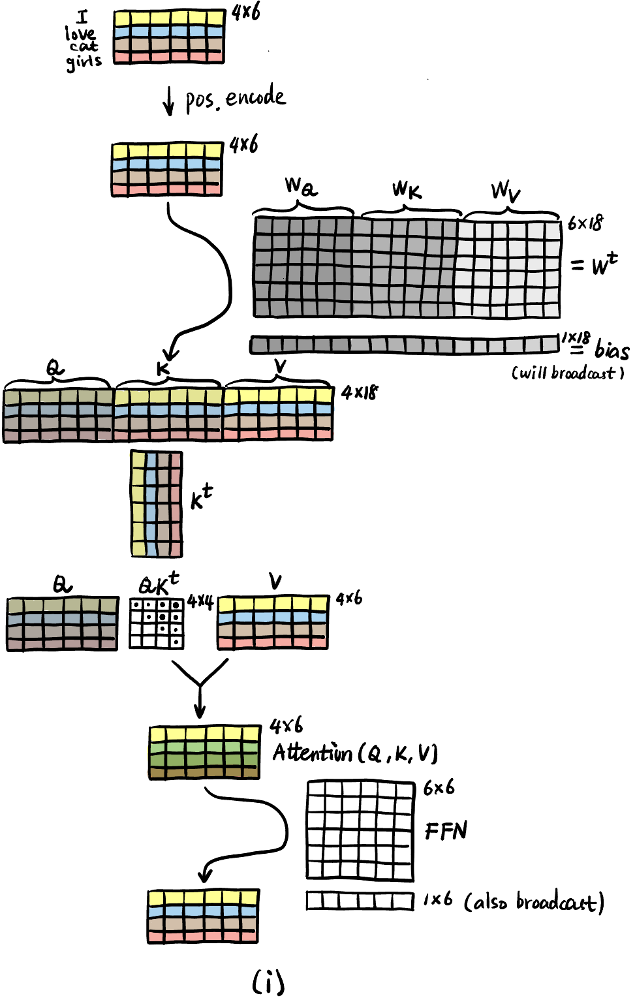
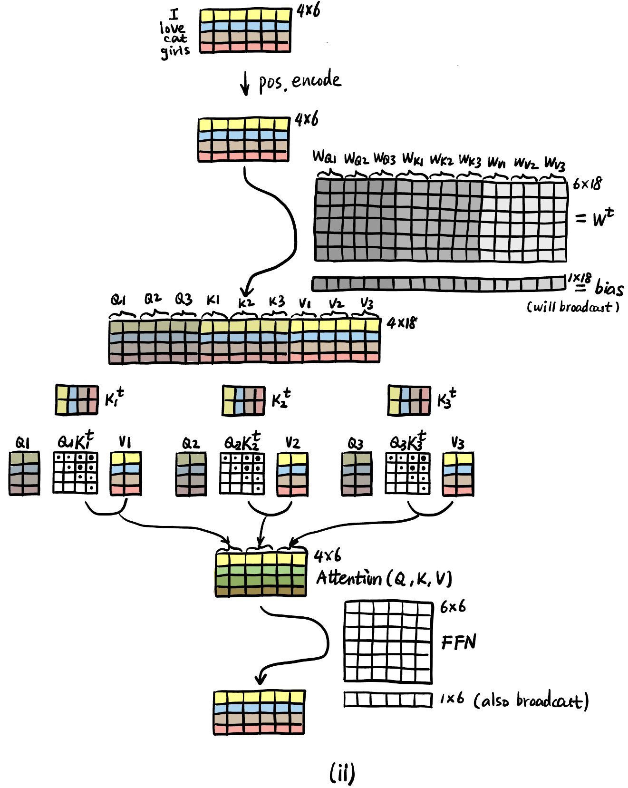

> 下面我们列举一些神经网络中的一些层, 它们仅仅是对 tensor 的一些操作.

### 带参数的层

#### Convolution 卷积层

> 匹配 NCL 或 NCHW 中的 C.

- `Conv1d` 和 `Conv2d` 输入张量必须为 `NCL` 和 `NCHW` 格式且维度正确, 左边缺少维度自动补 1, 左边多了维度会报错.

    ```python
    photos1d = torch.randn(2,3,20)
    photos1d_ = torch.randn(3,20)  # 也可以
    # photo1d = torch.randn(2,4,20)  # 报错: 维度不匹配
    # photo1d = torch.randn(2,3,20,5)  # 报错: 维度多了
    t1 = nn.Conv1d(in_channels=3, out_channels=6, kernel_size=3, padding=1)(photos1d)

    photos = torch.randn(2,3,5,4)
    photos_ = torch.randn(3,5,4)  # 也可以
    # photo = torch.randn(2,6,5,4)  # 报错: 维度不匹配
    # photo = torch.randn(1,2,3,5,1)  # 报错: 维度多了
    t2 = nn.Conv2d(in_channels=3, out_channels=6, kernel_size=3, padding=1)(photos)
    ```


#### Linear 线性层

> 只要匹配最右边的维度即可, 左边可以随便加多少 (按相同操作处理).

```python
t = torch.randn(2,10)
t_ = torch.randn(2,3,5,1,2,10)  # 也可以
t1 = nn.Linear(in_features=10, out_features=5)(t)   # t1.shape = [2,5]
```

#### Normalization 归一化层

> 选择 tensor 的**某些维度**的元素作为整体进行归一化, 传入的参数非常恼火, 理解不了就忽略吧.

```python
import torch
photos = torch.randn(10, 3, 224, 224)               # [N,C,H,W]
bn = nn.BatchNorm2d(num_features=3)                 # 参数填写 C 的数值
ln = nn.LayerNorm(normalized_shape=[3,224,224])     # 参数填写 [C,H,W], 为什么要这样, 我真佛了
my_norm = nn.LayerNorm(normalized_shape=[224,224])  # 也可以定制, 即将最后两个维度视为求均值和方差的整体.
```

- **Post-norm 和 Pre-norm**

    {#fig-pre-post}


<!-- ----------------------------------------- -->
::: {.callout-note icon=true collapse=true}
## 图片处理中的 Normalization

- Normalization 指对 tensor 的**某些数据当作整体** (@fig-norm 的蓝色区域), 算 $\mu$ 和 $\sigma^2$, 然后对该区域的每个元素 $x_i$:

    $$
    \hat{x}_i = \frac{x_i - \mu}{\sigma}
    $$

    最后这个区域内的所有元素 $\hat{x}_i$ 还会被**统一处理**为:

    $$
    y_i = \gamma \hat{x}_i + \beta
    $$

    这就是 Norm 层参数的来源, 可以算算参数量如何决定.

- Norm 层会加入神经网络的很多地方, **本质上是在给神经网络加入 Inductive Bias**! 即告诉神经网络哪些数据是类似的 (满足同一个分布, 从而将他们等地位化 (即归一化)).

- 由于 Norm 层经常用于处理图片的 4 维张量 $[N,C,H,W]$ [^n-batch] ($[10, 3, 224, 224]$ 表示 $10$ 张 $224\times 224$ RGB 图片), 所以会用图片处理的维度来描述不同蓝色区域的选择, 分为:
    - **BN (Batch Normalization)**: 对 output tensor 中相同 Channel 的元素进行归一化.
        - 之所以叫 Batch Norm 是因为图像处理中 **output tensor** 的一个 channel 对应 **parameter tensor** 的一个 batch. 为什么不叫 Channel Norm!? SB.
    - **LN (Layer Normalization)**: 对 output tensor 的一个 batch 中所有元素进行归一化.
        - LLM 常用.
    - **IN (Instance Normalization)**
    - **GN (Group Normalization)**

{#fig-norm}

[^n-batch]: $N$ 表示 batch.
:::
<!-- ----------------------------------------- -->


#### Attention 注意力层

<!-- ----------------------------------------- -->
::: {.callout-note icon=true collapse=true}
## Attention 的理解

- 一个 Attention head 里面的 Inductive Bias 分析:
    - Query $Q$: Hey, do you all have anything relevant in terms of **\<syntax\>** for me?
    - Key $K$: Here is what I can offer in terms of **\<syntax\>**.
    - Score: How relevant is what you guys offer in terms of **\<syntax\>**?
    - Value $V$: What direction in the embedding space should I move to capture **\<syntax\>** information?

- Multi-head: 相当于问很多个不同的问题, 即改变 "**\<\>**" 里面的内容, 比如 **\<meaning\>**, **\<irrelevance\>**, **\<description\>**, etc.
    - 合并多个 head 输出的向量可以用相加或者拼接.

        {#fig-mha width=80%}


::: {layout = "[50,50]"}
{#fig-sha-compute width=80%}

{#fig-mha-compute width=120%}
:::


:::
<!-- ----------------------------------------- -->


### 无参数的层

- **「切片」操作**: 对 tensor 某一维度的处理.

- **Softmax**: 下面代码 `Softmax(dim=1)` 表示在 `t` 的第 2 个维度「切片」的整体做 softmax.

    ```python
    t = torch.tensor([
        [ 1,1,1,1 ],
        [ 2,2,2,2 ],
        [ 3,3,3,3 ]
    ], dtype=torch.float32)     # torch.Size([3, 4])
    t = nn.Softmax(dim=1)(t)    # tensor([[0.2500, 0.2500, 0.2500, 0.2500],
                                        # [0.2500, 0.2500, 0.2500, 0.2500],
                                        # [0.2500, 0.2500, 0.2500, 0.2500]])
    ```

- **其它操作**
    - **激活函数**: `SiLU()`
    - **恒等映射**: `Identity()`
    - **Dropout**: 训练时随机置 0, 推理时自动关闭.
    - **下采样**: `AvgPool2d()`
    
### 其它


#### DSC 深度可分离卷积

我们直接举例说明 DSC (Depthwise Separable Convolution) 如何减少计算量:

- 参数:
    - Input 输入信息: $(7\times 7) \times 8 = 392$ ($8$ 个 channel).
    - Output 输出信息: 同上.
    - Filter 卷积核:
        - **平面 (2D) 大小**: $3 \times 3 = 9$.
        - **立体 (3D) 大小**: $(3\times 3) \times 8 = 72$.
        - **张量 (4D) 大小**: $(3\times 3) \times 8 \times 8 = 576$. (最后的 $8$ 是卷积核个数 (= 输出通道数), 注意 [HWCN 规范](../glossary/glossary.qmd#sec-cv-terms)).
        - @fig-normal-conv 中每个「立体核」都会对 Input 进行扫描, 姑且将「闪」一下称为一次「快照」.
    - Stride = 1 (`s1`).
    - Padding = 1 (@fig-normal-conv 的灰色部分).

- **常规卷积层** (见 @fig-normal-conv):
    - **参数量** = 一个立体核参数量 + 有几个立体核 $= (72+1) \times 8 = 584$ (别忘了每个卷积核还有有一个 bias 参数).
    - **MAC**[^mac] = 「闪」一次的 MAC $\times$「闪」的总次数 $= 72 \times 392 = 28224$.
        - **FLOPs** = MAC $\times 2 = 56448$.

[^mac]: 算 MAC 的时候这样思考: 每「闪」一下都算了 $72$ 次乘法和 $71$ 次加法, 哦不对! **最后还要加 bias**, 所以加法也是 $72$ 次 (即 MAC=72); 而输出的每个「小方块」都对应一次「快照」! 这两个数乘一下就是总 MAC 数了.

- **DSC** (见 @fig-dsc):
    - **参数量** 
        - Depthwise 部分 $= (9+1) \times 8 = 80$.
        - Pointwise 部分 $= (8+1) \times 8 = 72$.
        - 总共 $80 + 72 = 152$.
    - **MAC** 
        - Depthwise 部分 $= 9 \times 392 = 3528$.
        - Pointwise 部分 $= 8 \times 392 = 3136$.
        - 总共 $3528 + 3136 = 6664$ (比常规卷积小了 $4$ 倍多!).
        - **FLOPs** = MAC $\times 2 = 13328$.
    - DSC 相当于将 channel 之间和 spatial 之间的信息混合方式分开训练.
    - DSC 还可以有 **Depth multiplier 深度乘子** 和 **Group** 的概念. **Depth multiplier** 指每个输出通道不一定要对应一个卷积核, 也可以对应两个卷积核 (深度乘子 $=2$), 并产生两个输出通道. **Group** 见 @fig-dsc-group.

::: {layout = "[50,50]"}
{#fig-normal-conv}

{#fig-dsc}
:::

::: {.column-margin}
{#fig-dsc-group}
:::
