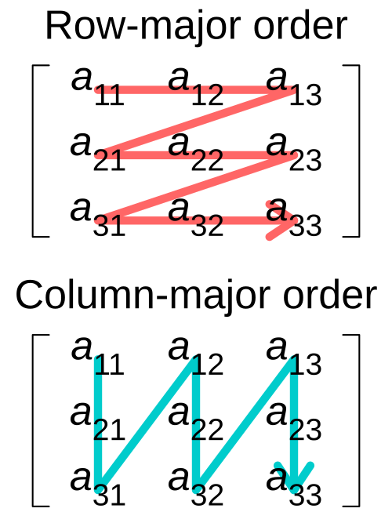
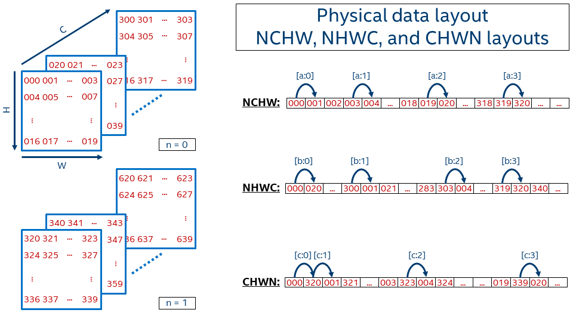
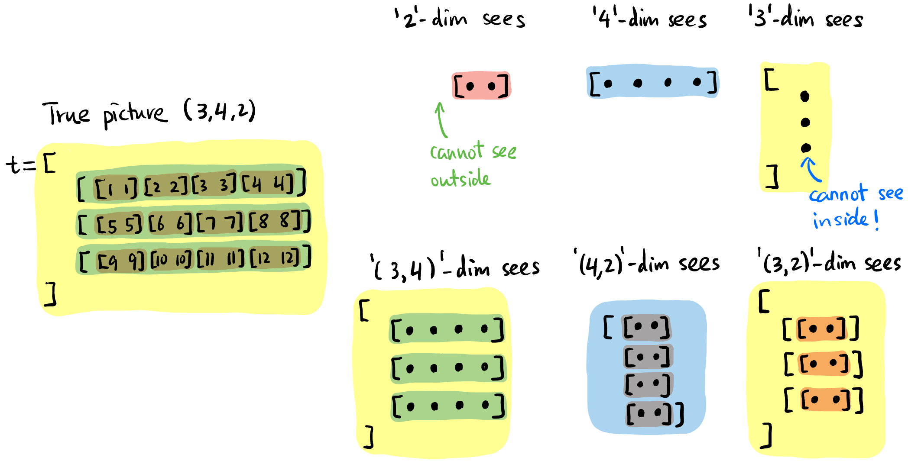
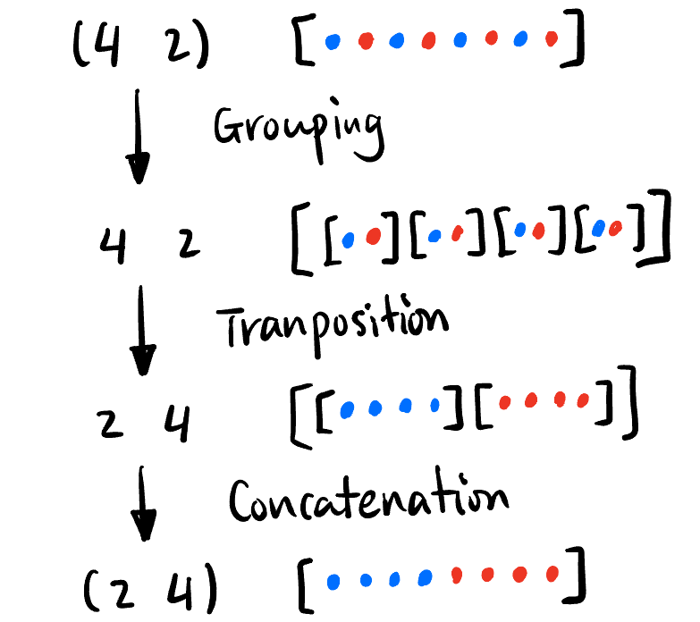
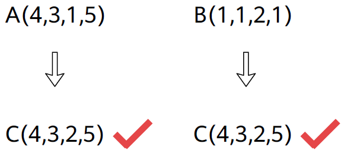

- **动机**: 很多**地位都相同**的数据可以用一维数组存储. 如果有很多不同「地位」的数据, 我们给没种地位分配一个维度来存储, 这就是张量.

- 名字来源: 由于数学里 $(0,k)$-tensor $T: V^k \to \mathbb{F}$ 在选取一组 basis $\{\mathbf{e}_i\}_{i=1}^k$ 后的 representation 刚好是一个 $k$ 维数组 $T_{i_1i_2 \cdots i_k}$ (正如 linear functional 可以被一个 covector 描述, bilinear functional 可以被一个 matrix 描述).

- 机器学习里 **training data**, **kernel**, **feature map** 等都用 tensor 来描述, Python 自带的 `list` 和 `np.array()`, 统统都要转化为 `torch.tensor` 来进行计算 (因为 `Tensor` 类提供了很多现成的方法可以调用).

    ```python
    import torch
    import numpy as np
    # python list to tensor
    data_list = [[1, 2, 3], [4, 5, 6]]
    list2tensor = torch.tensor(data_list)
    # numpy array to tensor
    data_array = np.array([[1, 2, 3], [4, 5, 6]])
    array2tensor = torch.from_numpy(data_array)
    ```

### Tensor Format

- **2D tensor**: (就是矩阵)
    - **Row, Col (R, C)**: 两个维度.
    - **Memory Layout**: 见 @fig-tensor2d-layout.
        - **Row-major (RC)**: 先沿着行方向将数据拉直, `numpy` 采用.
        - **Column-major (CR)**: 先沿着列方向将数据拉直, `Eigen` 采用.

::: {.column-margin}
{#fig-tensor2d-layout}
:::


- **4D tensor**: 特别是在图像处理中, 4D 张量非常常见, 现在单独详细研究一下它:

    - **H, W, C(D), N(B) 维度语义**: Height, Width, Channel(Depth), Batch size (见 @fig-tensor-layout 左图).

    - **Memory Layout**[^data-layout]: (注意无论多少维度的张量, 在内存中显然都是以 (也只能以) 一维数组的形式连续存储).
        - <u>HWC</u>**N**: Batch 在最后.
        - **N**<u>HWC</u>: Batch 在最前, `numpy` 采用.
        - **N**<u>CHW</u>: Batch 在最前, `pytorch` 采用 (个人感觉这是最符合直觉的顺序!)

        {#fig-tensor-layout width=90%}

[^data-layout]: *记忆方法*: 反过来看, 如 NHWC, 先沿着 C 方向将数据拉直, 结束后跳到下一个 W, 然后换 H, 最后换 N.

::: {.column-margin}
{#fig-tensor-format-conversion}
:::


### Mental Picture of Tensors

- **同一个中括号内用逗号分割**的元素一般被认为**地位相同**. 比如下面 `1`, `2`, `3` 地位相同, `[1,2,3]` 和 `[4,5,6]` 地位相同.

- **Tensor size**: 笔者习惯从最内层中括号开始读起, 每层中括号相同地位的元素个数即为该维度的大小, **从右向左** 列出来即为 tensor shape.
    - 比如:

        ```python
        torch.Size([2, 4])
        ```
        
        应解读为两个 `[....]` 而不是 4 个 `[..]`. 

    - 这里留两个练习, 给出下面两个 tensor 的 shape:

        ```python
        t = torch.tensor([
            [ [1], [2],  [3],  [4]  ],
            [ [5], [6],  [7],  [8]  ],
            [ [9], [10], [11], [12] ]
        ])
        u = torch.tensor([
            [ [ [ [1] ] ], [ [ [2] ] ] ]
        ])

        print(t.shape)  # 输出: torch.Size([3, 4, 1])
        print(u.shape)  # 输出: torch.Size([1, 2, 1, 1, 1])
        ```

- **当我们说一个「维度」时我们在谈论什么?**
    - 每个维度看到的「元素」都是「**片面**」且「**抽象**」的. 比如下面的 `4` 这个维度看见的画面仅仅是蓝色的「**切片**」, 而且它无法分清三个蓝色条条的区别.
    - 后文很多算子都有 `dim` 这个参数, 说明这个算子作用在这个「维度」上. 对维度 `4` 来说, 就是同时作用在所有的**蓝色切片**上!

        {#fig-tensor-abstract width=80%}


### Tensor Operations

#### Tensor 形状改变 (`einops` 库)

> `einops` 提供了方便的 API 来改变 tensor 的形状.

- **所有 Tensor 形状变化构成群, 可由下面三个生成元 (Grouping, Transposition, Concatenation) 生成**:

    {#fig-tensor-generator width=35%}

    ```python
    import torch
    from einops import rearrange

    t = torch.tensor([1,2,3,4,5,6,7,8])
    t = rearrange(t, '(b a) -> b a', a=2)   # Grouping, t.shape = [4,2], t = [[1,2],[3,4],[5,6],[7,8]]
    t = rearrange(t, 'b a -> a b')          # Transposition, t.shape = [2,4], t = [[1,3,5,7],[2,4,6,8]]
    t = rearrage(t, 'b a -> (b a)', a=4)    # Concatenation, t.shape = [8], t = [1,3,5,7,2,4,6,8]
    ```

    - Transposition 操作也可以用:

        ```python
        t.transpose(-1, -2)     # 将 t 的最后两个维度交换
        ```
        如果 `t` 是 `torch.Size([3, 4, 1])`, 则变成 `torch.Size([3, 1, 4])`.

- 小练习: 给出下面 `t` 的操作过程和结果:

    ```python
    import torch
    from einops import rearrange
    t = torch.tensor([
        [ [1], [2],  [3],  [4]  ],
        [ [5], [6],  [7],  [8]  ],
        [ [9], [10], [11], [12] ]
    ])
    t = rearrange(t, 'a (b1 b2) c -> (a c) (b2 b1)', b1=2)
    print(t.shape)  # torch.Size([3, 4])
    print(t) # tensor([[ 1,  3,  2,  4],
                     # [ 5,  7,  6,  8],
                     # [ 9, 11, 10, 12]])
    ```
    这里的变形可以拆成:

    ```python
    'a (b1 b2) c -> a (b2 b1) c -> a c (b2 b1) -> (a c) (b2 b1)'
    ```

#### Tensor 切分

- `chunk()` 将一个 tensor 且成相等大小的多个 tensor.
    - 下面代码 `chunk(num, dim)` 代表将维度 `dim` 的「切片」分成 `num` 份.

        ```python
        import torch
        t = torch.tensor([
            [ 1,1,4,4 ],
            [ 2,2,5,5 ],
            [ 3,3,6,6 ]
        ])     # torch.Size([3, 4])

        a, b = t.chunk(2, dim=1)
        # a = tensor([[1., 1.],
        #             [2., 2.],
        #             [3., 3.]])
        # b = tensor([[4., 4.],
        #             [5., 5.],
        #             [6., 6.]])
        ```

#### Tensor 乘加

- Tensor 的基础运算包括:
    - **Element-wise multiplication**: `+`, `-`, `*`, `/` 都是逐点的.
    - **Matrix-like multiplication**: `@` (等价于 `torch.matmul()` 函数).
        - 注意当对高维张量进行矩阵乘法的时候, 只要求**最后两个维度**满足矩阵相乘的规定 (比如 ) 即可, 前面的维度一般要求相同好进行两两配对 (见 @fig-tensor-matmul).

            {#fig-tensor-matmul width=90%}
        - 思考张量矩阵乘法时**将最后两维度的一个「切片」想象出来即可**, 前面的维度只是这个过程的结构化重复
            - 比如 @fig-tensor-matmul 中只需要将右下角的「切片」按照前面的维度 `3` 的结构放好就行, 这里很简单直接拼接即可; 如果 `aa` 和 `bb` 前面的维度不是 `3` 而是复杂点的比如 `(2,4,1)`, 思考方式没有任何变化.

- **Tensor Broadcasting**: 上面两种运算都支持 broadcasting, 指 **左侧缺少的维度** 或者 **不匹配的相应维度是 `1`** 的维度都会自动复制成与另一个张量一样的:

    ```python
    import torch
    aa = torch.randn(2,3,6,5,4)     # base tensor

    bb = torch.randn(  3,6,5,4)
    cc = torch.randn(2,3,6,5  )
    dd = torch.randn(2,3,  5,4)
    ee = torch.randn(2,3,1,5,4)
    ff = torch.randn(2,3,2,5,4)

    ## Element-wise operation (+ - * / 都是逐点的)
    add1_ew = aa + bb        # 可以自动填充左侧维度, add1_ew 大小 [2,3,6,5,4]
    # add2_ew = aa + cc      # 不能自动填充右侧维度!
    # add3_ew = aa + dd      # 不能自动填充中间维度!
    add4_ew = aa + ee        # 1 维度自动复制 6 份, add4_ew 大小 [2,3,6,5,4]
    # add4_ew = aa + ff      # 中间的 2 维度不能自动复制 3 份! (虽然理论上是可以定义的)

    gg = torch.randn(2,3,6,4,5)
    hh = torch.randn(2,3,6,1,5)

    ## Matrix multiplication (@ 与 torch.matmul() 函数效果一样)
    matmul1 = aa @ gg        # 最后两个维度满足矩阵相乘要求就行, matmul1 大小 [2,3,6,5,5]
    matmul2 = aa @ bb.transpose(-1,-2)      # 可以自动填充左侧维度, matmul2 大小 [2,3,6,5,5]
    # matmul3 = aa @ dd.transpose(-1,-2)    # 不能自动填充中间维度!
    matmul4 = aa @ ee.transpose(-1,-2)      # 1 维度自动复制 6 份, matmul4 大小 [2,3,6,5,5]
    # matmul5 = aa @ ff.transpose(-1,-2)    # 中间的 2 维度不能自动复制 3 份! (虽然理论上是可以定义的)
    # matmul6 = aa @ hh                     # 最后两个维度必须严格满足矩阵相乘规定, 没有 broadcasting 的说法.
    ```

::: {.column-margin}
{#fig-tensor-broadcasting}
:::

