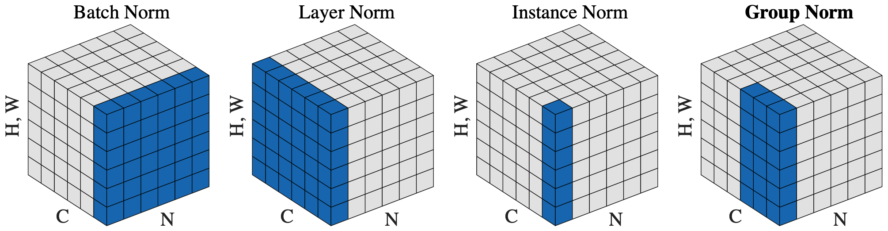
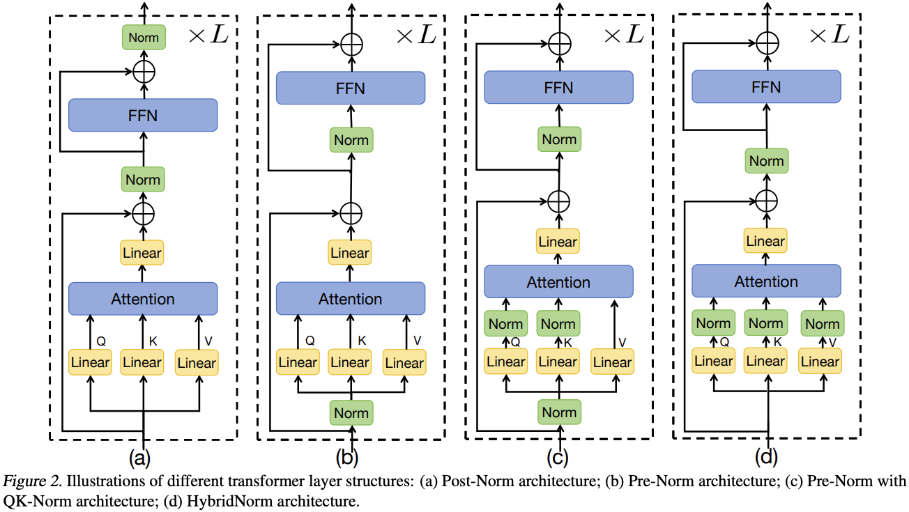

> ViT 成功把 NLP 领域的 Transformer 架构移植到计算机视觉任务中, 而且模型几乎没有改动 !

### Normalization 归一化

- 对 **tensor** 的一种操作 (在图像处理中一般是 4 维张量, 见 @fig-norm).
    - Norm 层会加入神经网络的很多地方, **本质上是在给神经网络加入 Inductive Bias**! 即告诉神经网络哪些数据是类似的 (满足同一个分布, 从而将他们等地位化 (即归一化)).

- 四种常见的 Normalization 方法:
    - **BN (Batch Normalization)**: 对 output tensor 中相同 Channel 的元素进行归一化
        - 之所以叫 Batch Norm 是因为图像处理中 **output tensor** 的一个 channel 对应 **parameter tensor** 的一个 batch.
        - 图像处理常用.
    - **LN (Layer Normalization)**: 对 output tensor 的一个 batch 中所有元素进行归一化.
        - LLM 常用.
    - **IN (Instance Normalization)**
    - **GN (Group Normalization)**

    设 @fig-norm 中的某蓝色区域所有元素的均值为 $\mu$ , 方差为 $\sigma^2$ , 则**该区域**的每个元素 $x_i$ 会被归一化为:
        $$
        \hat{x}_i = \frac{x_i - \mu}{\sigma}
        $$
    
    在归一化之后, 通常还会引入两个可学习的 scalar 参数 $\gamma, \beta$ (仅对于每整个蓝色区域), 逐点进行变换:
        $$
        y_i = \gamma \hat{x}_i + \beta
        $$
    
    {#fig-norm}

- **Post-norm 和 Pre-norm**

    {#fig-pre-post}

### Regularization 正则化

> 正则化跟「正则」这个词没有半毛钱关系, 仅仅是减小模型的过拟合.

- **$\mathcal{L}_1, \mathcal{L}_2$ 正则化**: 尽可能让模型参数在一个度量空间的球面上.
    - $\mathcal{L}_1$ 的 “球” 在欧式空间内的嵌入是一个类似于立方体的形状, 会让某些参数精准地等于 0 (Sparse).
    - $\mathcal{L}_2$ 就是一个高维球 (维度等于参数的数量), 参数不会精准地等于 0 而是会很小.

- **Dropout**: 以概率 $P_{\text{dropout}}$ (超参数) 将某些神经元的输出置为 0 (不是参数置 0), 防止网络过度依赖某些神经元导致过拟合.
    